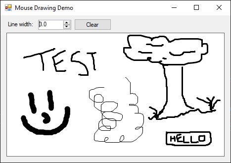

# Drawing with the Mouse
A MouseMove event handler can be assigned to the `PictureBox` that our `Bitmap` and `Graphics` objects are drawing on. Every time the mouse is moved, the new and old positions are remembered. If on a MouseMove event the mouse button is being held down, we can tell the software to draw a line between these two points. The result is an MSPaint-like drawing surface.

<a href="screenshot.png"></a>

## Core Concepts

### Mouse Tracking
This isn't as hard as you'd think. The code below does all the mouse tracking and line drawing for the entire program. The last mouse position is always stored in `lastMousePosition`, and if the mouse button is pressed and the program sees a previous location and a current location, it simply draws a line between the two locations. That's it!

```cs
private Point lastMousePosition;
private void PictureBox1_MouseMove(object sender, MouseEventArgs e)
{
    Console.WriteLine(e.Location);
    if (e.Button == MouseButtons.Left && lastMousePosition != null)
    {
        Pen pen = new Pen(Color.Black, (float)numericUpDown1.Value);
        gfx.DrawLine(pen, lastMousePosition, e.Location);
        pictureBox1.Image = bmp;
    }
    lastMousePosition = e.Location;
}
```

### Pro Tip: Customize your Pen for Smoother Lines
This is an obscure one, but really useful to know. By default lines have blocky corners and edges which can create rendering artifacts. If you customize the pen to draw rounded, your multi-line images will look much better.

```cs
Pen pen = new Pen(Color.Black, (float)numericUpDown1.Value)
{
    StartCap = System.Drawing.Drawing2D.LineCap.Round,
    EndCap = System.Drawing.Drawing2D.LineCap.Round,
    LineJoin = System.Drawing.Drawing2D.LineJoin.Round
};
```