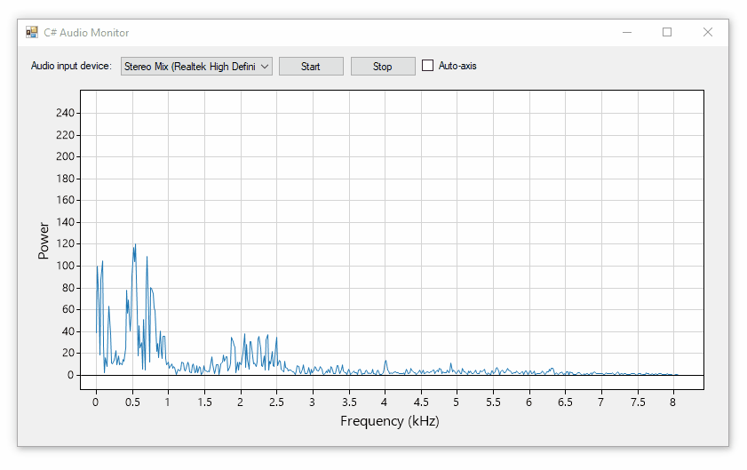

# Graphing FFT Audio Data
Many applications benefit from measuring the _frequency_ component of audio (or other signals). A simple way to convert a linear stream of data into its frequency components is by applying the [Fast Fourier transform](https://en.wikipedia.org/wiki/Fast_Fourier_transform). 

This example uses the FFT provided with [NAudio](https://github.com/naudio/NAudio/) to graph the frequency component of a PCN signal from an audio input device. This program builds on the previous examples [graphing PCM data](/examples/2019-06-07-audio-visualizer/readme.md) and [graphing audio levels](/examples/2019-06-06-audio-level-monitor/readme.md) which use [ScottPlot](https://github.com/swharden/ScottPlot)'s PlotSignal function to continuously display data. 



## UPDATE: NEW VERSION

Users simply looking to display audio data in the frequency domain will benefit from newer code provided with the [FftSharp](https://github.com/swharden/FftSharp) library:


* [FftSharp on GitHub](https://github.com/swharden/FftSharp)

## Core Concepts

### Notes about the FFT

* The FFT procedure will take in `pcmData` and output `fftData`. 
* The FFT must be fed with PCM data whose length is a power of 2.
* The length of `fftData` will be half the `pcmData` Length.
* The maximum frequency of the FFT is always half of the inverse of the sample rate.
* Use a [windowing function](https://en.wikipedia.org/wiki/Window_function) on the PCM input to reduce artifacts on the FFT output.

### Capturing PCM Data
This is similar to before, but notice I only record and save a single buffer any time. Notice this data capture function isn't weighed-down with FFT processing. To save a bit of memory I keep the PCM data as `Int16` (it'll just get converted to a complex number later).

```cs
Int16[] dataPcm;

private void OnDataAvailable(object sender, NAudio.Wave.WaveInEventArgs args)
{
    int bytesPerSample = wvin.WaveFormat.BitsPerSample / 8;
    int samplesRecorded = args.BytesRecorded / bytesPerSample;
    if (dataPcm == null)
        dataPcm = new Int16[samplesRecorded];
    for (int i = 0; i < samplesRecorded; i++)
        dataPcm[i] = BitConverter.ToInt16(args.Buffer, i * bytesPerSample);
}
```

### Performing the FFT
The only fancy thing this does is find the largest power of 2 that's less than the length of `dataPcm` and only FFT-process those values. Note that the FFT output is complex, and the real and imaginary components are added together to produce data values for the output array.

```cs
private double[] dataFft;

private void updateFFT()
{
    // the PCM size to be analyzed with FFT must be a power of 2
    int fftPoints = 2;
    while (fftPoints * 2 <= dataPcm.Length)
        fftPoints *= 2;

    // apply a Hamming window function as we load the FFT array then calculate the FFT
    NAudio.Dsp.Complex[] fftFull = new NAudio.Dsp.Complex[fftPoints];
    for (int i = 0; i < fftPoints; i++)
        fftFull[i].X = (float)(dataPcm[i] * NAudio.Dsp.FastFourierTransform.HammingWindow(i, fftPoints));
    NAudio.Dsp.FastFourierTransform.FFT(true, (int)Math.Log(fftPoints, 2.0), fftFull);

    // copy the complex values into the double array that will be plotted
    if (dataFft == null)
        dataFft = new double[fftPoints / 2];
    for (int i = 0; i < fftPoints / 2; i++)
    {
        double fftLeft = Math.Abs(fftFull[i].X + fftFull[i].Y);
        double fftRight = Math.Abs(fftFull[fftPoints - i - 1].X + fftFull[fftPoints - i - 1].Y);
        dataFft[i] = fftLeft + fftRight;
    }
}
```

### Updating the Display
I placed the FFT processing call in the timer to make sure it doesn't slow down the data capture function. Every time the timer runs the FFT is updated and plotted.

```cs
private void Timer1_Tick(object sender, EventArgs e)
{
    updateFFT();
    scottPlotUC1.Render();
}
```

### Want a smoother output?

To get a smoother output use a large input buffer and store a few buffers in memory. Then step through the input buffers fractionally (perhaps 1/10th of a buffer size) and calculate the FFT and graph it for each fractional step. In other words, lay two buffers' data side by side and slide across it calculating the FFT many times as you go.
