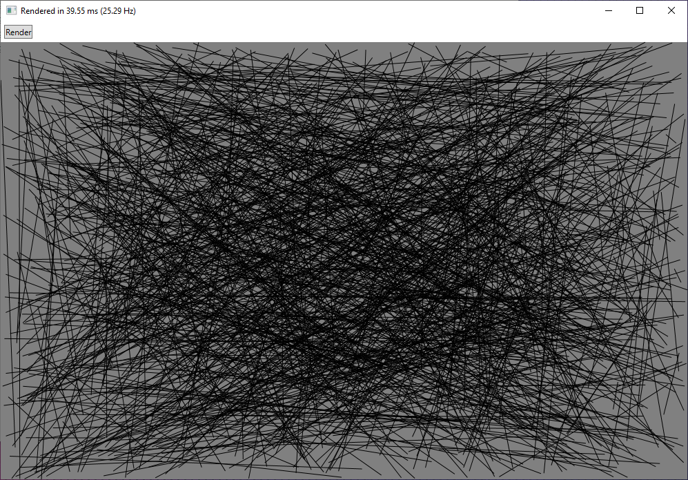

# Drawing Lines with WPF

Most of my code examples use `System.Drawing` to draw lines onto Bitmap images. This example uses `System.Windows.Media` to create lines (`LineGeometry` objects), style them (creating a `Path`), then add them to a `Canvas`.



### XAML
```XAML
<Canvas Grid.Row="1" Background="Gray" Name="myCanvas" />
```

### Draw Lines with LineGeometry
This method is simple, but a little slower.
```cs
myCanvas.Children.Clear();

for (int i=0; i<1_000; i++)
{
    LineGeometry myLineGeometry = new LineGeometry
    {
        myLineGeometry.StartPoint = new Point(randomX, randomY);
        myLineGeometry.EndPoint = new Point(randomX, randomY);
    }

    Path myPath = new Path
    {
        Stroke = Brushes.Black,
        StrokeThickness = 1,
        Data = myLineGeometry
    };

    myCanvas.Children.Add(myPath);
}
```

### Draw Lines with DrawingVisual
This method is a little faster, but still too slow to be useful for my applications.
```cs
myCanvas.Children.Clear();

DrawingVisual drawingVisual = new DrawingVisual();

DrawingContext drawingContext = drawingVisual.RenderOpen();

Pen pen = new Pen(new SolidColorBrush(Color.FromRgb(0, 0, 0)), 1);
for (int i = 0; i < 1_000; i++)
{
    drawingContext.DrawLine(pen, randomPoint, randomPoint);
}

drawingContext.Close();

RenderTargetBitmap bmp = new RenderTargetBitmap((int)myCanvas.ActualWidth, (int)myCanvas.ActualHeight, 0, 0, PixelFormats.Pbgra32);
bmp.Render(drawingVisual);

Image image = new Image();
image.Source = bmp;

myCanvas.Children.Add(image);
```

### Performance
* Full-screen rendering of just a few lines is extremely fast. This task would be slow with System.Drawing, which slows down as the resolution of the image increases.
* As more lines are added, speed decreases significantly. Around 1,000 lines at full screen resolution performance is so slow that System.Drawing is actually faster.
* If your task requires drawing lines and moving them around the screen, WPF would probably be faster. My task requires creating a large number of new lines on every render, which WPF doesn't seem able to do fast enough to be meaningfully interactive.