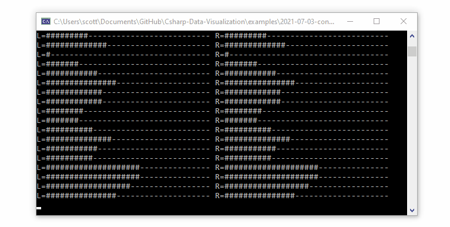

# Console Microphone Monitor

This program demonstrates how to monitor the microphone levels from a console application using C#.

Mono | Stereo
---|---
|

Source code: [Program.cs](Program.cs)

This project uses NAudio (available on NuGet) to access the microphone, and because that package is Windows-only and targets .NET Framework the same is true of this application.

## Configure the Audio Input Device

This program starts by creating a `WaveInEvent` with a `WaveFormat` that specifies the sample rate, bit depth, and number of channels (1 for mono, 2 for stereo).

We can create a function to handle incoming data and add it to the `DataAvailable` event handler:

```cs
var waveIn = new NAudio.Wave.WaveInEvent
{
    DeviceNumber = 0, // customize this to select your microphone device
    WaveFormat = new NAudio.Wave.WaveFormat(rate: 44100, bits: 16, channels: 1),
    BufferMilliseconds = 50
};
waveIn.DataAvailable += ShowPeakMono;
waveIn.StartRecording();
```

## Analyze Mono Audio Data

This method is called when the incoming audio buffer is filled. One of the arguments gives you access to the raw bytes in the buffer, and it's up to you to convert them to the appropriate data format. 

This example is suitable for 16-bit (two bytes per sample) mono input.

```cs
private static void ShowPeakMono(object sender, NAudio.Wave.WaveInEventArgs args)
{
    float maxValue = 32767;
    int peakValue = 0;
    int bytesPerSample = 2;
    for (int index = 0; index < args.BytesRecorded; index += bytesPerSample)
    {
        int value = BitConverter.ToInt16(args.Buffer, index);
        peakValue = Math.Max(peakValue, value);
    }

    Console.WriteLine("L=" + GetBars(peakValue / maxValue));
}
```

This method converts a level (fraction) into bars suitable to display in the console:

```cs
private static string GetBars(double fraction, int barCount = 35)
{
    int barsOn = (int)(barCount * fraction);
    int barsOff = barCount - barsOn;
    return new string('#', barsOn) + new string('-', barsOff);
}
```


## Analyze Stereo Audio Data

When the `WaveFormat` is configured for 2 channels, bytes in the incoming audio buffer will have left and right channel values interleaved (2 bytes for left, two bytes for right, then repeat). Left and right channels must be treated separately to display independent levels for stereo audio inputs:

```cs
private static void ShowPeakStereo(object sender, NAudio.Wave.WaveInEventArgs args)
{
    float maxValue = 32767;
    int peakL = 0;
    int peakR = 0;
    int bytesPerSample = 4;
    for (int index = 0; index < args.BytesRecorded; index += bytesPerSample)
    {
        int valueL = BitConverter.ToInt16(args.Buffer, index);
        peakL = Math.Max(peakL, valueL);
        int valueR = BitConverter.ToInt16(args.Buffer, index + 2);
        peakR = Math.Max(peakR, valueR);
    }

    Console.Write("L=" + GetBars(peakL / maxValue));
    Console.Write(" ");
    Console.Write("R=" + GetBars(peakR / maxValue));
    Console.Write("\n");
}
```

