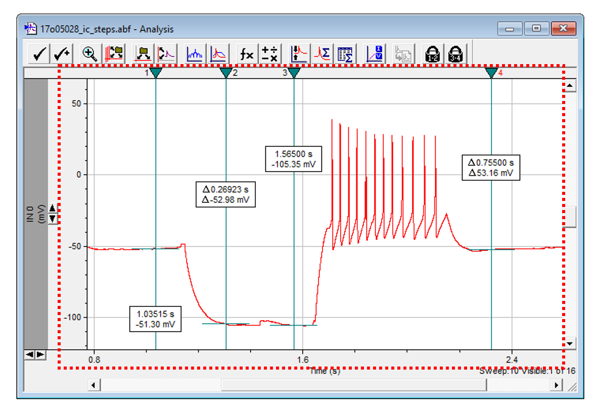

# DataView: A ClampFit-like Data Browser

Description | ClampFit | DataView
---|---|---
As a challenge I decided to use only the standard library to make a data browsing user control as similar to a ClampFit as possible (a data analysis tool for electrical recordings). I accomplished this ~95% to my satisfaction, and learned a lot along the way. Insights I gained while developing this project will help me construct faster and lighter graphing tools in the future, ideally with extremly simple APIs. Although I'm going to abandon this for a ground-up recode, this project is provided as-is for reference. |  | 

---

# Project Log

## Inspection of ClampFit Interface
The first step of this project involved mentally deconstructing the layout of the ClampFit interface.

This is what a data window looks like inside ClampFit. Although there is a toolbar on the top, all of the data is displayed in a sunken panel. 

The image inside the data area of this sunken panel is extremely similar to what [ScottPlot](https://github.com/swharden/ScottPlot) can do, so with a little tweaking we should be able to create a problem that mimics this one. 

This is how I intend to break-up my form. I'll keep as much as possible as windows form events (labels, scrollbars, etc) and minimize the size and complexity of the bitmap I'll be updating with the axis and data changes. I suspect I can do this with two primary table layout controls. This would almost work perfectly as a single table layout (grid), but the label on the bottom right spans two columns so if I intend to be exact to the ClampFit screenshot, I'll stick with nested layouts.

## Designing a Resizable Layout

### First Iteration: Pixel Placement
I built an iteration of layout controls which require pixel-calculated placement. In other words I just dropped buttons and scrolls randomly on the form, and every time the form was resized I had a function calcaulate where they should be and set their positions. This worked, but was hard to maintain when small adjustments were desired (i.e., changing the width of a scrollbar). Early versions of this are projects in the Visual Studio solution.

### Second Iteration: Nested Table Layouts
I started over and made a nicer layout which entirely uses nested tables. I found if I have several rows or columns in a table and fix the pixel sizes of each cell except one, it resizes nicely.

### Design

### Implementation

### This version got pretty close!

I didn't try to make it look _exactly_ like ClampFit, but I wanted it to be similar enough that anyone who knows how to one will know how to use the other. You can zoom by left-click-dragging the axis marks. You can move markers. You can show/hide/bring markers by right-clicking them or the marker bar. This is a strong start!

It works well up to about 1,000,000 points, but then starts to slow down a bit. There are some easy structural changes to the plotting methods which can greatly improve speed (and API simplicity), but it would require a ground-up recode so I'll freeze this project where it is.

## What I learned / next iteration improvements

### What worked well:
* Table layouts for everything - no code was required to reposition buttons or scrollbars when the window resizes
* Using a picturebox instead of setting the background of a panel
* Having an axis/grid bitmap and a data bitmap that can be drawn on sequentially. This made drawing stacked sweeps very easy
* Drawing max/min binned data rather than each data point: [`Render_data()`](https://github.com/swharden/Csharp-Data-Visualization/blob/master/projects/18-01-15_form_drawing/drawing/03%20functional/ScottPlot.cs#L304)
* Draggable elements are entirely pixel shapes in memory and creative mouseover detection
* Although the marker bar and data window are two different controls, they don't feel like it
* Axis "limits" (the edges of how far you can scroll) are useful, and required to set scrollbar widths.

### What can be improved:
* Interactive elements (markers, and later peak detectors and such) should have their own layer(s). Perhaps functions could "build" a bitmap as it renders by layering-on things like shaded regions, etc. This should be planned carefully.
* For data loaded into sweeps, the pixel binning can be computationally intense. Perhaps we should store all this data in a list after it's calculated once, then cycling through sweeps will be fast (it loads the list rather than regenerating it).
* I like the idea of starting with a base ScottPlot class and modyfing it to fit a need, rather than weighing it down with all the bells and whistles.
