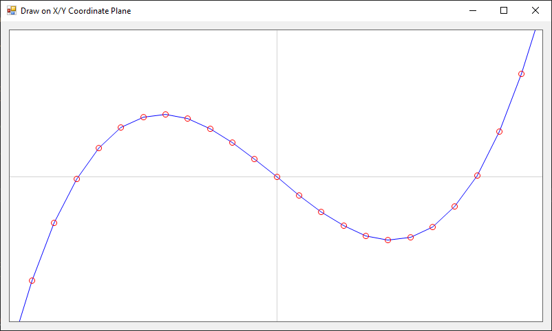

# Drawing on an X/Y Coordinate Plane
If you have a _coordinate plane_ defined by _axis limits_ (e.g., X from -5 to +5 and Y from -10 to +10), how do you convert those positions to pixel positions on a bitmap? If the width of the horizontal axis is 10 units (-5 to +5) and the width of the bitmap is 600 pixels, what horizontal pixel position corresponds to X=1.234?

This project provides a simple-case example for converting coordinates from a location on an XY plane to a pixel location on a Bitmap. We use these methods to plot X/Y data points from a formula on a Bitmap.

<a href="screenshot.png"></a>

## Core Concepts

### Create Data to Plot
There's not much special here. Creating lists and converting them into arrays is inefficient, but we only do this once at the start of the program so who cares.

For this example we plot `Y = X^3 + 5*X` over an X range of -3 to +3

```cs
double[] xs;
double[] ys;
private void CreateData()
{
    List<double> xsList = new List<double>();
    List<double> ysList = new List<double>();
    for (double x = -3; x <= 3; x += 0.25)
    {
        xsList.Add(x);
        ysList.Add(Math.Pow(x, 3) - 5 * x); //
    }
    xs = xsList.ToArray();
    ys = ysList.ToArray();
}
```

### Define Axis Limits
After a lot of experience, I prefer to handle axis limit definitions with a single class-level array. Note how easy it is to manually redefine these or act upon them (zooming or panning).

```cs
double[] axisLimits = new double[] { -3, 3, -10, 10 }; // x1, x2, y1, y2
```

### Location Conversion Function (coordinate-to-pixel)
This method returns a pixel location of a point on a coordinate plane determined by considering the dimensions of the image and the axis limits.

```cs
public Point GetPixelFromLocation(double x, double y)
{
    double pxPerUnitX = bmp.Width / (axisLimits[1] - axisLimits[0]);
    double pxPerUnitY = bmp.Height / (axisLimits[3] - axisLimits[2]);
    int xPx = (int)((x - axisLimits[0]) * pxPerUnitX);
    int yPx = bmp.Height - (int)((y - axisLimits[2]) * pxPerUnitY);
    return new Point(xPx, yPx);
}
```

### Plot the Line (with Markers)
The coordinate conversion is the hard part! From here we can simply draw lines on the bitmap by calling `GetPixelFromLocation()` whenever we need to convert from a coordinate to a pixel location.
```cs
private void PlotData()
{
    // draw lines at zero intercepts
    Point origin = GetPixelFromLocation(0, 0);
    gfx.DrawLine(Pens.LightGray, 0, origin.Y, bmp.Width, origin.Y);
    gfx.DrawLine(Pens.LightGray, origin.X, 0, origin.X, bmp.Height);

    // plot the data points as lines
    Point[] points = new Point[xs.Length];
    for (int i = 0; i < xs.Length; i++)
        points[i] = GetPixelFromLocation(xs[i], ys[i]);
    gfx.DrawLines(Pens.Blue, points);
    Console.WriteLine($"plotted lines connecting {points.Length} points");
    pictureBox1.Image = bmp;

    // draw dots at each point
    float markerSize = 4;
    foreach (Point point in points)
    {
        gfx.DrawEllipse(Pens.Red, 
            point.X - markerSize, point.Y - markerSize, 
            markerSize * 2, markerSize * 2);
    }
}
```

### Output
