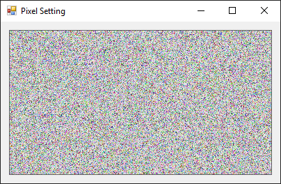

# Modifying Bitmap Data in Memory
The fastest way to set pixel values of an image is to directly modify the values of its memory. Finding a pixel position in memory is easy because for 32-bit color images each pixel is 4 bytes (A, R, G, B), and from there it can be easily modified This method can be faster than using drawing methods like GetPixel and PutPixel.



## Core Concepts

### Converting Images To/From Byte Arrays
The [System.Runtime.InteropServices.Marshal](https://docs.microsoft.com/en-us/dotnet/api/system.runtime.interopservices.marshal) class is used to provide byte access to Bitmap memory blocks. These functions do not require using any [unsafe](https://docs.microsoft.com/en-us/dotnet/csharp/language-reference/keywords/unsafe) code blocks.

```cs
public byte[] BitmapToBytes(Bitmap bmp)
{
    // return a bitmap (of any image format) as a byte array
    int bytesPerPixel = Image.GetPixelFormatSize(bmp.PixelFormat) / 8;
    Rectangle rect = new Rectangle(0, 0, bmp.Width, bmp.Height);
    BitmapData bmpData = bmp.LockBits(rect, ImageLockMode.ReadOnly, bmp.PixelFormat);
    byte[] bytes = new byte[bmpData.Stride * bmp.Height * bytesPerPixel];
    Marshal.Copy(bmpData.Scan0, bytes, 0, bytes.Length);
    bmp.UnlockBits(bmpData);
    return bytes;
}
```

```cs
public Bitmap BitmapFromBytes(byte[] bytes, Size size, 
    PixelFormat format = PixelFormat.Format32bppArgb)
{
    // create a bitmap given a byte array of raw data
    Bitmap bmp = new Bitmap(size.Width, size.Height, format);
    Rectangle rect = new Rectangle(0, 0, bmp.Width, bmp.Height);
    BitmapData bmpData = bmp.LockBits(rect, ImageLockMode.ReadWrite, bmp.PixelFormat);
    Marshal.Copy(bytes, 0, bmpData.Scan0, bytes.Length);
    bmp.UnlockBits(bmpData);
    return bmp;
}
```

### Assign Random Values to Image Bytes
In this example we assign random values to all bytes in an image and render the output on a picturebox.
```cs
private Bitmap bmp;
private Graphics gfx;
private Random rand = new Random();

private void InitializeBitmapAndGraphics()
{
    bmp = new Bitmap(pictureBox1.Width, pictureBox1.Height);
    gfx = Graphics.FromImage(bmp);

    byte[] bmpBytes = BitmapToBytes(bmp);
    for (int i = 0; i < bmpBytes.Length; i++)
        bmpBytes[i] = (byte)rand.Next(256);

    Console.WriteLine($"Created new bitmap {bmp.Size} ({bmpBytes.Length} bytes)");
    pictureBox1.Image = BitmapFromBytes(bmpBytes, bmp.Size);

}
```

### Output
