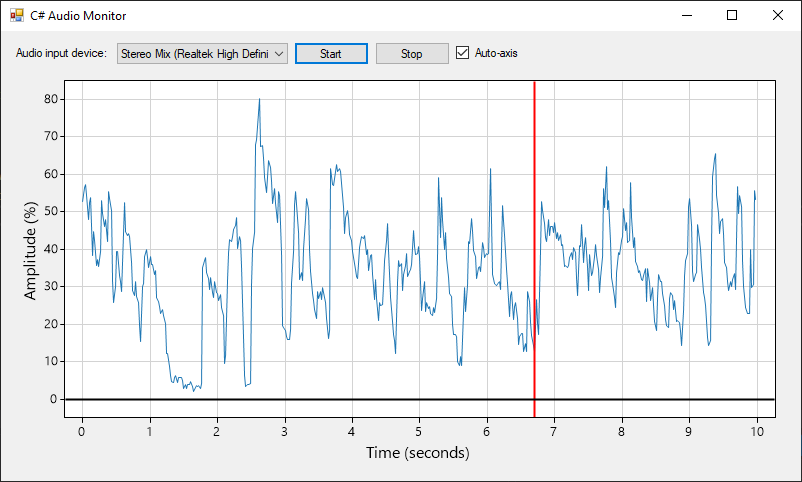

# Graphing Audio Level
This program continuously reads an audio input device, determines the amplitude of the input signal, then graphs it using a [ScottPlot](https://github.com/swharden/ScottPlot). Audio interfacing is provided with the [NAudio](https://github.com/naudio/NAudio) library. Reviewing how this program works is a good way to learn how to work with audio signals from the microphone.



## Core Concepts

### Scanning for Audio Input Devices
I always let the user decide which audio device to sample from. The easiest way to do this is to populate a combo box with audio devices.

```cs
private void ScanSoundCards()
{
    cbDevice.Items.Clear();
    for (int i = 0; i < NAudio.Wave.WaveIn.DeviceCount; i++)
        cbDevice.Items.Add(NAudio.Wave.WaveIn.GetCapabilities(i).ProductName);
    if (cbDevice.Items.Count > 0)
        cbDevice.SelectedIndex = 0;
    else
        MessageBox.Show("ERROR: no recording devices available");
}
```

### Audio Device Initialization 
When the user clicks "Start", a connection is made to the audio device using the index of the combo box that is currently selected. At this time a `WaveInEvent` is created whatever audio recording settings we desire. We also assign a function to the `DataAvailable` field. This function gets called every time an audio buffer is filled with data.

```cs
private NAudio.Wave.WaveInEvent wvin;

private void AudioMonitorInitialize(
        int DeviceIndex, int sampleRate = 8000, int bitRate = 16, 
        int channels = 1, int bufferMilliseconds = 100, bool start = true
        )
{
    if (wvin == null)
    {
        wvin = new NAudio.Wave.WaveInEvent();
        wvin.DeviceNumber = DeviceIndex;
        wvin.WaveFormat = new NAudio.Wave.WaveFormat(sampleRate, bitRate, channels);
        wvin.DataAvailable += OnDataAvailable;
        wvin.BufferMilliseconds = bufferMilliseconds;
        if (start)
            wvin.StartRecording();
    }
}

```

```cs
private int bufferReadCount = 0;

private void OnDataAvailable(object sender, NAudio.Wave.WaveInEventArgs args)
{
    int bytesPerSample = wvin.WaveFormat.BitsPerSample / 8;
    int samplesRecorded = args.BytesRecorded / bytesPerSample;
    Int16[] lastBuffer = new Int16[samplesRecorded];
    for (int i = 0; i < samplesRecorded; i++)
        lastBuffer[i] = BitConverter.ToInt16(args.Buffer, i * bytesPerSample);
    int lastBufferAmplitude = lastBuffer.Max() - lastBuffer.Min();
    bufferReadCount += 1;
    Console.WriteLine($"Buffer {bufferReadCount} amplitude: {lastBufferAmplitude}");
}
```

### Start/Stop Listening

```cs
private void BtnStart_Click(object sender, EventArgs e)
{
    AudioMonitorInitialize(cbDevice.SelectedIndex);
}

private void BtnStop_Click(object sender, EventArgs e)
{
    if (wvin!= null)
    {
        wvin.StopRecording();
        wvin = null;
    }
}
```

### Plotting Amplitude with ScottPlot
I created a double array with `500` values and every time the buffer-filled function is called I use `bufferReadCount % 500` to indicate which buffer position to fill with the latest amplitude. I use the same technique to position the vertical line where I want it. I only have to plot this with ScottPlot once, and I user a timer to re-render the graph every 20ms.

```cs
private double[] amplitudes;
private void PlotInitialize(int pointCount = 500)
{
    amplitudes = new double[pointCount];
    scottPlotUC1.plt.Clear();
    scottPlotUC1.plt.PlotSignal(amplitudes, sampleRate: 1000.0 / 20, markerSize: 0);
    scottPlotUC1.plt.PlotVLine(0, color: Color.Red, lineWidth: 2);
    scottPlotUC1.plt.PlotHLine(0, color: Color.Black, lineWidth: 2);
    scottPlotUC1.plt.YLabel("Amplitude (%)");
    scottPlotUC1.plt.XLabel("Time (seconds)");
    scottPlotUC1.Render();
}
```

```cs
private void Timer1_Tick(object sender, EventArgs e)
{
    if (cbAutoAxis.Checked)
        scottPlotUC1.plt.AxisAuto();
    scottPlotUC1.Render();
}
```


### Output
