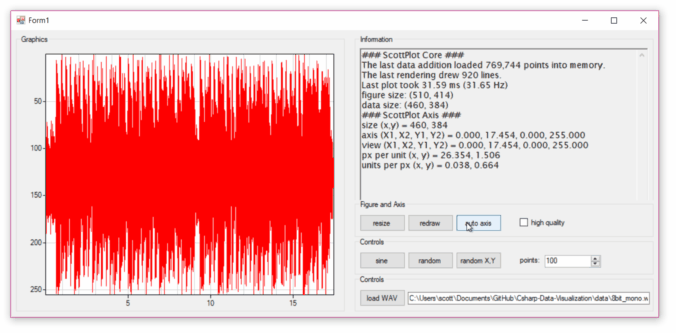

# High Speed Graphing of High Density Linear Data

## Accelerated Graphing for Linear Signals
I **dramatically** sped-up the graphing by drawing only single vertical lines (of small range min and max values) when the point density exceeds the horizontal pixel density. This is only suitable for evenly-spaced linear data (which is exactly what my target applications will be plotting). Performance is great, and there is plenty of room for improvement on the coding side too. `AddLineXY()` will be used to manually draw a line between every X,Y point in a list. `AddLineSignal()` graphs data from huge amounts of linear data by only graphing vertical lines.

**I'm getting ~50 Hz frame rate plotting about 1 million data points:**



## Load Data from WAV File
Rather than generating fake data, let's use some real data. A ~20 second 8-bit 44100Hz WAV ([/data/8bit_mono.wav](/data/8bit_mono.wav)) has about 780k data points. [The WAV PCM sound file format is pretty simple](http://soundfile.sapp.org/doc/WaveFormat/). I wish every analog data recording file format had such a simple, easy-to-use, and well-documented header... [pCLAMP](http://mdc.custhelp.com/app/answers/detail/a_id/18779) -_-

## Function Reference

### Reading a WAV File using a Byte Array
_this only works as written for 8-bit WAV files_
```c#
byte[] bytes = System.IO.File.ReadAllBytes(filename);
Ys = new List<double>();
for (int i=44; i<bytes.Length; i++) {Ys.Add((double)bytes[i]);}
```

### AddLineSignal()
```c#
public void AddLineSignal(List<double> Ys, double unitsPerPoint = 10, double offsetX = 0,  bool drawGrid = true)
{
	double unitsPerPixel = AX.UnitsPerPxX;
	double iPerPixel = unitsPerPixel / unitsPerPoint;
	double nDataPixels = unitsPerPoint * Ys.Count / unitsPerPixel;
	double offsetPixels = -(AX.GetAxis()[0] - offsetX) / unitsPerPixel;
	List<Point> points = new List<Point>();
	for (int x = 0; x < dataSizeX; x++)
	{
		int iLeft = (int)((iPerPixel * ((x + 0) - offsetPixels)));
		int iRight = (int)((iPerPixel * ((x + 1) - offsetPixels)));
		if ((iLeft < 0) || (iRight <= 0)) continue;
		if (iRight > Ys.Count) continue;
		if (iRight - iLeft == 0) continue;
		double colMin = Ys.GetRange(iLeft, iRight - iLeft).Min();
		double colMax = Ys.GetRange(iLeft, iRight - iLeft).Max();
		colMin = (colMin - AX.GetAxis()[2]) * AX.pxPerUnitY;
		colMax = (colMax - AX.GetAxis()[2]) * AX.pxPerUnitY;
		points.Add(new Point(x, (int)colMin));
		if ((int)colMin != (int)colMax) { points.Add(new Point(x, (int)colMax)); }
	}
	graphicsData.DrawLines(new Pen(Color.Red, 1), points.ToArray()); 
	dataPointCount = Ys.Count;
	dataLinesCount = points.Count;
}
```
