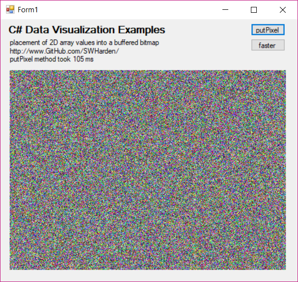

# Fast Pixel Drawing in C#
The purpose of this example is to determine/demonstrate the fastest/simplest methods to take an array of data and plot it into a bitmap. It compares the SetPixel method to the locked bits method.



### Example using `Bitmap.SetPixel`
```
Bitmap buffer = new Bitmap(width, height);
Color NewPixel = Color.FromArgb(255, 123, 213, 059);
buffer.SetPixel(x, y, NewPixel); // modify the pixel (RGBA) with a Color
pictureBox1.Image = buffer;
```

### Example using `Bitmap.Lockbits`
```
Bitmap buffer = new Bitmap(width, height);
BitmapData bitmapData = buffer.LockBits(new Rectangle(0, 0, buffer.Width, buffer.Height), ImageLockMode.ReadWrite, buffer.PixelFormat);
int bytesPerPixel = Bitmap.GetPixelFormatSize(buffer.PixelFormat) / 8;
int byteCount = bitmapData.Stride * buffer.Height;
byte[] pixels = new byte[byteCount];
IntPtr ptrFirstPixel = bitmapData.Scan0;
Marshal.Copy(ptrFirstPixel, pixels, 0, pixels.Length);
pixels[someBytePosition] = 123; // set a single R, G, B, or A value as a byte
Marshal.Copy(pixels, 0, ptrFirstPixel, pixels.Length);
buffer.UnlockBits(bitmapData);
pictureBox1.Image = buffer;
```

### Useful Links
* [High performance System.Drawing.Bitmap pixel manipulation in C#](http://erison.blogspot.com/2016/02/techdercom-high-performance.html)