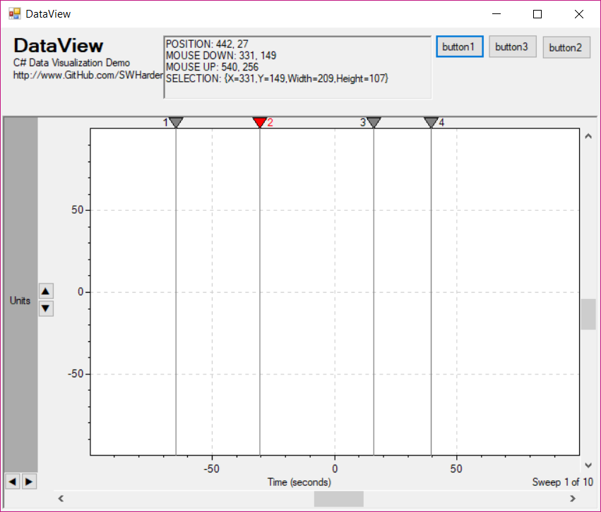

# DataView Control

This project aims to provide a user control to provide a navigatable axis field. A _secondary_ routine can be used to plot data over this axis. Since the hard part of interactive data analysis is typically the interactive part, this user control aims at simplifying the zooming/panning aspect of data viewing. This user control will behave similarly to the electrophysiology data viewer ClampFit

ClampFit | DataView
---|---
 | 
