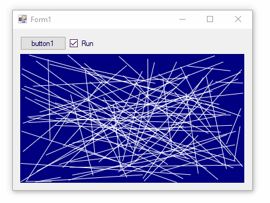

# Multi-Targeted App with Maui.Graphics

This project demonstrates how to create multi-targeted app using:
* **.NET Standard 2.0** library for all drawing logic
  * Drawing performed by `Microsoft.Maui.Graphics`
  * No dependency on `System.Drawing`
* **Windows Forms** apps for rendering using Skia + OpenGL
  * .NET Framework 4.8
  * .NET 6.0

