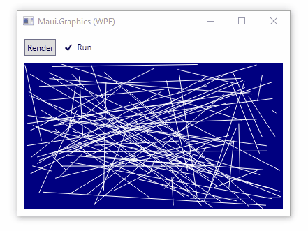
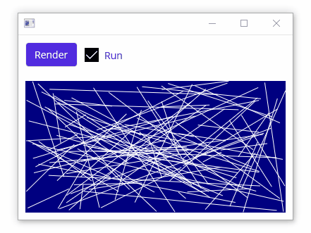

# Multi-Targeted App with Maui.Graphics

This project demonstrates how to create multi-targeted app using:
* **.NET Standard 2.0** library for all drawing logic ✨
  * Drawing performed by `Microsoft.Maui.Graphics`
  * No dependency on `System.Drawing`
* **Console Application** saves graphics as static image files
* **Windows Forms App** for .NET Framework and .NET Core (Windows)
* **WPF App** for .NET Framework and .NET Core (Windows)
* **Maui App** app for Windows, MacOS, iOS, and Android

Windows Forms | WPF | MAUI
---|---|---
 |  | 