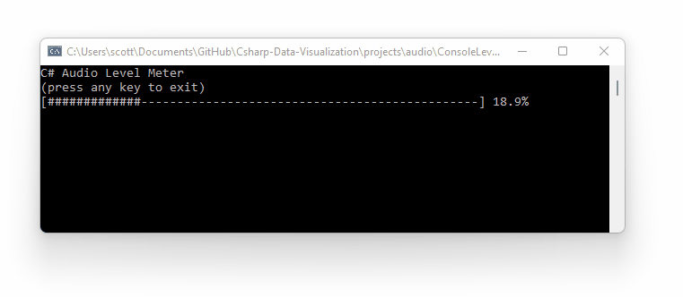

**This page demonstrates how to use NAudio to access microphone audio in a C# application.** See the [Audio Analysis and Visualization Page](../) for additional code examples.

## Project Setup

* **Add the NAudio package:** `dotnet add package naudio`

* **Target Windows:** NAudio only supports Windows, so edit your project file to append `-windows` to your target framework

```xml
<TargetFramework>net6.0-windows</TargetFramework>
```

## Record Audio

This is the full source code for a .NET 6 console application that displays microphone levels in the console.

```cs
var waveIn = new NAudio.Wave.WaveInEvent
{
    DeviceNumber = 0, // indicates which microphone to use
    WaveFormat = new NAudio.Wave.WaveFormat(rate: 44100, bits: 16, channels: 1),
    BufferMilliseconds = 20
};
waveIn.DataAvailable += WaveIn_DataAvailable;
waveIn.StartRecording();

Console.WriteLine("C# Audio Level Meter");
Console.WriteLine("(press any key to exit)");
Console.ReadKey();

static void WaveIn_DataAvailable(object? sender, NAudio.Wave.WaveInEventArgs e)
{
    // copy buffer into an array of integers
    Int16[] values = new Int16[e.Buffer.Length / 2];
    Buffer.BlockCopy(e.Buffer, 0, values, 0, e.Buffer.Length);

    // determine the highest value as a fraction of the maximum possible value
    float fraction = (float)values.Max() / 32768;

    // print a level meter using the console
    string bar = new('#', (int)(fraction * 70));
    string meter = "[" + bar.PadRight(60, '-') + "]";
    Console.CursorLeft = 0;
    Console.CursorVisible = false;
    Console.Write($"{meter} {fraction * 100:00.0}%");
}
```



## Additional Configuration

### Sample Rate

In the code above the sample rate is `44100` samples per second (44.1 kHz). This is a common sample rate for CD quality audio. However, if your application doesn't require such a high sample rate, you may want to reduce this. Telephone quality audio is near `8000` Hz.

### Bit Depth

In the code above a `16-bit` depth is used. This is the most common bit depth for typical audio equipment. 16-bit audio means the level of each sample is represented by a value between 0 and 2<sup>16</sup>-1 (65,535). Note that audio levels rest near the middle and extend positive and negative, so it is best to consider these data as an signed 16-bit integer (`Int16`) that can extend to ± 32,768.

### Left and Right Channels

In the code above audio from only the left channel is analyzed. Capturing a single channel produces a simple buffer which is a byte array representing `Int16[]` for a continuous waveform. If two channels are used, the `Int16[]` contains _interleaved_ data, meaning data for each channel is represented by every other data point. Breaking the buffer array into separate `Int16[]` arrays for left and right channels can be achieved like this:

```cs
static void WaveIn_DataAvailable(object? sender, NAudio.Wave.WaveInEventArgs e)
{
    int bytesPerSample = 2;
    int channelCount = 2;
    int sampleCount = e.Buffer.Length / bytesPerSample / channelCount;

    Int16[] valuesL = new Int16[sampleCount];
    Int16[] valuesR = new Int16[sampleCount];

    for (int i = 0; i < sampleCount; i++)
    {
        int position = i * bytesPerSample * channelCount;
        valuesL[i] = BitConverter.ToInt16(e.Buffer, position);
        valuesR[i] = BitConverter.ToInt16(e.Buffer, position + 2);
    }

    float maxPercentL = (float)valuesL.Max() / 32768 * 100;
    float maxPercentR = (float)valuesL.Max() / 32768 * 100;
    Console.WriteLine($"L: {maxPercentL}% R:{maxPercentR}%");
}
```

### Finding Audio Input Devices

Setting the `DeviceNumber` of your `WaveInEvent` determines which audio input device will be sampled. Use `NAudio.Wave.WaveIn.GetCapabilities()` to retrieve information about all audio devices. 

```cs
for (int i = -1; i < NAudio.Wave.WaveIn.DeviceCount; i++)
{
    var caps = NAudio.Wave.WaveIn.GetCapabilities(i);
    Console.WriteLine($"{i}: {caps.ProductName}");
}
```

Output:

```
-1: Microsoft Sound Mapper
0: Microphone (High Definition Aud
1: Wave Link MicrophoneFX (Elgato
2: Wave Link Stream (Elgato Wave:X
3: Microphone (HD Webcam C270)
4: Wave Link Monitor (Elgato Wave:
5: Mic In (Elgato Wave:XLR)
```

According to the NAudio developers ([#379](https://github.com/naudio/NAudio/issues/379), [#612](https://github.com/naudio/NAudio/issues/612)) audio device descriptions will be truncated to 32 characters due to a limitation of the Windows API.

## Resources
* [Source code for this project](https://github.com/swharden/Csharp-Data-Visualization/tree/main/projects/audio/ConsoleLevelMonitor) (GitHub)
* [NAudio on GitHub](https://github.com/naudio/NAudio)
* [NAudio on NuGet](https://www.nuget.org/packages/NAudio/)
* [NAudio tutorials](https://github.com/naudio/NAudio#tutorials)