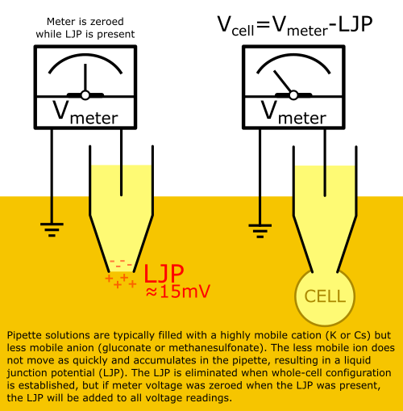

This page contains notes about the analytical methods LJPcalc uses to calculate LJP from ion tables
 as well as notes for experimenters about what causes LJP and how to compensate for it in electrophysiology experiments.

## Table of Contents



## LJP Calculation Notes

### LJPcalc Calculation Method

LJPcalc calculates the liquid junction potential according to the stationary Nernst-Planck equation which is typically regarded as superior to the simpler Henderson equation used by most commercial LJP calculators. Both equations produce nearly identical LJPs, but the Henderson equation becomes inaccurate as ion concentrations increase, and also when calculating LJP for solutions containing polyvalent ions.

### LJPcalc Ion Mobility Library

LJPcalc uses an extensive [ion mobility library](../iontable)

The ion mobility table is stored in Markdown format. Not only does Markdown make it easy to display the table nicely in a browser, 
but it also makes the table easy to edit in any text editor. Users desiring to use their own ion mobilities or add new ions to the table
can do so by editing the `IonTable.md` file adjacent to `LJPcalc.exe` as needed.

### Influence of Ion Sequence on Calculated LJP

> 💡 LJPcalc automatically sorts the ion table into an ideal sequence prior to solving for LJP. Attention only needs to be paid to the ion sequence if automatic sorting is disabled.

When calculating LJP for a set of ions it is important to consider the sequence in which they are listed. Additional information can be found in [Marino et al., 2014](https://arxiv.org/abs/1403.3640) which describes the exact computational methods employed by LJPcalc.

* **The last ion's c0 may be overridden** to achieve electroneutrality on the c0 side. This will not occur if the sum of charge on the c0 side is zero.

* **cL for most ions will be slightly adjusted** to achieve electroneutrality on the cL side. The second-to-last ion's cL (which cannot equal its c0) will remain fixed, while the last cL will be adjusted to achieve electroneutrality. During the solving process all cL values (but the second-from-last) will be slightly adjusted. The adjustments are likely negligible experimentally, but this is why cL values in the output table slightly differ from those given for inputs.

### Effect of Temperature on LJP

**The LJP is temperature dependent.** There are two sources of temperature-dependent variation: the Einstein relation and the conductivity table. The former can be easily defined at calculation time, while the latter requires modifying conductances in the ion mobility table. These modifications typically have a small effect on the LJP, so standard temperature (25C) can be assumed for most applications.

**The [Einstein relation](https://en.wikipedia.org/wiki/Einstein_relation_(kinetic_theory))** defines diffusion as **`D = µ * k * T`** where:

* **`D`** is the diffusion coefficient
* **`µ`** (mu) is [ionic mobility](https://en.wikipedia.org/wiki/Electrical_mobility)
* **`k`** is the [Boltzmann constant](https://en.wikipedia.org/wiki/Boltzmann_constant) (1.380649e-23 J / K)
* **`T`** is temperature (K)

**The ion conductivity table is temperature-specific.** Ion conductivity was measured experimentally and varies with temperature. The ion conductivity table here assumes standard temperature (25C), but ion conductivity values can be found for many ions at nonstandard temperatures. LJPcalc users desiring to perform LJP calculations at nonstandard temperatures are encouraged to build their own temperature-specific ion tables.

### Calculating Ionic Mobility from Charge and Conductivity

Ionic mobility is **`µ = Λ / (N * e² * |z|)`** where:

* **`µ`** (mu) is [ionic mobility](https://en.wikipedia.org/wiki/Electrical_mobility) (m² / V / sec)
* **`Λ`** (Lambda) is [molar conductivity](https://en.wikipedia.org/wiki/Molar_conductivity) (S * cm²/ mol)
* **`N`** is the [Avogadro constant](https://en.wikipedia.org/wiki/Avogadro_constant) (6.02214076e23 particles / mol)
* **`e`** is the [elementary charge](https://en.wikipedia.org/wiki/Elementary_charge) (1.602176634e-19 Coulombs)
* **`z`** is the absolute value of the [elementary charge](https://en.wikipedia.org/wiki/Elementary_charge) of the ion

## How to Correct for LJP in Electrophysiology Experiments

Patch-clamp electrophysiologists impale cells with glass microelectrodes to measure or clamp their voltage.
Amplifier offset voltage is adjusted to achieve a reading of zero volts when the pipette is in open-tip configuration with the bath,
but this voltage includes offset for a _liquid junction potential_ (LJP) caused by the free exchange of ions with different mobilities between the pipette and bath solutions.
Whole-cell patch-clamp experiments typically fill the pipette with large anions like gluconate, aspartate, or methanesulfonate, and their low mobility 
(relative to ions like K, Na, and Cl) causes them to accumulate in the pipette and produce a LJP (where the bath is more positive than then pipette).
After establishment of whole-cell configuration, ions no longer freely move between pipette and bath solutions (they are separated by the cell membrane), so
there is effectively no LJP but the offset voltage is still offsetting as if LJP were present. By knowing the LJP, the scientist can
adjust offset voltage to compensate for it, resulting in more accurate measured and clamped voltages.

<p align="center">V<sub>meter</sub> = V<sub>cell</sub> + LJP</p>

**To correct for LJP,** the electrophysiologist must calculate LJP mathematically (using software like LJPcalc) or estimate it experimentally (see the section on this topic below). Once the LJP is known it can be compensated for experimentally to improve accuracy of recorded and clamped voltages.

<p align="center">V<sub>cell</sub> = V<sub>meter</sub> - LJP</p>

> ⚠️ This method assumes that the amplifier voltage was zeroed at the start of the experiment when the pipette was in open-tip configuration 
with the bath, and that concentration of chloride (if using Ag/AgCl electrodes) in the internal and bath solutions are stable throughout experiments.

<div class="text-center">



</div>

### Example Patch-Clamp LJP Calculation & Correction

This ion set came from in [Figl et al., 2003](https://medicalsciences.med.unsw.edu.au/sites/default/files/soms/page/ElectroPhysSW/AxoBits39New.pdf) Page 8. They have been loaded into LJPcalc such that the pipette solution is c0 and the bath solution is cL. Note that the order of ions has been adjusted to place the most abundant two ions at the bottom. This is ideal for LJPcalc's analytical method.


 Name       | Charge | pipette (mM) | bath (mM)      
------------|--------|--------------|---------
 K          | +1     | 145          | 2.8
 Na         | +1     | 13           | 145
 Mg         | +2     | 1            | 2
 Ca         | +2     | 0            | 1
 HEPES      | -1     | 5            | 5
 Gluconate  | -1     | 145          | 0           
 Cl         | -1     | 10           | 148.8


Loading this table into LJPcalc produces the following output:

```
Values for cL were adjusted to achieve electro-neutrality:

 Name               | Charge | Conductivity (E-4) | C0 (mM)      | CL (mM)      
--------------------|--------|--------------------|--------------|--------------
 K                  | +1     | 73.5               | 145          | 2.8098265   
 Na                 | +1     | 50.11              | 13           | 144.9794365 
 Mg                 | +2     | 53.06              | 1            | 1.9998212   
 Ca                 | +2     | 59.5               | 0            | 0.9999109   
 HEPES              | -1     | 22.05              | 5            | 4.9990023   
 Gluconate          | -1     | 24.255             | 145          | 0           
 Cl                 | -1     | 76.31              | 10           | 148.789725

Equations were solved in 88.91 ms
LJP at 20 C (293.15 K) = 16.052319631180264 mV
```

> 💡 _[Figl et al., 2003](https://medicalsciences.med.unsw.edu.au/sites/default/files/soms/page/ElectroPhysSW/AxoBits39New.pdf) Page 8 calculated a LJP of 15.6 mV for this ion set (720 µV lesser magnitude than our calculated LJP). As discussed above, differences in ion mobility table values and use of the Nernst-Planck vs. Henderson equation can cause commercial software to report values slightly different than LJPcalc. Experimentally these small differences are negligible, but values produced by LJPcalc are assumed to be more accurate. See [Marino et al., 2014](https://arxiv.org/abs/1403.3640) for discussion._

If we have patch-clamp data that indicates a neuron rests at -48.13 mV, what is its true resting potential? Now that we know the LJP, we can subtract it from our measurement:

<p align="center">V<sub>cell</sub> = V<sub>measured</sub> - LJP</p>

<p align="center">V<sub>cell</sub> = -48.13 - 16.05 mV</p>

<p align="center">V<sub>cell</sub> = -64.18 mV</p>

We now know our cell rests at -64.18 mV.

### Zeroed Voltage = LJP + Two Electrode Half-Cell Potentials

The patch-clamp amplifier is typically zeroed at the start of every experiment when the patch pipette is in open-tip configuration 
with the bath solution. An offset voltage (V<sub>offset</sub>) is applied such that the V<sub>measured</sub> is zero. 
This process incorporates 3 potentials into the offset voltage:

* **liquid junction potential (LJP)** between the **pipette** solution and the **bath** solution (mostly from small mobile ions)
* **half-cell potential (HCP)** between the **reference electrode** and the **bath** solution (mostly from Cl)
* **half-cell potential (HCP)** between the **recording electrode** and the **pipette** solution (mostly from Cl)

When the amplifier is zeroed before to experiments, all 3 voltages are incorporated into the offset voltage. 
Since the LJP is the only one that changes after forming whole-cell configuration with a patched cell (it is eliminated),
it is the only one that needs to be known and compensated for to achieve a true zero offset (the rest remain constant).

However, if the [Cl] of the internal or bath solutions change during the course of an experiment 
(most likely to occur when an Ag/AgCl pellet is immersed in a flowing bath solution), 
the half-cell potentials become significant and affect V<sub>measured</sub> as they change. 
This is why agar bridge references are preferred over Ag/AgCl pellets.
See [Figl et al., 2003](https://medicalsciences.med.unsw.edu.au/sites/default/files/soms/page/ElectroPhysSW/AxoBits39New.pdf) 
for more information about LJPs as they relate to electrophysiological experiments.

### Measuring LJP Experimentally

It is possible to measure LJP experimentally, but this technique is often discouraged because issues with KCl reference electrodes make it difficult 
to accurately measure ([Barry and Diamond, 1970](https://link.springer.com/article/10.1007/BF01868010)). However, experimental measurement 
may be the only option to calculate LJP for solutions containing ions with unknown mobilities.

**To measure LJP Experimentally:**<br>
&bull; **Step 1:** Zero the amplifier with intracellular solution in the bath and in your pipette<br>
&bull; **Step 2:** Replace the bath with extracellular solution<br>
&bull; **Step 3:** The measured voltage is the negative LJP (invert its sign to get LJP)

> **✔️ Confirm no drift is present** by replacing the bath with intracellular solution after step 3 to verify the reading is 0. 
If it is not 0, some type of drift is occurring and the measured LJP is not accurate.

> **❓ Why invert the sign of the LJP?** The LJP measured in step 2 is the LJP of the _pipette_ relative to 
the _bath_, but in electrophysiology experiments convention is to refer to LJP as that of the _bath_ relative to the _pipette_. 
LJPs for experiments using typical ACSF bath and physiological K-gluconate pipette solutions are usually near +15 mV.

> **⚠️ Do not measure LJP using a Ag/AgCl reference electrode!** because mobility will be low when the bath is filled with intracellular solution (physiological intracellular solutions have low [Cl]). 
Use a 3M KCl reference electrode instead, allowing high [K] mobility in intracellular solution and high [Cl] mobility in extracellular solution.

## References

* **[Marino et al. (2014)](https://arxiv.org/abs/1403.3640)** - describes a computational method to calculate LJP according to the stationary Nernst-Planck equation. The JAVA software described in this manuscript is open-source and now on GitHub ([JLJP](https://github.com/swharden/jljp)). Figure 1 directly compares LJP calculated by the Nernst-Planck vs. Henderson equation.

* **[Perram and Stiles (2006)](https://pubs.rsc.org/en/content/articlelanding/2006/cp/b601668e)** - A review of several methods used to calculate liquid junction potential. This manuscript provides excellent context for the history of LJP calculations and describes the advantages and limitations of each.

* **[Shinagawa (1980)](https://www.ncbi.nlm.nih.gov/pubmed/7401663)** _"Invalidity of the Henderson diffusion equation shown by the exact solution of the Nernst-Planck equations"_ - a manuscript which argues that the Henderson equation is inferior to solved Nernst-Planck-Poisson equations due to how it accounts for ion flux in the charged diffusion zone.

* **[Lin (2011)](http://www.sci.osaka-cu.ac.jp/~ohnita/2010/TCLin.pdf)** _"The Poisson The Poisson-Nernst-Planck (PNP) system for ion transport (PNP) system for ion transport"_ - a PowerPoint presentation which reviews mathematical methods to calculate LJP with notes related to its application in measuring voltage across cell membranes.

* **[Nernst-Planck equation](https://en.wikipedia.org/wiki/Nernst%E2%80%93Planck_equation)** (Wikipedia)

* **[Goldman Equation](https://en.wikipedia.org/wiki/Goldman_equation)** (Wikipedia)

* **[EGTA charge and pH](https://www.sciencedirect.com/science/article/pii/S0165027099000369?via%3Dihub#FIG1)** - Empirical determination of EGTA charge state distribution as a function of pH.

* **[LJPCalcWin](https://medicalsciences.med.unsw.edu.au/sites/default/files/soms/page/ElectroPhysSW/JPCalcWin-Demo%20Manual.pdf)** - A Program for Calculating Liquid Junction Potentials

* **[LJP Corrections](http://beenhakkerlab.org/lab-links/ephys/Guides/Theory/Liquid-Junction-Potential-Corrections-Axon.pdf)** (Axon Instruments Application Note) describes how to calculate LJP using ClampEx and LJPCalcWin and also summarizes how to measure LJP experimentally

* **[LJP Corrections](https://medicalsciences.med.unsw.edu.au/sites/default/files/soms/page/ElectroPhysSW/AxoBits39New.pdf)** (Figl et al., AxoBits 39) summarizes LJP and discusses measurement and calculation with ClampEx