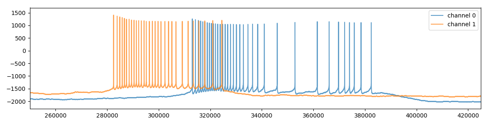

### What are ABF files?

The field of cellular electrophysiology uses highly-sensitive voltage and current measurement devices to gain insights into the electrical properties of biological membranes. Voltage-clamp and current-clamp circuits are used to measure the flow of ions through ion channels embedded in small patches of cell membranes. This technique is called _patch-clamp electrophysiology_, and Axon Instruments (now a division of Molecular Devices) sells patch-clamp systems (including amplifiers, digitizers, and software) which are commonly used by electrophysiologists in scientific research environments. Electrophysiological data produced by theses systems is saved in Axon Binary Format (ABF) files. Their patch-clamp analysis software suite (pCLAMP) includes acquisition software (Clampex) and analysis software (ClampFit) which can read and write ABF files.

### ABF File Format

Axon Binary Format (ABF) files are encoded in a proprietary format. In the late 90s and early 2000s the file structure of ABF files was documented in the Axon SDK, allowing third party software (such as Mini Analysis by Synaptosoft, Inc.) to easily read data from ABF files. In 2006 pCLAMP 10 was released, featuring a new file format (ABF2) which was intentionally undocumented. Programmers seeking to write software to analyze ABF files were told that they must exclusively interact with ABFs through a closed-source, 32-bit, Windows-only DLL (abffio.dll) provided with the Axon pCLAMP SDK.

> "_One of the goals of the ABF reading routines is to isolate the applications programmer from the need to know anything other than the most basic information about the file format. ABF 2.0 now uses a header of variable length.  This means that it is now essential to use the ABFFIO.DLL library to access the data._" 
 -[ABF User Guide](http://mdc.custhelp.com/euf/assets/software/FSP_ABFHelp_2.03.pdf) (page 9)

### History of pyABF

The pyABF project began in 2017 as a collection of documentation about the ABF file format assembled with the goal of providing platform-independent and language-agnostic resources for programmers who desired to write their own ABF file readers. A Python module was created to demonstrate how to read header values and data from ABF1 and ABF2 files, and grew in features as more about the ABF file format was discovered. Eventually the potential utility of this module to scientists interested in writing analysis software using Python (and especially those using non-Windows environments) became apparent, and pyABF was packaged and released on PyPi. 

Since its release on PyPi, pyABF has continued to mature thanks in a large part to the correspondence and contributions from the open-source community. Commits to the GitHub project and new releases on PyPi have decreased in frequency as pyABF has stabilized in recent years, which is a sign the pyABF package has matured. This page remains as a testament to all of the work that initially went into deciphering the ABF file format, and may serve as a useful guide to programmers interested in writing ABF reading software in additional languages.

### Evolution of this Document

This page contains a blend of information I learned by inspecting the work of previous designers, supplemented with code examples and insights I discovered myself. A lot of my understanding initially came from reviewing what open-source ABF-reading projects were available, and I have tried to credit all of these developers by listing their projects at the bottom of this document. 

Characterization of previously-undocumented features (e.g., extracting digital output command waveforms from the ABF header) was primarily achieved by inspecting ABFs in a hex editor, comparing files byte-by-byte, and modifying individual bytes of ABF files to see how they changed when viewed in ClampFit.

> ⚠️ **WARNING:** This document was assembled from several smaller documents and has been extensively modified over the years. While some efforts have been made to ensure internal consistency, users who intend to study this document are encouraged to consider code examples for their interpretive value rather than treat them as copy/paste-ready sources of truth. The source code of the pyABF module is a much better reference for working code, and is backed by numerous tests.

# Table of Contents



## Reading the ABF Header

For the following examples we will be inspecting the content of ABF files in the [/data/](/data/) folder. Note that all header values of all ABFs in the [/data/](/data/) folder are provided in both markdown and HTML formats. I recommend reviewing example ABF headers in that folder while studying this document.

> 💡 **TIP:** Many ABF2 header variables have highly confusing names. Most of these names are evolutionarily conserved from the ABF1 file format. The [ABF1 file format notes](../abf1-file-format) have definitions for all variables, so if you're trying to figure out what an ABF2 header value represents the answer may be found in the ABF1 documentation.

### Reading Structured Data
Text files are usually UTF-8 encoded ASCII characters, where every 8-bit byte corresponds to a single character. On the other hand, binary files can contain variables which span multiple bytes, and they're not always directly mappable to ASCII characters. 

Since ABF files are binary, we need to open them with the `'rb'` mode. We can then read a certain number of bytes with `read(numBytes)`:

```python
f = open("14o08011_ic_pair.abf", 'rb')
byteString = f.read(16)
f.close()
```

Now let's display the 16 bytes we read:

```python
b'ABF2\x00\x00\x00\x02\x00\x02\x00\x00\x03\x00\x00\x00'
```

Notice the message starts with `b` - that means this is a _bytestring_ object, not a string! If a byte corresponds to an ASCII character ([on the chart](https://www.asciitable.com)), it is displayed by that character. If the character isn't ASCII, it's displayed in [hexadecimal](https://en.wikipedia.org/wiki/Hexadecimal) format. If you count the number of bytes visually, you'll identify 16: 4 characters (`'ABF2'`) and 12 hexadecimal codes (each starting with `\x`).

Let's display the same message as a list of integers. Calling `list()` on a bytestring does this conversion:

```python
byteList = list(byteString)
print(byteList)
```

We then observe a list of 16 integers, each representing one of the bytes in the bytestring:

```
[65, 66, 70, 50, 0, 0, 0, 2, 0, 2, 0, 0, 3, 0, 0, 0]
```

As we would predict from the [ASCII table](https://www.asciitable.com), `'A'`, `'B'`, `'F'`, and `'2'`, correspond to integers `65`, `66`, `70`, and `50`.

### Determine if a File is ABF1 or ABF2
Notice the first 4 characters are `'ABF2'`. This is how you know this is an ABF2 format ABF file. ABF1 files start with `'ABF '` where the 4th character is a space (ASCII 32). Therefore the fastest way to determine if a file is ABF1 or ABF2 is to determine if the 4th byte of the file is `50` or `32`.

If the file is ABF1, check out the [ABF1 file format notes](../abf1-file-format).

### Reading Multi-byte Integers from Bytestrings

I happen to know that the number of sweeps in an episodic ABF2 file is a four-byte unsigned integer formed from bytes 13, 14, 15, and 16. One way to read just these 4 bytes is to use the `seek()` method of the file object to go to byte 13, then just read-out 4 bytes. Note that to read byte 1 you'd `seek(0)`, so to read byte 13 you'd `seek(12)`.

```python
f.seek(12)
byteString = f.read(4)
byteList = list(byteString)
print(byteList)
```

The output is then 4 bytes:

```
[3, 0, 0, 0]
```

The [struct](https://docs.python.org/2/library/struct.html) package lets us convert bytestrings into python objects as long as we know what format they are in (e.g., this value is a 4-byte, 32-bit, unsigned integer). According to the [list of struct format characters](https://docs.python.org/2/library/struct.html#format-characters), this data type corresponds to the C `unsigned int` and has the format `I`. 

This program uses `struct.unpack()` to pull an `I`-formatted value from the 4 bytes starting at the 13th byte of the file.

```python
import struct

f = open("14o08011_ic_pair.abf", 'rb')
f.seek(12)
byteString = f.read(4)
f.close()

numSweeps = struct.unpack("I", byteString)
print(numSweeps)
```

The output is what you'd expect:
```
(3,)
```

Notice it's a [tuple](https://www.w3schools.com/python/python_tuples.asp). It doesn't really matter, just expect `struct.unpack()` to always return tuples. In my code I often convert them to lists right away because I frequently change the content of items in the returned data, and tuples are immutable.

### Writing a Function to Read Structured Data

Since we will be reading lots of structured data, our lives get easier if we can write a function to simplify it. Notice that I use `struct.calcsize()` to determine how many bytes we must `read()`.

```python
def readStruct(f, structFormat, seekTo=-1):
  if seekTo>=0:
    f.seek(seekTo)
  byteCount = struct.calcsize(structFormat)
  byteString = f.read(byteCount)
  value = struct.unpack(structFormat, byteString)
  return list(value)
```

I can now call it multiple times easily. Also note that to retrieve multiple values of the same type, send a string format with a number before the character. A struct format of `'5I'` will return a tuple of 5 integers, `'4b'` will return a list of 4 bytes, and `'4s'` will a list of 4 characters.

```python
f = open("14o08011_ic_pair.abf", 'rb')
print(readStruct(f, "4s", 0))
print(readStruct(f, "I", 12))
f.close()
```

Now we can tell this is an ABF2 file with 3 sweeps:

```
[b'ABF2']
[3]
```

To convert a character-containing bytestring to a string object, use `.decode()`. I usually add extra arguments to ensure it decodes ASCII and doesn't crash if it encounters a non-character code.

```python
value1 = readStruct(f, "4s", 0)[0]
print(value1)
value2 = value1[0].decode("ascii", errors="ignore")
print(value2)
```

You can recognize the bytestring from the `b`, and the second line is a true string:

```
b'ABF2'
ABF2
```

### Byte Maps and Structured Data

How did I know that the 4 bytes starting at byte position 13 contained an unsigned integer indicating the number of sweeps in the ABF? It's because I have a _byte map_ for the ABF2 header, and the same data values are always at the same positions. There is another byte map for ABF1 files. You can find these byte maps (derived from _structs_ found in C headers and other source code) in the [structures.py](/src/pyabf/structures.py) file of the pyABF source code.

### ABF1 Header

Reading the ABF1 header is very simple. The same variables are always found at the same byte positions. This code can be used to read the entire ABF1 header. 

Extensive notes are available on the [ABF1 file format notes](../abf1-file-format.md.html) page.

```python
fFileSignature = readStruct(f, "4s", 0)
fFileVersionNumber = readStruct(f, "f", 4)
nOperationMode = readStruct(f, "h", 8)
lActualAcqLength = readStruct(f, "i", 10)
nNumPointsIgnored = readStruct(f, "h", 14)
lActualEpisodes = readStruct(f, "i", 16)
lFileStartTime = readStruct(f, "i", 24)
lDataSectionPtr = readStruct(f, "i", 40)
lTagSectionPtr = readStruct(f, "i", 44)
lNumTagEntries = readStruct(f, "i", 48)
lSynchArrayPtr = readStruct(f, "i", 92)
lSynchArraySize = readStruct(f, "i", 96)
nDataFormat = readStruct(f, "h", 100)
nADCNumChannels = readStruct(f, "h", 120)
fADCSampleInterval = readStruct(f, "f", 122)
fSynchTimeUnit = readStruct(f, "f", 130)
lNumSamplesPerEpisode = readStruct(f, "i", 138)
lPreTriggerSamples = readStruct(f, "i", 142)
lEpisodesPerRun = readStruct(f, "i", 146)
fADCRange = readStruct(f, "f", 244)
lADCResolution = readStruct(f, "i", 252)
nFileStartMillisecs = readStruct(f, "h", 366)
nADCPtoLChannelMap = readStruct(f, "16h", 378)
nADCSamplingSeq = readStruct(f, "16h", 410)
sADCChannelName = readStruct(f, "10s"*16, 442)
sADCUnits = readStruct(f, "8s"*16, 602)
fADCProgrammableGain = readStruct(f, "16f", 730)
fInstrument
= readStruct(f, "16f", 922)
fInstrumentOffset = readStruct(f, "16f", 986)
fSignalGain = readStruct(f, "16f", 1050)
fSignalOffset = readStruct(f, "16f", 1114)
nDigitalEnable = readStruct(f, "h", 1436)
nActiveDACChannel = readStruct(f, "h", 1440)
nDigitalHolding = readStruct(f, "h", 1584)
nDigitalInterEpisode = readStruct(f, "h", 1586)
nDigitalValue = readStruct(f, "10h", 2588)
lDACFilePtr = readStruct(f, "2i", 2048)
lDACFileNumEpisodes = readStruct(f, "2i", 2056)
fDACCalibrationFactor = readStruct(f, "4f", 2074)
fDACCalibrationOffset = readStruct(f, "4f", 2090)
nWaveformEnable = readStruct(f, "2h", 2296)
nWaveformSource = readStruct(f, "2h", 2300)
nInterEpisodeLevel = readStruct(f, "2h", 2304)
nEpochType = readStruct(f, "20h", 2308)
fEpochInitLevel = readStruct(f, "20f", 2348)
fEpochLevelInc = readStruct(f, "20f", 2428)
lEpochInitDuration = readStruct(f, "20i", 2508)
lEpochDurationInc = readStruct(f, "20i", 2588)
nTelegraphEnable = readStruct(f, "16h", 4512)
fTelegraphAdditGain = readStruct(f, "16f", 4576)
sProtocolPath = readStruct(f, "384s", 4898)
```

A detailed description of which variables are useful is in the [ABF File Reading Sequence](#ABF%20File%20Reading%20Sequence) section. 

### The ABF2 Header

Reading the ABF2 header is similarly simple, as those variables are always found at the same byte positions too. This code can read the ABF2 header, but it's important to note that ABF2 files have many more additional variables stored throughout the file. These data values are stored in _sections_, which we will review later. For now, you can use the code we've already written to read all these variables from the ABF2 header.

Notice that we only `seek()` once. This is because after reading a struct, the position of the file read buffer has been moved by the size of the struct. Unlike ABF1 headers which have irregularly-spaced data values, almost all ABF2 variable lists can be read consecutively without having to `seek()` from byte to byte.

```python
fb.seek(0)
fFileSignature = readStruct(f, "4s")
fFileVersionNumber = readStruct(f, "4b")
uFileInfoSize = readStruct(f, "I")
lActualEpisodes = readStruct(f, "I")
uFileStartDate = readStruct(f, "I")
uFileStartTimeMS = readStruct(f, "I")
uStopwatchTime = readStruct(f, "I")
nFileType = readStruct(f, "H")
nDataFormat = readStruct(f, "H")
nSimultaneousScan = readStruct(f, "H")
nCRCEnable = readStruct(f, "H")
uFileCRC = readStruct(f, "I")
FileGUID = readStruct(f, "I")
unknown1 = readStruct(f, "I")
unknown2 = readStruct(f, "I")
unknown3 = readStruct(f, "I")
uCreatorVersion = readStruct(f, "I")
uCreatorNameIndex = readStruct(f, "I")
uModifierVersion = readStruct(f, "I")
uModifierNameIndex = readStruct(f, "I")
uProtocolPathIndex = readStruct(f, "I")
```

A detailed description of which variables are useful is in the [ABF File Reading Sequence](#ABF%20File%20Reading%20Sequence) section. 

## Reading ABF Sections
You'll notice the ABF2 header itself contains many fewer values than the ABF1 header. That's because its header values are split into _sections_. There's a DACSection, ADCsection, ProtocolSection, etc.
Some sections (like ProtocolSection) are always "flat" and their corresponding struct of variables only gets read a single time. Other sections can be multidimensional, and their struct variables are read over and over to build an array of values (e.g., the structs for ADCsection get read once per ADC channel).

This is a list of _sections_ contained in ABF2 headers along with a brief description of what they're for:

* **ProtocolSection** - 
This section contains information about the recording settings.
This is useful for determining things like sample rate and
channel scaling factors.

* **ADCSection** - 
Information about the ADC (what gets recorded). 
There is 1 item per ADC.

* **DACSection** - 
Information about the DAC (what gets clamped). 
There is 1 item per DAC.

* **EpochPerDACSection** - 
This section contains waveform protocol information. These are most of
the values set when using the epoch the waveform editor. Note that digital
output signals are not stored here, but are in EpochSection.

* **EpochSection** - 
This section contains the digital output signals for each epoch. This
section has been overlooked by some previous open-source ABF-reading
projects. Note that the digital output is a single byte, but represents 
8 bits corresponding to 8 outputs (7->0). When working with these bits,
I convert it to a string like "10011101" for easy eyeballing.

* **TagSection** - 
Tags are comments placed in ABF files during the recording. Physically
they are located at the end of the file (after the data).
Later we will populate the times and sweeps (human-understandable units)
by multiplying the lTagTime by fSynchTimeUnit from the protocol section.

* **StringsSection** - 
Part of the ABF file contains long strings. Some of these can be broken
apart into indexed strings. 
The first string is the only one which seems to contain useful information.
This contains information like channel names, channel units, and abf 
protocol path and comments. The other strings are very large and I do not 
know what they do.
Strings which contain indexed substrings are separated by \\x00 characters.

* **DataSection** - 
This is the exciting part. It contains the electrophysiological data itself!

_**A note about other sections:** I only read data from the sections listed here.
Other sections are either not useful for my applications, are typically unused,
or have an undocumented struct format and cannot be deciphered._

### Obtaining the Section Map

Each section starts at a different byte position and its values can be read with its own list of structs. Unfortunately, the sections aren't at the same byte location in every ABF file. To discover where each section starts, how big it is, and how many replicates it has, we need to read from the Section Map. Thankfully, the section map is always at the same byte locations:

```python
# Sections I find useful
ProtocolSection = readStruct(f, "IIl", 76)
ADCSection = readStruct(f, "IIl", 92)
DACSection = readStruct(f, "IIl", 108)
EpochSection = readStruct(f, "IIl", 124)
ADCPerDACSection = readStruct(f, "IIl", 140)
EpochPerDACSection = readStruct(f, "IIl", 156)
StringsSection = readStruct(f, "IIl", 220)
DataSection = readStruct(f, "IIl", 236)
TagSection = readStruct(f, "IIl", 252)

# Sections I don't find useful
UserListSection = readStruct(f, "IIl", 172)
StatsRegionSection = readStruct(f, "IIl", 188)
MathSection = readStruct(f, "IIl", 204)
ScopeSection = readStruct(f, "IIl", 268)
DeltaSection = readStruct(f, "IIl", 284)
VoiceTagSection = readStruct(f, "IIl", 300)
SynchArraySection = readStruct(f, "IIl", 316)
AnnotationSection = readStruct(f, "IIl", 332)
StatsSection = readStruct(f, "IIl", 348)
```

Notice that we read a struct format `IIl` for each section, corresponding to `int`, `int`, `long`. This causes all returned values to be a list of 3 numbers which reveals information for each section: 
`[blockNumber, byteCount, itemCount]`.

* `blockNumber` is the byte location where the section starts (each block is 512 bytes)
* `byteCount` is the number of bytes each "read" of the section produces
* `itemCount` is how many times consecutively the section should be read

### Iteratively Reading Structured Data from Sections
If you know how to read structured data at specific byte positions, you'll be able to figure out how
to build arrays of section data by reading the same struct over and over for a given section once you've built the Section Map. The ideal strategy for this will vary depending on programming language.

In Python I found it useful to create classes for each section, and make every variable
a list that gets appended with new values every time the struct is re-read.
These classes (and struct formats) can be found in pyABF's [structures.py](https://github.com/swharden/pyABF/blob/master/src/pyabf/structures.py) file, 
which gets read by the ABFcore class in [core.py](https://github.com/swharden/pyABF/blob/master/src/pyabf/core.py).


### About the StringsSection
The strings section is somewhat confusing, but inside it are channel names, channel units, the path of the ABF protocol used, and comments (tags) in the ABF file. Because the StringsSection itself is so convoluted, I find it useful to make my own "indexedStrings" object (a list of strings). If this indexed string list is created properly, individual strings are pointed to from other variables in other sections (including the ABF2header, ProtocolSection, ADCsection, and DACsection).

The StringsSection isn't like the other sections in the sense that this section doesn't have a rigid struct. Each item is a single string, so if there are 20 items there will be 20 strings. If the byteSize of a string is 123, read it using the struct format `123s`. It will return a bytestring which contains ASCII and non-ASCII characters, so don't try to `.decode()` it too early! 

### Reading Strings from the StringsSection

I start by isolating the first string as it's the only one containing useful information. I still don't know what the other strings are for.

```python
indexedStrings = stringsSection.strings[0]
```

The first chunk of the string contains a lot of garbage, then there's a lot of `\x00` (zero) values, then there's the useful data at the very end (a bunch of strings separated by a single `\x00` each)

I cut-off the junk in the beginning by finding the final location of a double-zero, and chopping off everything before that.

```python
indexedStrings = indexedStrings[indexedStrings.rfind(b'\x00\x00'):]
```

I found that sometimes a mu (µ) is used as part of a unit label and this doesn't `decode()` to ASCII. Therefore I replace it with the letter u which is `\x75` on the [ASCII table](https://www.asciitable.com).

```python
indexedStrings = indexedStrings.replace(b'\xb5', b"\x75")
```

I then split the split on `\x00` bytes and drop-off the first element. This yields a list of bytestrings.

```python
indexedStrings = indexedStrings.split(b'\x00')[1:]
```

Every string should be ASCII formatted, so I `decode()` to make each bytestring a string.

```python
indexedStrings = [x.decode("ascii", errors='replace').strip() for x in indexedStrings]
```

_The difference between using `'ignore'` and `'replace'` in the error argument of `decode()` is that if something goofy happens and non-ASCII characters end up in a string (suggesting I'm parsing it wrong), `'replace'` will make them show up as `\x` hex codes spelled-out in ASCII text letting me know something is wrong._

Note that most other open-source ABF-reading programs don't know how to read this section. They search for key words and try to split upon them. The abfload.m script tries to split on the words `clampex`, `clampfit`, `axoscope`, `patchxpress`. This method makes me a bit uneasy because I noticed in my file `Clampex` is capitalized which could complicate things. Also, I'm not sure if that list is exhaustive. Instead, the splitting-on-double-zero method shown above should keep doing the job. There's nothing preventing you from using both methods (first looking for a keyword, then resorting to a double-zero-split if that fails).

### Determining Indexes for the StringsSection

By now you should have an `indexedStrings` which is a list of strings looking something like this:

```python
indexedStrings = ['', 'Clampex', '', 'C:/path/protocol.pro', 'some comment',
                  'IN 0', 'mV', 'IN 1', 'mV', 'Cmd 0', 'pA', 'Cmd 1', 'pA', 
                  'Cmd 2', 'mV', 'Cmd 3', 'mV']
```

That's nice, but what do they mean? We have to figure out what these strings are by seeing where they're referred to by _index_ in this list as defined in several variables of other sections. 

The first 5 values are in the same order in every ABF file I've seen, but from there it varies from file to file depending on DAC and ADC configuration.

These values are pulled from the ABF2 header:
* `indexedStrings[uModifierNameIndex]` - always blank for me, not sure what it is for
* `indexedStrings[uCreatorNameIndex]` - name of program used to create the ABF
* `indexedStrings[uProtocolPathIndex]` - path to the protocol used
* `indexedStrings[lFileComment]` - file commend defined in the waveform editor

These values are pulled from the ADCSection:
* `indexedStrings[lADCChannelNameIndex]` - name/label of the ADC
* `indexedStrings[lADCUnitsIndex]` - units of the ADC

These values are pulled from the DACSection:
* `indexedStrings[lDACChannelNameIndex]` - name/label of the ADC
* `indexedStrings[lDACUnitsIndex]` - units of the ADC
* `indexedStrings[lDACFilePath]` - path of custom stimulus waveform
* `indexedStrings[nLeakSubtractADC]` - leak subtraction? Usually blank for me.

_Note looking-up values in the ADC and DAC sections are a little more complex than I show here because the indexes are lists of indexes, not single numbers. The indexed strings of ADC and DAC sections will themselves be lists of strings._

### Reading Data from the DataSection
Interestingly, reading data is no different than reading any other series of numbers from a binary file. We could even use the `readStruct()` function we wrote earlier to pull data from the file!

To read sweep data from an ABF, learn about the data section:

```python
f = open("14o08011_ic_pair.abf", 'rb')
DataSection = readStruct(f, "IIl", 236)
print(DataSection)
f.close()
```

This will reveal the blockNumber, byteCount, and itemCount:

```
[9, 2, 3600000]
```

This result tells us the following:
  * ABF data starts at byte 4608 (9*512)
  * Each data point is 2 bytes (probably 16-bit integers)
  * There are 3,600,000 data points in this file

Reviewing the [struct format characters](https://docs.python.org/2/library/struct.html#format-characters) you'll notice that 2-byte integers correspond to the `short` C type and are struct format `h`. 

Lets read the first 10 data values from our ABF file using our `readStruct()` function:

```python
f = open("14o08011_ic_pair.abf", 'rb')
DataSection = readStruct(f, "IIl", 236)
data = readStruct(f, "10h", DataSection[0]*512)
f.close()
print(data)
```

The output is some seriously huge numbers. That's okay, because they're not properly scaled yet. We will tackle that issue later.

```
[-2147, -1839, -2147, -1838, -2147, -1838, -2147, -1837, -2147, -1838]
```

Something to consider is that the `readStruct()` function we wrote is simple and easy to use, but slow for massive amounts of data. [Numpy](http://www.numpy.org) is a Python package which is optimized for working with large amounts of multidimensional numerical data, and it has a function to read structured data directly from binary files into numpy arrays. We will use numpy for handling all ABF data from now on:

```python
import numpy as np
f = open("14o08011_ic_pair.abf", 'rb')
DataSection = readStruct(f, "IIl", 236)
f.seek(DataSection[0]*512)
data = np.fromfile(f, dtype=np.int16, count=DataSection[2])
f.close()
print(data)
```

The output is the same as before, it's just a numpy array, and it contains ALL data in the ABF file.

```
[-2147 -1839 -2147 ..., -1416 -1972 -1417]
```

If you have a single-channel ABF file, you're done! You can plot this data right away.

If you have a multi-channel ABF file, data from each channel is _interleaved_. This means for a 2-channel ABF, to plot one channel you'd need to plot every other data point.

How do you determine how many channels an ABF has? For ABF1 files it's the `nADCNumChannels` value in the header. For ABF2 files I take the third value (itemCount) from the `ADCsection` of the section map.

Let's assume the number of channels is in a `channelCount` variable. The easiest way to _deinterleave_ a numpy array is to reshape it.

After reshaping it, it forms 2 columns. I'd rather have two _rows_ so I can plot my two channels as data[0] and data[1], so it's necessary to use `np.rotate()`. Interestingly this places the channels in opposite order (the last channel is data[0]), so I reverse the order by slapping `[::-1]` at the end.

```python
f = open("14o08011_ic_pair.abf", 'rb')
DataSection = readStruct(f, "IIl", 236)
ADCSection = readStruct(f, "IIl", 92)
channelCount = ADCSection[2]
f.seek(DataSection[0]*512)
data = np.fromfile(f, dtype=np.int16, count=DataSection[2])
data = np.reshape(data, (int(len(data)/channelCount), channelCount))
data = np.rot90(data)[::-1]
f.close()
print(data)
```

The final result is an n-dimensional numpy array where every row is an ADC channel.

```
[[-2147 -2147 -2147 ..., -1971 -1971 -1972]
 [-1839 -1838 -1838 ..., -1417 -1416 -1417]]
```

Take a moment to appreciate we have a header-parsing multi-channel data reading ABF2 file reader in ten lines! Nice.

```python
import matplotlib.pyplot as plt
plt.figure(figsize=(12,3))
for channel in range(channelCount):
    plt.plot(data[channel], label=f"channel {channel}", alpha=.7)
plt.margins(0,0)
plt.tight_layout()
plt.axis([250_000, 425_000, -2300, 1700])
plt.legend()
plt.show()
```

A few lines of [matplotlib](https://matplotlib.org) is all it takes to graph this ABF data by channel:



Horizontal units can be converted to seconds by dividing by the sample rate. How to determine the sample rate is discussed later in this document.

Vertical units can be converted to true units by multiplying the data by a _scaling factor_ which has to be calculated from a variety of header values. Since the data originated as int16, the output of the ADC will span 2^16 units centered at 0 (-32,768 to 32,768), and hence this data is much larger vertically than expected. How to determine the scaling factor is discussed later in this document.


## Creating an ABF File Reader

When pyABF loads an ABF file, the [ABFcore class](/src/pyabf/core.py) reads the contents of the entire ABF header, all sections, and all data, then does all the operations necessary to determine the number of channels, sweeps, sample rate, scaling factor, etc. It is written in such a way that it is agnostic as to whether it loads an ABF1 or ABF2 file. Any software written to analyze ABF files will benefit from reading ABF files in this same sequence. 

In this section I will walk through every step pyABF uses to load ABF files, and mention some of the tricks and surprises I learned along the way. To benefit from advice in these sections it is assumed you have a full understanding of how to read ABF header and data values using the structures outlined in [structures.py](/src/pyabf/structures.py).

To see specific examples code for any of the following sections, simply navigate to that function in the [ABFcore class](/src/pyabf/core.py).

```python
# This is what pyABF does to fully load an ABF file
self._fileOpen()
self._determineAbfFormat()
self._readHeaders()
self._formatVersion()
self._determineCreationDateTime()
self._determineDataProperties()
self._determineDataUnits()
self._determineDataScaling()
self._determineHoldingValues()
self._determineProtocolPath()
self._determineProtocolComment()
self._makeTagTimesHumanReadable()
self._makeUsefulObjects()
self._digitalWaveformEpochs()
self._loadAndScaleData()
self._fileClose()
```


### fileOpen()
* Assert that the file path exists
* Record the `abfID` variable as the filename without the extension
* Open the file in `rb` mode (don't forget to close it later!)
* I like to start timer for benchmarking at this point. [`time.perf_counter()`](https://docs.python.org/3/library/time.html#time.perf_counter) is perfect for this.

### determineAbfFormat()
* Read the first 4 bytes of the ABF file
* If the first 3 bytes aren't `bABF`, it's not a valid file format!
* If byte 4 is a ` ` (space), it's an ABF1 file.
* If byte 4 is a `2`, it's an ABF2 file.

### readHeaders()
The purpose of this section is to read the entire header into memory. For ABF1 files this is just the header struct. For ABF2 files this is the header, section map, and all sub-sections. 

It's a lot of work, but ultimately it's just reading structs from the file buffer exactly like described in the first half of this document. The values from these headers will be used in subsequent sections.

Don't forget all the special work you have to do to create your own indexed StringsSection!

### formatVersion()
ABF file formats have versions more detailed than just "ABF1" and "ABF2". Both headers contain `fFileVersionNumber`, but it's formatted differently in ABF1 and ABF2 files. Unfortunately the versions are different variable formats. I prefer version numbers as `x.x.x.x` strings ([semantic versioning is a documented thing](https://semver.org)), so I convert both to a string version number.

In ABF1 files `fFileVersionNumber` is a `f` (4 byte float):

```python
# for ABF1 files
abfVersion = "%.03f" % fFileVersionNumber
abfVersion = list(abfVersion.replace(".", ""))
abfVersion = ".".join(abfVersion)
```

In ABF2 files `fFileVersionNumber` is a `4b` (4 8-bit integers, in reverse order):

```python
# for ABF2 files
abfVersion = fFileVersionNumber[::-1]
abfVersion = [str(x) for x in abfVersion]
abfVersion = ".".join(abfVersion)
```

Now `abfVersion` contains the  ([semantic versionin](https://semver.org)) of the ABF file regardless of ABF1 or ABF2.

### determineCreationDateTime()
I like to know when the ABF was recorded. 

ABF1 files don't store creation date/time in the header, so I get the file system creation date/time:

```python
# for ABF1 files
abfDateTime = round(os.path.getctime(abfFilePath))
abfDateTime = datetime.datetime.fromtimestamp(abfDateTime)
```

ABF2 files store creation date/time in their header as a combination of `uFileStartDate` and `uFileStartTimeMS`:

```python
# for ABF2 files
startDate = str(uFileStartDate)
startTime = round(uFileStartTimeMS/1000)
startDate = datetime.datetime.strptime(startDate, "%Y%M%d")
startTime = datetime.timedelta(seconds=startTime)
abfDateTime = startDate+startTime
```

### determineDataProperties()
This is where I determine information about the signal data.
This includes things like data rate, number of channels, number of sweeps, etc.
I try to create a set of common variables to store these values, then just figure
out how to set those variables depending on if I'm reading ABF1 or ABF2 files.
Remember that `BLOCKSIZE = 512`

In both ABF1 and ABF2 files the sample rate is
`1e6/fADCSampleInterval` and the number of sweeps is `lActualEpisodes`.

For ABF1 files, the byte location and size of the data is defined in 
`lDataSectionPtr`, `nNumPointsIgnored`, and `lActualAcqLength`:

```python
# for ABF1 files
dataByteStart = lDataSectionPtr*BLOCKSIZE
dataByteStart += nNumPointsIgnored
dataPointCount = lActualAcqLength
channelCount = nADCNumChannels
dataRate = int(1e6 / fADCSampleInterval)
dataSecPerPoint = 1/dataRate
sweepCount = lActualEpisodes
```

For ABF2 files we already discussed how to find the location and size of data using the section map, so there's little new here:

```python
# for ABF2 files
dataByteStart = _sectionMap.DataSection[0]*BLOCKSIZE
dataPointCount = _sectionMap.DataSection[2]
channelCount = _sectionMap.ADCSection[2]
dataRate = int(1e6 / _protocolSection.fADCSequenceInterval)
dataSecPerPoint = 1/dataRate
sweepCount = lActualEpisodes
```

For gap free files, the sweep length will be zero. I tend to treat this as
an episodic file with 1 sweep. In every other sense, that's how it behaves.

Here we are assuming fixed-length sweeps. This is almost always the case, but if it's not read about the Synch Array section below to learn how to calculate each sweep's start time, length, and position in the data section.

### determineDataUnits()
ADC units are what are displayed on the vertical axis of the graphs shown by ClampEx and ClampFit when you load an ABF file.

For ABF1 files the channel units and labels are clearly written in `sADCUnits` and `sADCChannelName`.

For ABF2 files it's not so easy. Units and channels are actually in the strings section, at position indexes indicated in multiple other sections. You'll have to create a custom indexed strings section matching-up these strings with the index values, then pull ADC units and ADC channel names from that. This process is described above in the StringsSection.

### determineDataScaling()
As we saw earlier, directly reading data values as 16-bit integers produces beautiful data (and nice graphs) but the magnitude of the signal is way off. There is a certain multiple and offset which, when applied to this data, re-creates the original waveform. I call this process data scaling, even though technically it's more like scaling and offsetting.

_Usually ABF data is stored as `int`, in which case the data must be multiplied by the scaling factor. If the data type is `float`, the data should not be multiplied by the scaling factor. Indication of data type is in `nDataFormat` which is 0 for `int` and 1 for `float`._

Note: there is an [official explaination](http://mdc.custhelp.com/app/answers/detail/a_id/16852/~/convert-data-file-from-another-program-to-an-abf-file-so-that-it-can-be-read-by) on the sequence of events to scale and offset data.

In this section I don't actually apply the scaling, I just determine how much to scale the data by if/when it's loaded later.

It's important to remember that the scaling may be different for every channel, so this scaling routine produces a scaling factor for every channel (and stores them in a list called `scaleFactors`). I start by setting every scaleFactor to 1.

```python
self.scaleFactors = [1]*channelCount
```

Determining scaling for ABF1 files couldn't be easier:

```python
# for ABF1
for i in range(channelCount):
    scaleFactors[i] = lADCResolution/1e6
```

Unfortunately, ABF2 files require a lot more steps:

```python
# for ABF2
for i in range(channelCount):
    scaleFactors[i] /= fInstrumentScaleFactor[i]
    scaleFactors[i] /= fSignalGain[i]
    scaleFactors[i] /= fADCProgrammableGain[i]
    if nTelegraphEnable:
        scaleFactors[i] /= fTelegraphAdditGain[i]
    scaleFactors[i] *= fADCRange
    scaleFactors[i] /= lADCResolution
    scaleFactors[i] += fInstrumentOffset[i]
    scaleFactors[i] -= fSignalOffset[i]
```

Yes, offsets are to be applied to the _scale factor_, and not the data itself.

By now, you have a list of scale factors (one for each channel) and will be ready for when the data is loaded.

### determineHoldingValues()
When a waveform epoch isn't commanding the DAC clamp value, the holding value is used. Holding values are stored as a list (one item per channel).

In ABF1 files this is `fEpochInitLevel`

In ABF2 files this is `fDACHoldingLevel`

### determineProtocolPath()
If a protocol was used to record the ABF, its stored in the header.

In ABF1 files it's in `sProtocolPath`.

In ABF2 files we should have already prepared the list of indexed strings, and therefore have this value waiting for us in `indexedStrings[uProtocolPathIndex]`.

### determineProtocolComment()
ABF file comments are not supported in ABF1 files.

In ABF2 files we should have already prepared the list of indexed strings, and therefore have this value waiting for us in `indexedStrings[lFileCommentIndex]`.

### makeTagTimesHumanReadable()
If tags are added to ABF2 files, their TagSection will contain lists of items. 
The `sComment` list contains the text of the comments and `lTagTime` contains the
exact time point of each comment. There are problems with both of these lists, and they
need to be cleaned up a bit to be most useful.

First, the comments need to be cleaned up. They're bytestrings (not strings) and they're padded with spaces.

```python
tagComments = [x.decode("ascii", errors='ignore').strip() for x in sComment]
```

Next, tag times are in crazy units. Let's convert them to seconds. This can be done by multiplying each by `fSynchTimeUnit` then dividing it by `1e6`.

```python
tagTimesSec = [x*fSynchTimeUnit/1e6 for x in lTagTime]
```

Regarding `nTagType`, like the [ABF1 header ABF Tag Section](../abf1-file-format#the-abf-tag-section), the number of this value indicates which type of tag each tag represents:

* `0` for time tag
* `1` for comment tag
* `2` for external tag
* `3` for voice tag

### makeUsefulObjects()
By this point, virtually all of the header data has been loaded.
I take this opportunity to create helpful objects. One of such is
a list pre-populated with channel numbers, and another with sweep numbers.

```python
channelList = list(range(self.channelCount))
sweepList = list(range(self.sweepCount))
```

This lets me rapidly loop through sweeps anywhere in my code like:

```python
for sweepNumber in sweepList:
  print("I'm on sweep", sweepNumber)
```

### digitalWaveformEpochs()
The waveform editor doesn't just let you control DAC values, it also lets you
control the ON/OFF state of digital outputs. This section creates a 2d array 
indicating the high/low state (1 or 0) of each digital output (rows) for each 
epoch (columns).

```python
numOutputs = nDigitizerTotalDigitalOuts
byteStatesByEpoch = nEpochDigitalOutput
numEpochs = len(byteStatesByEpoch)
digitalWaveformEpochs = np.full((numOutputs, numEpochs), 0)
for epochNumber in range(numEpochs):
    byteState = bin(byteStatesByEpoch[epochNumber])[2:]
    byteState = "0"*(numOutputs-len(byteState))+byteState
    byteState = [int(x) for x in list(byteState)]
    digitalWaveformEpochs[:, epochNumber] = byteState[::-1]
print(digitalWaveformEpochs)
```

DAC waveform generation is discussed in detail below.

### loadAndScaleData()
The final thing to do when loading an ABF is to read its sweep data. We already
discussed above how to load data with numpy and arrange it as a multidimensional
array. Here I show how to use numpy to scale the data too.

Ideally we defined `dataByteStart`, `dataPointCount`, and `channelCount`
in earlier sections. This makes the data reader ABF version agnostic, 
identically supporting ABF1 and ABF2 formats.

```python
# loaddata as a numpy array
f.seek(dataByteStart)
raw = np.fromfile(f, dtype=dtype, count=dataPointCount)
raw = np.reshape(raw, (int(len(raw)/channelCount), channelCount))
raw = np.rot90(raw)
raw = raw[::-1]

# multiply each channel by its scale factor
data = np.empty(raw.shape, dtype='float32')
for i in range(channelCount):
    data[i] = np.multiply(raw[i], scaleFactors[i], dtype='float32')
```

_Usually ABF data is stored as `int`, in which case the data must be multiplied by the scaling factor. If the data type is `float`, the data should not be multiplied by the scaling factor! Indication of data type is in `nDataFormat` which is 0 for `int` and 1 for `float`._

### fileClose()
You're completely done! All header values are read, and all data is loaded in 
memory.

* terminate the performance counter, and calculate the load time
* close the file (earlier opened in `rb` mode)

### Reading Sweep Data
Although `data` holds the entire data in the ABF organized by channel, often
you just want to analyze data sweep by sweep. I like to create a `sweepX` and
`sweepY` variable for easy graphing.

```python
pointStart = sweepPointCount * sweepNumber
pointEnd = pointStart + sweepPointCount
sweepY = data[channel, pointStart:pointEnd]
sweepX = np.arange(len(sweepY))*dataSecPerPoint
```

Note that sweepX is "sweep time", always starting at zero. If absolute time is required, add an extra line to offset it by the start time of this sweep:

```python
sweepX += sweepNumber * sweepLengthSec
```

## Epoch Table Stimulus Waveforms
Information about DAC epochs is stored in EpochPerDACSection. The `_updateStimulusWaveform()` function in [core.py](/src/pyabf/core.py) reads this section and can generate a stimulus waveform for a particular channel of a given sweep. This is often unnecessary computational effort as the stimulus waveform is rarely graphed, so perform this task with reservation.

In the waveform editor tab you can select the "type" of epoch (step, pulse, ramp, etc.). Disabled is type 0, step is type 1, and ramp is type 2. Additional steps exist, but I haven't written stimulus generator code (yet) for them. I'll refer you to [core.py](/src/pyabf/core.py) to see the latest stimulus waveform generation code.

Note also that [core.py](/src/pyabf/core.py) contains a `sweepD()` function which returns the stimulus waveform of
a digital output. Since we generated the digital output matrix as part of `digitalWaveformEpochs()` a few steps back, this waveform is simple to generate. 

```python
states = digitalWaveformEpochs[digitalOutputNumber]
sweepD = np.full(sweepPointCount, 0)
for epoch in range(len(states)):
    sweepD[epochPoints[epoch]:epochPoints[epoch+1]] = states[epoch]
```

Now the given digital output waveform is in `sweepD` to compliment `sweepX` and `sweepY`.

## Synch Array

The synch array stores information about where in the ABF file sweep data starts and stops. This is really only useful for ABFs with variable-length sweeps. The synch array has a length equal to the number of sweeps, and each item contains two numbers: a start time (in `fSynchTimeUnit ` time units) and a sweep length (in multiplexed sample units). Both numbers are unsigned 32-bit integers.

To read variable-length sweep data from the data array it is helpful to have a list of sweep start positions and sweep lengths ready to go. I found this is easiest to accomplish by cycling through the synch array, adding the length of each sweep as I go to get a running total of previous sweep lengths to serve as an indication of the data offset for each successive sweep. The time offset is only useful when generating time values to accompany sweep ADC values.

## Additional Resources

### Official Documents and Software
* Official [Axon Binary Format (ABF) User Guide](http://mdc.custhelp.com/euf/assets/software/FSP_ABFHelp_2.03.pdf) (3rd party cache)
* [pCLAMP 10 download page](http://mdc.custhelp.com/app/answers/detail/a_id/18779/~/axon™-pclamp™-10-electrophysiology-data-acquisition-%26-analysis-software) for pCLAMP, ClampFit, and AxoScope
* [Historical pCLAMP User Guides](http://mdc.custhelp.com/app/answers/detail/a_id/18747/session/L2F2LzEvdGltZS8xNTI5Nzc5MDQ2L3NpZC9TdEZxa1hQbg%3D%3D)
* [pCLAMP ABF File Support Pack](http://mdc.custhelp.com/app/answers/detail/a_id/18881/~/axon™-pclamp®-abf-file-support-pack-download-page) provides abffio.dll and some documentation\
_The official download link stopped working some time between June and December 2018, but its content is [mirrored on GitHub](https://github.com/swharden/pyABF/tree/master/docs/advanced/AxonSDK)_

### Other ABF-reading Projects
* [vsABF](https://github.com/swharden/vsABF) is a modern .NET interface to the ABF format (which _does_ use abffio.dll) I wrote to make it easier to read ABF header values and sweep data using C#.
* [phpABF](https://github.com/swharden/phpABF) is a PHP implementation of the concepts described on this page. I find this project useful for developing web-interfaces to organize electrophysiology projects, as it allows access to common header values (ABF protocol, tag comments, sweep length, etc.) in a PHP environment.
* [BioSig](https://github.com/dongzhenye/biosignal-tools/tree/master/biosig4c%2B%2B/t210) has some C/CPP code which appears to be modified Axon Library Files
  * [abfheader.h](https://github.com/dongzhenye/biosignal-tools/blob/master/biosig4c%2B%2B/t210/abfheadr.h) - 
Defines the ABFFileHeader structure and provides prototypes for functions implemented in ABFHEADR.CPP for reading and writing ABFFileHeaders
  * [axon_structs.h](https://github.com/dongzhenye/biosignal-tools/blob/master/biosig4c%2B%2B/t210/axon_structs.h) - brief header containing all structures of ABF
  * [sopen_abf_read.c](https://github.com/dongzhenye/biosignal-tools/blob/master/biosig4c%2B%2B/t210/sopen_abf_read.c) - reads data from ABF files
* [abf2load.m](https://github.com/fcollman/abfload) is a MatLab interface for ABF files originally written by Harald Hentschke. It is now maintained by Forrest Collman on GitHub.
* [StimFit](https://github.com/neurodroid/stimfit) ([abflib.cpp](https://github.com/neurodroid/stimfit/blob/master/src/libstfio/abf/abflib.cpp)) is C++ ABF reader
* [Neo](https://github.com/NeuralEnsemble/python-neo) ([axonrawio.py](https://github.com/NeuralEnsemble/python-neo/blob/master/neo/rawio/axonrawio.py)) has a Python ABF1 and ABF2 reader based on a port of abfload.m
* [QUB Express](https://qub.mandelics.com/) ([data_abf.py](https://qub.mandelics.com/src/qub-express/qubx/data_abf.py)) interacts with abffio.dll from Python
* [libabf](https://github.com/yamad/libabf/blob/master/docs/goals.rst) is a portable C library for reading and writing ABF files

### Electrophysiology Equipment and Theory
* [Axoclamp-2B theory and operation](https://neurophysics.ucsd.edu/Manuals/Axon%20Instruments/Axoclamp-2B_Manual.pdf)
* [pCLAMP 10 User Guide](https://neurophysics.ucsd.edu/Manuals/Axon%20Instruments/pCLAMP10-User-Guide-RevA.pdf)

### Programming Concepts
* [Python struct format characters](https://docs.python.org/2/library/struct.html#format-characters)
* [Numpy.fromfile()](https://docs.scipy.org/doc/numpy-1.13.0/reference/generated/numpy.fromfile.html)
* [Numpy's built-in dataypes](https://docs.scipy.org/doc/numpy-1.13.0/reference/arrays.scalars.html#arrays-scalars-built-in)