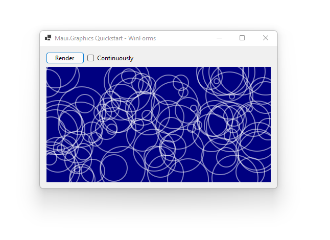

This page describes how to draw using Maui.Graphics from a Windows Forms application.

<div class='text-center img-border'>



</div>

#### 1. Create a WinForms Application

```sh
dotnet new WinForms
```

#### 2. Add NuGet Packages

```sh
dotnet add package Microsoft.Maui.Graphics --prerelease
dotnet add package Microsoft.Maui.Graphics.Skia --prerelease
dotnet add package SkiaSharp.Views.WindowsForms --prerelease
```

#### 3. Add a SkiaSharp Control

Drag a `SKGLControl` from the toolbox and drop it onto your Form.

#### 4. Draw Graphics

Double-click the `SKGLControl` to create a `PaintSurface` EventHandler and method where you can add your drawing code:

```cs
private void skglControl1_PaintSurface(object sender, SkiaSharp.Views.Desktop.SKPaintGLSurfaceEventArgs e)
{
    ICanvas canvas = new SkiaCanvas() { Canvas = e.Surface.Canvas };

    canvas.FillColor = Colors.Navy;
    canvas.FillRectangle(0, 0, skglControl1.Width, skglControl1.Height);

    canvas.StrokeColor = Colors.White.WithAlpha(.5f);
    canvas.StrokeSize = 2;
    for (int i = 0; i < 100; i++)
    {
        float x = Random.Shared.Next(skglControl1.Width);
        float y = Random.Shared.Next(skglControl1.Height);
        float r = Random.Shared.Next(5, 50);
        canvas.DrawCircle(x, y, r);
    }
}
```

#### 5. Render on Events

It is often a good idea to re-render when the window size changes

```cs
private void skglControl1_SizeChanged(object s, EventArgs e) => skglControl1.Invalidate();
```

You can also request renders manually or automatically using a timer

```cs
private void button1_Click(object s, EventArgs e) => skglControl1.Invalidate();
```

```cs
private void timer1_Tick(object s, EventArgs e) => skglControl1.Invalidate();
```

## Resources

* [Download the source code for this project](https://github.com/swharden/Maui.Graphics/tree/main/projects)