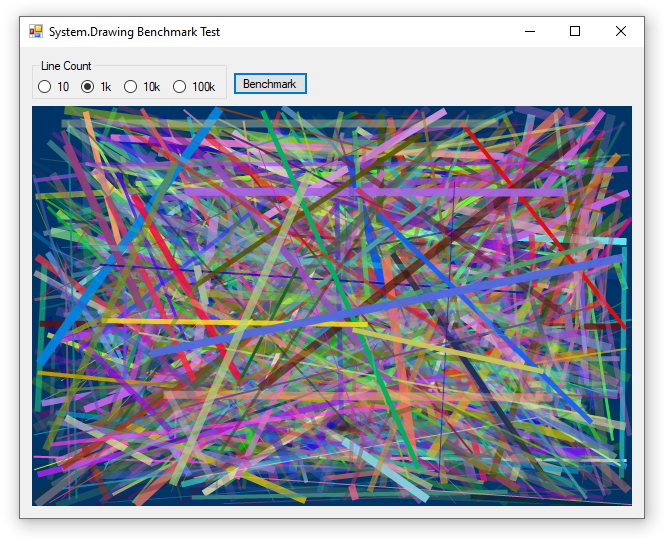

**This set of articles will look beyond `System.Drawing` at some of the currently-available alternative options for 2D drawing libraries.** To compare performance of different rendering libraries we will use a common benchmark image which is simply a blue background with random lines on it that vary by position, size, and color.

## Benchmark Strategy

* **Size:** `800x600` - A fixed size (and intentionally _not_ supporting dynamic resizing as the window changes) will simplify the code for our performance tests.

* **Background:** `#003366` will be used instead of black to ensure our background is indeed drawn.

* **Line Position:** Random _integer_ coordinates for every line. Lines must me contained entirely within the drawing area.

* **Line Width:** Random integer (1-10px) for every line.

* **Line Color:** Random color (and alpha) for every line.

* **Line Count:** `10`, `1k`, `10k`, or `100k` - Speed of some rendering systems depends on the _total area_ of drawn structures, while other systems may depend on the _total number of objects_ drawn.

* **Clear Lines:** Lines from one render will not be visible in the next render.

* **Random number generator:** Re-seed at 0 for every test.

* **Repetitions:** We will report the mean render time of the first `10` frames rendered.

* **Anti-aliasing:** Will be used if available.

* **Alpha Type:** Premultiplied (8, 8, 8, 8)

* **Display:** Display time will be included in the benchmark. For example, if buffered display requires creating or copying a Bitmap, the copy time will be included in the benchmark. However, we won't force our application to actually draw to the screen (so render + display time is not limited by the screen's refresh rate).

* **Optimizations:** Realistic optimizations will be employed for this test. These will vary by library and be library-specific, but in general:
  * Rendering must occur in a single threaded
  * Bitmaps will be created once (not on every render)
  * Styling objects are to be created inside the render loop but can be reused across lines (rather than get new'd for every line)

* **Platform:** .NET Framework 4.7.2, 64-bit, debug mode. While all libraries in these experiments support .NET Core, the benchmark test application will target .NET Framework because at the time of writing the Windows Forms visual editor is not available for .NET Core.

## Benchmark Results

* Values shown are the time required to render 1 image.
* Times < 5 sec are the mean of 10 renders
* Times preceded by ~ are predicted times and not measured

Drawing Library | 10 lines | 1k lines | 10k lines | 100k lines
---|---|---|---|---
System.Drawing | 0.614 ms | 28.350 ms | 278.477 ms | 2.834 sec
ImageSharp | 60.874 ms | 2.981 sec | 29.276 sec | ~5 min
SkiaSharp | 12.777 ms | 97.011 ms | 352.343 ms | 3.493 sec
SkiaSharp + OpenGL | 2.973 ms | 6.588 ms | 40.765 ms | 422.217 ms
WPF Primitives | 0.678 ms | 45.575 ms | 539.807 ms | 6.081 sec
WPF DrawingVisual | 1.684 ms | 44.027 ms | 431.367 ms | 4.509 sec

### Performance vs. Render Area
These stats were created using a 600 x 400 pixel image. A 1920 x 1080 display is over 8 times more pixel area than the test image used here. System.Drawing's performance decreases as pixel area increases (especially when drawing filled shapes) so for full-screen drawing WPF and SkiaSharp (especially with OpenGL) begin to offer a strong advantage.

## Conclusions

* System.Drawing is simple, works on all platforms (with the System.Drawing.Common NuGet package), and demonstrates competitive performance. Its main drawbacks are that it is not thread-safe and manages memory poorly.

> ⚠️ **Warning: System.Drawing.Common now only supports Windows!**\
> See [Cross-Platform Support for `System.Drawing`](../../system.drawing/cross-platform) for more information and what you can do about it.

* ImageSharp works on all modern .NET platforms and may be the most platform-flexible way to generate static images where memory management and/or thread safety is critical.

* WPF primitive objects can create graphics and animations in WPF applications, but this option is best for cases where only a limited number of objects are drawn.

* SkiaSharp with OpenGL is the most performant option for displaying complex animations (especially at full-screen sizes) but you have to pay attention to your build configuration to get it right.

## Source Code

* System.Drawing: [Form1.cs](https://github.com/swharden/Csharp-Data-Visualization/blob/master/dev/old/drawing/alternate/SystemDrawing/Form1.cs)
* ImageSharp [Form1.cs](https://github.com/swharden/Csharp-Data-Visualization/blob/master/dev/old/drawing/alternate/ImageSharpBenchmark/Form1.cs)
* WPF [MainWindow.xaml](https://github.com/swharden/Csharp-Data-Visualization/blob/master/dev/old/drawing/alternate/WpfBenchmark/MainWindow.xaml) and [MainWindow.xaml.cs](https://github.com/swharden/Csharp-Data-Visualization/blob/master/dev/old/drawing/alternate/WpfBenchmark/MainWindow.xaml.cs)
* SkiaSharp [Form1.cs](https://github.com/swharden/Csharp-Data-Visualization/blob/master/dev/old/drawing/alternate/SkiaSharpBenchmark/Form1.cs)
* SkiaSharp with OpengGL [Form1.cs](https://github.com/swharden/Csharp-Data-Visualization/blob/master/dev/old/drawing/alternate/SkiaSharpOpenGLBenchmark/Form1.cs)
