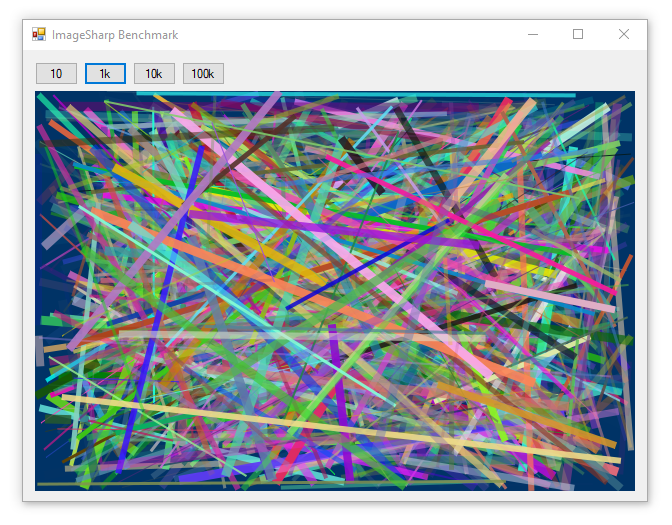

**[ImageSharp](https://github.com/SixLabors/ImageSharp) is a 2D graphics library developed by [Six Labors](https://sixlabors.com/).** Compared to System.Drawing, ImageSharp uses more modern paradigms like memory management, thread safety, and functional styles, and strives to be flexible and extensible. Development is partially supported by contributions through [Open Collective](https://opencollective.com/sixlabors).

ImageSharp is provided under the [Apache 2.0 License](https://github.com/SixLabors/ImageSharp/blob/master/LICENSE) which requires modifications to be open-sourced and projects to carry NOTICE files into derivative works along with a copy of the Apache 2.0 license. An [alternative commercial license](https://sixlabors.com/pricing/license) is available for annual purchase which may be more suitable for closed-source commercial applications.



<div class="text-center">
<div class="mx-auto d-inline-block">

Drawing Library | 10 lines | 1k lines | 10k lines | 100k lines
---|---|---|---|---
System.Drawing | 0.614 ms | 28.350 ms | 278.477 ms | 2.834 sec
ImageSharp | 60.874 ms | 2.981 sec | 29.276 sec | ~5 min

_Benchmarks are from SixLabors.ImageSharp.Drawing 1.0.0-beta0007_

</div>
</div>

### Rendering

The gist here is that you create an `Image`, then `Mutate` it with an `imageContext` (function) that does all the drawing. Afterwords you can save it (in memory) as a `Bitmap`, then display it on a Picturebox. 

Displaying a Bitmap on a Picturebox is preferred because the Picturebox is natively double-buffered, eliminating flickering often observed when animations rapidly update the underlying Image.

```cs

using (var image = new Image<SixLabors.ImageSharp.PixelFormats.Rgba32>(600, 400))
{
    image.Mutate(imageContext =>
    {
        // draw background
        var bgColor = SixLabors.ImageSharp.PixelFormats.Rgba32.FromHex("#003366");
        imageContext.BackgroundColor(bgColor);

        int lineCount = 1000;
        for (int i = 0; i < lineCount; i++)
        {
            // create an array of two points to make the straight line
            var points = new SixLabors.Primitives.PointF[2];
            points[0] = new SixLabors.Primitives.PointF(
                x: (float)(rand.NextDouble() * pictureBox1.Width),
                y: (float)(rand.NextDouble() * pictureBox1.Height));
            points[1] = new SixLabors.Primitives.PointF(
                x: (float)(rand.NextDouble() * pictureBox1.Width),
                y: (float)(rand.NextDouble() * pictureBox1.Height));

            // create a pen unique to this line
            var lineColor = SixLabors.ImageSharp.Color.FromRgba(
                r: (byte)rand.Next(255),
                g: (byte)rand.Next(255),
                b: (byte)rand.Next(255),
                a: (byte)rand.Next(255));
            float lineWidth = rand.Next(1, 10);
            var linePen = new SixLabors.ImageSharp.Processing.Pen(lineColor, lineWidth);

            // draw the line
            imageContext.DrawLines(linePen, points);
        }
    });

    // render onto an Image
    var stream = new System.IO.MemoryStream();
    image.SaveAsBmp(stream);
    System.Drawing.Image img = System.Drawing.Image.FromStream(stream);

    // dispose the old image before displaying the new one
    pictureBox1.Image?.Dispose();
    pictureBox1.Image = img;
}
```

### Maximizing Performance

#### Use 64-bit
Make sure you run a 64-bit build. This may be required to support hardware acceleration as well:

```cs
Debug.WriteLine($"This is a {IntPtr.Size * 8}-bit application");
```

```
This is a 64-bit application
```

#### Ensure SMID is used

ImageSharp can use [single instruction, multiple data (SIMD)](https://en.wikipedia.org/wiki/SIMD) for hardware-accelerated drawing. Check to ensure SMID is enabled:

```cs
if (System.Numerics.Vector.IsHardwareAccelerated)
    Debug.WriteLine($"hardware acceleration ENABLED");
else
    Debug.WriteLine($"hardware acceleration DISABLED");
```

## Conclusions

### Advantages

* Fully managed memory (less prone to memory leaks)
* Free of system-wide process locks (better thread safety)
* Supports mobile platforms which may not support System.Drawing.Common
* Targets .NET Standard 1.3, supporting back to .NET Framework 4.6.0 and .NET Core 1.0
 
> 💡 **In the early days of .NET Core, System.Drawing could only be used in .NET Framework applications.** In May, 2018 [`System.Drawing.Common`](https://www.nuget.org/packages/System.Drawing.Common/) (targeting .NET Standard) brought System.Drawing support to .NET Core environments. These topics are discussed in a [2017 article by Clinton Ingram](https://photosauce.net/blog/post/5-reasons-you-should-stop-using-systemdrawing-from-aspnet) and a [2018 article by Scott Hanselman](https://www.hanselman.com/blog/HowDoYouUseSystemDrawingInNETCore.aspx).

> ⚠️ **Warning: System.Drawing.Common now only supports Windows!**\
> See [Cross-Platform Support for `System.Drawing`](../../system.drawing/cross-platform) for more information and what you can do about it.

### Disadvantages

* ImageSharp has similar performance to System.Drawing when drawing simple images, but falls short when drawing large numbers of objects. ImageSharp's slow drawing performance is attributed to it being "beta quality", as noted on the [imagesharp.drawing documentation](https://docs.sixlabors.com/articles/imagesharp.drawing/).

## Source Code

GitHub: [ImageSharpBenchmark](https://github.com/swharden/Csharp-Data-Visualization/blob/master/dev/old/drawing/alternate/ImageSharpBenchmark)
