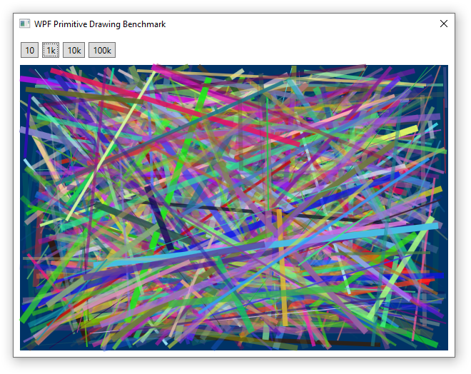

**This article demonstrates how to draw graphics using WPF primitive objects.** The allure of drawing this way is that the programmer can simply place objects and WPF will display them using a separate thread (with DirectX acceleration). We will also take a closer look at the use of `DrawingVisual` which can be used to display graphics with a slight performance enhancement.



<div class="text-center">
<div class="d-inline-block">


Drawing Library | 10 lines | 1k lines | 10k lines | 100k lines
---|---|---|---|---
System.Drawing | 0.614 ms | 28.350 ms | 278.477 ms | 2.834 sec
WPF Primitives | 0.678 ms | 45.575 ms | 539.807 ms | 6.081 sec
WPF DrawingVisual | 1.684 ms | 44.027 ms | 431.367 ms | 4.509 sec

</div>
</div>

## Layout

```xml
<Grid>
    <StackPanel>

        <!-- row of buttons -->
        <StackPanel Orientation="Horizontal">
            <Button Content="10" Click="Button10_Click" />
            <Button Content="1k" Click="Button1k_Click" />
            <Button Content="10k" Click="Button10k_Click" />
            <Button Content="100k" Click="Button100k_Click" />
        </StackPanel>

        <!-- benchmark image -->
        <Canvas x:Name="myCanvas" Width="600" Height="400" />

    </StackPanel>
</Grid>
```

## Render with WPF Primitives

* The background isn't drawn (we never have to fill a defined area or draw a large rectangle or something), but instead is simply defined as the `Background` property of the `Canvas`.

* Objects may get displayed outside the `Canvas`. For example, very thick lines may have edges that lie outside the bounds of the Canvas. This is apparent in the screenshot at the top of the page near the center of the upper edge of the drawing area.

* In this example lines are created with each frame, then cleared at the start of the next frame. A lot of memory must be allocated to draw each frame (since so many new objects are created), so this benchmark definitely strains WPF's capabilities.

```cs
private void Render(int lineCount)
{
    int width = (int)myCanvas.ActualWidth);
    int height = (int)myCanvas.ActualHeight;

    // clear lines from the previous render
    myCanvas.Children.Clear();

    var bgColor = (Color)ColorConverter.ConvertFromString("#003366");
    myCanvas.Background = new SolidColorBrush(bgColor);

    for (int i = 0; i < lineCount; i++)
    {
        var p1 = new Point(rand.Next(width), rand.Next(height));
        var p2 = new Point(rand.Next(width), rand.Next(height));
        var lineGeom = new LineGeometry { StartPoint = p1, EndPoint = p2 };

        var lineColor = Color.FromArgb(
            a: (byte)rand.Next(255),
            r: (byte)rand.Next(255),
            g: (byte)rand.Next(255),
            b: (byte)rand.Next(255));

        Path linePath = new Path
        {
            Stroke = new SolidColorBrush(lineColor),
            StrokeThickness = rand.Next(1, 10),
            Data = lineGeom
        };

        // add this line to the canvas
        myCanvas.Children.Add(linePath);
    }
}
```

## Render with DrawingVisual

* `DrawingVisual` is a WPF drawing class that does not provide layout or event handling so it offers improved performance. 

* This rendering style is more like System.Drawing where a Bitmap is created, then displayed in an `Image`. When this method is used objects cannot hang over the edge of the Canvas they are displayed in.

```cs
private void Render(int lineCount)
{
    int width = (int)myCanvas.ActualWidth);
    int height = (int)myCanvas.ActualHeight;

    myCanvas.Children.Clear();

    var bgColor = (Color)ColorConverter.ConvertFromString("#003366");
    myCanvas.Background = new SolidColorBrush(bgColor);

    // create a visual and a drawing context
    DrawingVisual drawingVisual = new DrawingVisual();
    DrawingContext drawingContext = drawingVisual.RenderOpen();
    for (int i = 0; i < lineCount; i++)
    {
        var p1 = new Point(rand.Next(width, height);
        var p2 = new Point(rand.Next(width, height));

        var lineColor = Color.FromArgb(
            a: (byte)rand.Next(255),
            r: (byte)rand.Next(255),
            g: (byte)rand.Next(255),
            b: (byte)rand.Next(255));

        var pen = new Pen(new SolidColorBrush(lineColor), rand.Next(1, 10));

        // draw lines onto the visual's drawing context
        drawingContext.DrawLine(pen, p1, p2);
    }
    drawingContext.Close();

    // render the visual on a bitmap
    var bmp = new RenderTargetBitmap(
        pixelWidth: (int)myCanvas.ActualWidth, 
        pixelHeight: (int)myCanvas.ActualHeight, 
        dpiX: 0, dpiY: 0, pixelFormat: PixelFormats.Pbgra32);
    bmp.Render(drawingVisual);

    // create a new Image to display the bitmap, then add it to the canvas
    Image image = new Image();
    image.Source = bmp;
    myCanvas.Children.Add(image);
}
```

## Conclusions
* Does not get slow as image size increases
* Ideal for small numbers of objects drawn on an large area
* Ideal for objects that are placed and modified (rather than being deleted and re-created with each frame)
* Under-performs System.Drawing when large numbers of objects are drawn
* Ideal for simple GUI animations (like a spinning logo)

## Resources
* [WPF Graphics Rendering Overview](https://docs.microsoft.com/en-us/dotnet/framework/wpf/graphics-multimedia/wpf-graphics-rendering-overview)
* [How to: Create a Line Using a LineGeometry](https://docs.microsoft.com/en-us/dotnet/framework/wpf/graphics-multimedia/how-to-create-a-line-using-a-linegeometry)
* [Optimizing Performance: 2D Graphics and Imaging](https://docs.microsoft.com/en-us/dotnet/framework/wpf/advanced/optimizing-performance-2d-graphics-and-imaging)
* [Using DrawingVisual Objects](https://docs.microsoft.com/en-us/dotnet/framework/wpf/graphics-multimedia/using-drawingvisual-objects)

## Source Code
GitHub: [WPF Primitive Benchmark](https://github.com/swharden/Csharp-Data-Visualization/tree/main/dev/old/drawing/alternate/WpfBenchmark)