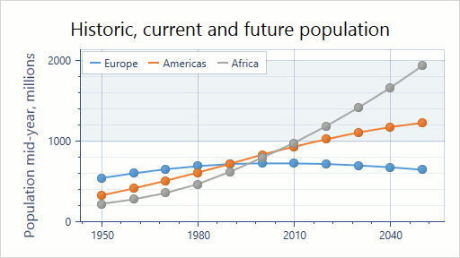
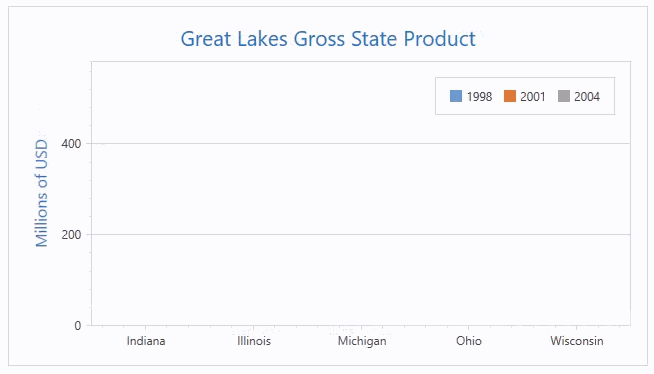
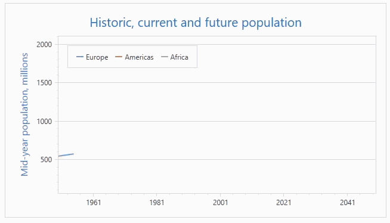
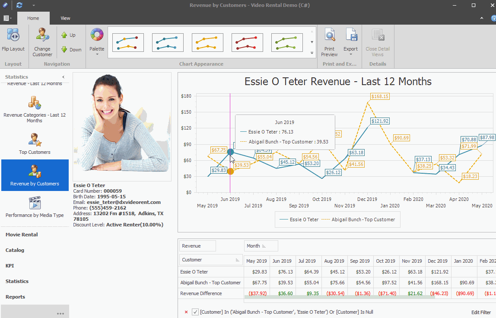
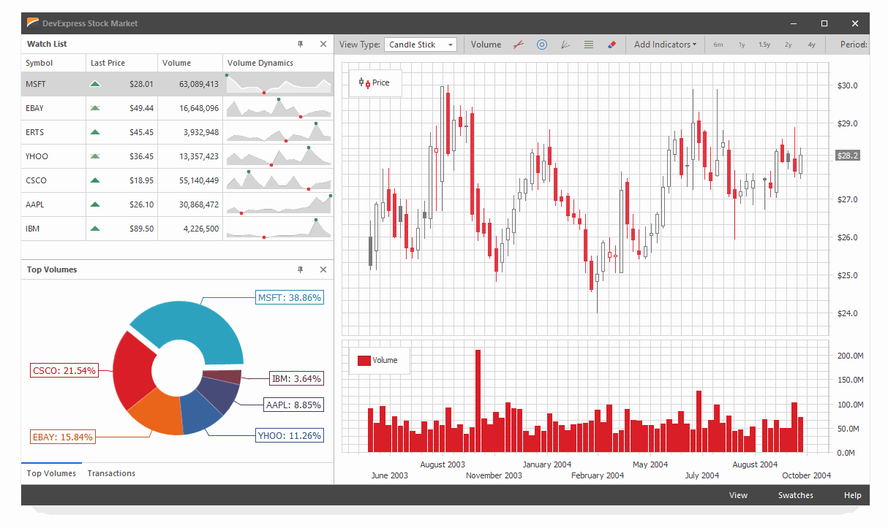
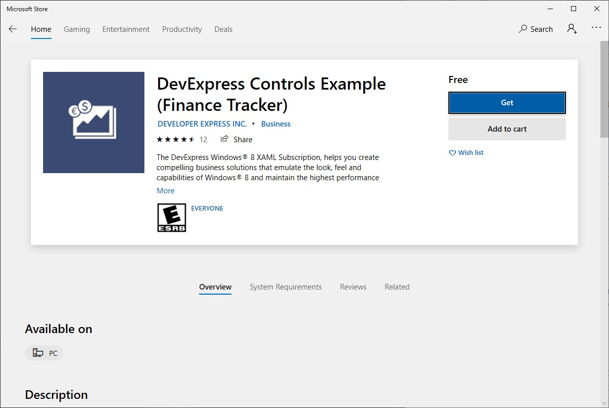
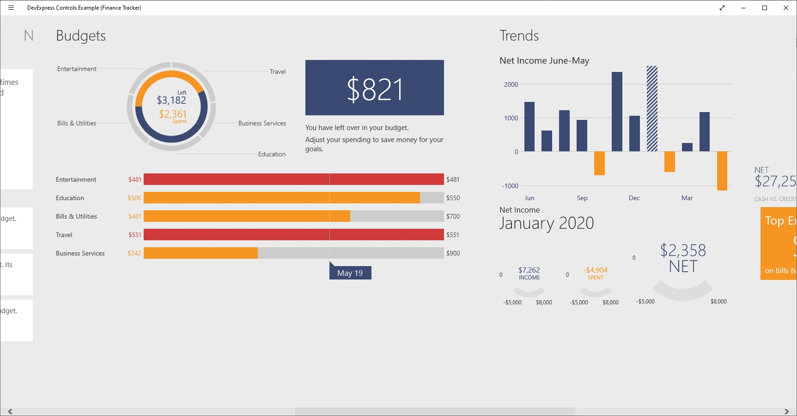

**The [WPF Charting](https://www.devexpress.com/Products/NET/Controls/WPF/Charting/) package by DevExpress provides user controls for creating interactive and animated charts in .NET applications.** DevExpress makes many controls for [Windows Forms](https://www.devexpress.com/products/net/controls/winforms/) and [WPF](https://www.devexpress.com/products/net/controls/wpf/), and charting controls are just one part of their large collection of UI components offered. When their charting controls are put under a magnifying glass and examined in isolation, I don't find them particularly impressive compared to similar controls designed by teams who only produce charting software.

## Price

According to the [DevExpress pricing section](https://www.devexpress.com/Products/NET/Controls/WPF/Charting/#Pricing) in 2022 the controls cost:

* **$899/year for WPF charting controls only**
* **$1,499/year for WPF and WinForms charting controls**
* **$2,199/year for all charting controls (including mobile) and source code**

## Examples and Documentation

**The [WPF Controls Documentation](https://docs.devexpress.com/WPF/114223/controls-and-libraries/charts-suite/chart-control/fundamentals/series-fundamentals/2d-series-types) is an extensive collection of images and ~~code~~ notes describing how to create every graph type.** From what I gather this is another MVVC-style view system. You create some type of series object (model), pass it into a diagram type (view), then assign/modify the model's data. 

**Unfortunately I'm struggling to find concise start-to-finish code examples** that show complimentary XAML, CS, and an output figure. The GitHub projects that demonstrate primary plot types are _almost_ useful, but since they have only source code and not an image of their output they're not particularly helpful unless they're downloaded, compiled, and executed.

Bar Chart | Line Graph
---|---
 | 

**Flipping through the demos on the [WPF Charting website](https://www.devexpress.com/Products/NET/Controls/WPF/Charting/) I'm struck by how much _movement_ these charts contain.** I thought I'd know what a bar graph would look like, but when I click it to see the demo I see animated bars growing into position. When I click a scatter plot I see lines growing and markers popping into view. 

**I respect the effort that goes into coding animated graphs like that, but I can't picture what type of application would actually benefit from _animated_ scatter plots appearing in view.** It's hard to emphasize how off-putting I find this. A graph that takes 5 seconds to animate to achieve its final position means I have to sit there and wait for the animation to stop before I can even assess the data represented by the graph. Such an effect may fit in as a score history chart in a video game, or maybe some metric in a weather app, but is noting I'd want to see in a serious scientific application.

## Demo Application

**I was initially attracted to this project because the [WPF Charting](https://www.devexpress.com/Products/NET/Controls/WPF/Charting/) page looked so interesting.** I tried for a very long time to run a meaningful demo to check out this charting library, but the only demos I could find weren't very impressive the charting department.

**Most demos on the [DevExpress demo page](https://www.devexpress.com/support/demos/) require activating a trial subscription.** Demo links direct to `dxdemo://` URLs which apparently requires the DevExpress trial program to be installed on your personal computer and configured in your browser. I find this absolutely revolting. Curiosity overcame my frustration though, and I threw in the towel and downloaded and installed the trial so I could view the demos. Props to DevExpress for letting me opt-out of phone-home notifications to their server during the installation process.

Revenue Demo | Stock Demo
---|---
 | 

This is interesting, but I'm not particularly impressed compared to some of the other options out there.

DevExpress has a demo program in the Microsoft Store. Maybe some of the charting controls will be prominently displayed in it...

Windows Store Installer | Budgets Demo
---|---
 | 

**This demo app is crazy! I'm so confused right now.** It scrolls horizontally instead of vertically, and I almost didn't notice! The vertical content goes off the page too and there's no way to access it. Maybe I need to buy a larger monitor? These are the only graphs in the app. I'm guessing this app isn't intended to showcase the charting controls after all.

## Conclusion

Due to the lack of a meaningful demo I wasn't really able to assess the charting controls. The lack of such a demo is... perhaps an indication the charting controls are under-developed, or at least not the primary focus of the development team.