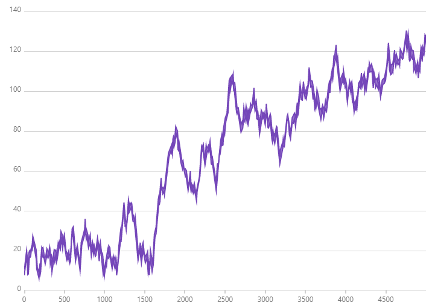

**Infragistics has [charting tools for a variety of platforms](https://www.infragistics.com/products/ultimate) including Windows Forms and WPF.** They seem to actively develop a wide variety of controls for many frameworks (including web platforms), and that diffusion of effort leaves them with a charting library that is interesting and looks nice, but isn't really the type of thing I'd want to integrate into a scientific desktop application.

## Price

According to their [pricing page](https://www.infragistics.com/how-to-buy/product-pricing) in 2022 they have two plans that include WPF and WinForms controls. The only difference is that the "ultimate" plan contains "Indigo.Design" which according to their [getting started guide](https://www.infragistics.com/products/indigo-design/help/getting-started) seems to be a tool to generate tests and Angular code from Sketch and Adobe XD files.

* **Professional: $1,295 / year per developer**
* **Ultimate: $1,495 / year per developer**

It looks like platform controls can be [purchased individually](https://www.infragistics.com/how-to-buy/product-pricing#individual-products):

* **Windows Forms: $995 / year per developer**
* **WPF: $995 / year per developer**

## Demo

**Infragistics has a [Windows Forms Reference Application](https://www.infragistics.com/products/ultimate#reference-apps) you can use to check out their controls.** It's huge (351 MB) and contains a ZIP of a MSI you must install before you can use. When it launches it tries to get you to review a modern-UI sample application, and you have to drill down into their legacy demo to access details about their charting control.

**I didn't find any of these charts to be particularly performant or interactive,** so after a quick flip through these examples I was happy to put this project down and move on. I'm sure it's great for data grids and UI-focused application development, but as a scientist trying to graph data that's just not what I'm looking for.

## Conclusions

The charting demos work, but they're not particularly interactive, and clearly not the primary focus of this development team. This seems to be a miscellaneous control product, not really one that focuses specifically on charting. 