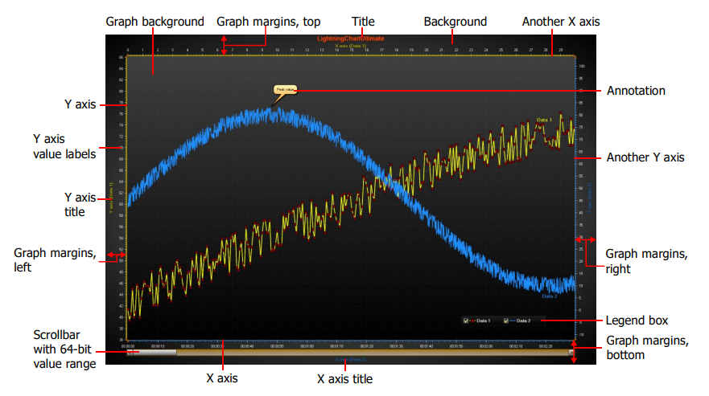

**LightningChart is a commercial .NET charting library for Windows.** It renders using DirectX and can be used in systems with or without hardware acceleration. Because of its high price I imagine LightningChart targets developers creating high-earning applications, and that casual individual developers are not its intended audience. 



## Usage

**I cannot locate any source code samples on the LightningChart website,** so I am unable to comment on its API. It does not have a publicly accessible demo either, so I cannot comment on its performance or usability. They do have a 30 day free trial which probably comes with some example source code, but it is not accessible without a name and phone number so I will not be evaluating that.

* Perhaps LightningChart's [JavaScript examples](https://lightningchart.com/lightningchart-js-interactive-examples/) are similar to their .NET offerings? They run in the browser without requiring a sign-up, they are more easily evaluated.

* The [LightningChart user manual](https://lightningchart.com/wp-content/uploads/LightningChart-User%27s-manual-rev10.4.pdf) has some source code examples, but it is focused more on styling and customization than simple demonstrations of how to use the control.

* I ended-up asking ChatGPT how to use LightningChart, and it provided some useful code examples (although I'm unable to evaluate if they compile or behave as expected). The following code is adapted from the response to my prompt: "I have x data [1, 2, 3, 4] and y data [1, 4, 9, 16]. How do I display these data as a line plot using the LightningChart .NET control for Windows Forms?"

```cs
public partial class Form1 : Form
{
    readonly LightningChartUltimate MyChart;

    public Form1()
    {
        InitializeComponent();

        // create a chart control and add it to the Form
        MyChart = new() { Dock = DockStyle.Fill };
        Controls.Add(MyChart);

        // crete a X/Y data series
        XYChartSeries series = new(
            MyChart.ViewXY, 
            MyChart.ViewXY.XAxes[0], 
            MyChart.ViewXY.YAxes[0]);

        // populate the data series with values
        double[] xData = { 1, 2, 3, 4 };
        double[] yData = { 1, 4, 9, 16 };
        for (int i = 0; i < xData.Length; i++)
            series.Points.AddXY(xData[i], yData[i]);

        // add the data series to the chart
        MyChart.ViewXY.PointLineSeries.Add(series);

        // style the chart
        MyChart.ViewXY.XAxes[0].Title.Text = "Horizontal Label";
        MyChart.ViewXY.YAxes[0].Title.Text = "Vertical Label";

        // refresh the chart to update the display
        MyChart.ViewXY.AxisLayout.Suspend();
        MyChart.ViewXY.AxisLayout.AutoAdjustMargins = true;
        MyChart.ViewXY.AxisLayout.Resume();
        MyChart.ViewXY.UpdateLayout();
        MyChart.Update();
    }
}
```

## Pricing

There is not a simple price for LightningChart packages, but instead a [matrix of customizations](https://lightningchart.com/net-charts/pricing/) that determines the price depending on various platform, chart type, and support options users wish to purchase. At the time of writing (mid 2023), here's how I would summarize it:

* **Base product: $1,375/year** to develop for a single platform (e.g., WinForms) with support for only X/Y plots. The base price is multiplied by a factor if you want support for other plot types:

* **Additional Chart Types:** It seems the base product comes with only support for X/Y plots, and additional packages including more chart types are available at additional cost:
  * 3D: **1.4x price**
  * 3D, polar, smith, maps, and signal plots: **1.75x price**
  * 3D, polar, smith, maps, signal, and volume rendering: **2.3x price**

* **Support: getting ten support tickets is 2x the price**, but unlimited support tickets are available for 2.5x the price. Note that every product comes with 2 support tickets included. It looks like support tickets can also be purchased in packs of 3 or 5 at $100 each.

* **Multi-platform licenses are about 1.4x the price**, allowing developers to target WPF, WinForms, and UWP.

**If I were developing a scientific application today** I would be interested in the package with multi-platform charting with support for signal plots and unlimited support tickets, which would run me **$5,775/year**.

**Enterprise Pricing:** I started writing this without scrolling down their [pricing page](https://lightningchart.com/net-charts/pricing/) and now I see there's a whole different pricing system for Enterprise Packages, and it doesn't seem to be public and the only way to discover pricing is to request a quote.

## Conclusions

LightningChart seems like a strong product at a high price aimed at professional application developers creating lucrative products. As an independent open-source developer, I'm not their primary audience. Without a demo application I can run without signing-up, it's hard to evaluate its performance on my system. Without source code examples available on their website, it's hard to evaluate their API or documentation.

If you have experience using LightningChart, let me know what you think! I would love to include more information here from somebody more familiar with their product.

## Resources

* [LightningChart Gallery](https://lightningchart.com/net-charts/gallery/)
* [LightningChart YouTube demo of X/Y plots](https://www.youtube.com/watch?v=9CA-6o4ybmQ)