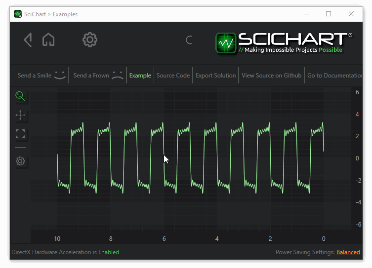
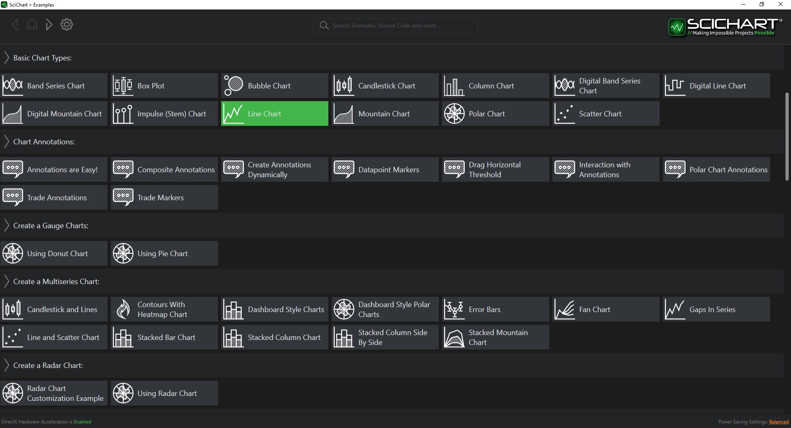
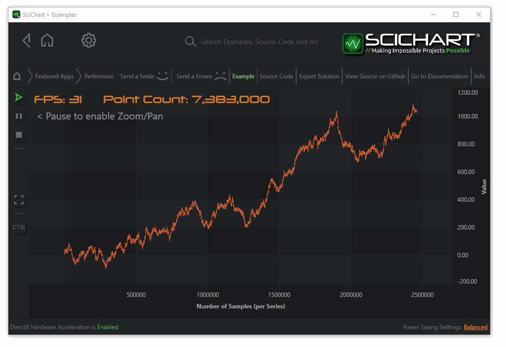

**SciChart is a commercial charting library for .NET for high performance interactive charting.** Although they have mobile (iOS and Android) libraries, here we will take a closer look at their WPF charts library. It may be possible to use this control in Windows Forms applications with [ElementHost](https://docs.microsoft.com/en-us/previous-versions/dotnet/netframework-3.5/ms754008(v=vs.90)) or [more modern](https://docs.microsoft.com/en-us/dotnet/framework/wpf/advanced/walkthrough-hosting-a-wpf-composite-control-in-windows-forms) techniques, but their core product is intended for use in WPF applications.



**SciChart strikes a nice balance of performance and aesthetic.** These charts benefit from DirectX (Windows), OpenGL (Android), or Metal (iOS) hardware acceleration, and controls are extensively themeable and have many customizable behaviors. The SciChart trial application demonstrates many plot types, and the intuitive controls, well-balanced visuals, and subtle animations are the best I've seen in this class of software.

## Price
According to the [SciChart store](https://store.scichart.com/) in 2022:

* $1,699 / year per developer for binaries for 2D charts for Windows
* $1,999 / year per developer for binaries for 2D charts for all platforms
* $2,299 / year per developer for binaries for 2D and 3D charts for Windows
* $2,999 / year per developer for binaries for 2D and 3D charts for all platforms
* $3,999 / year per developer for full source code

## Demo

The [SciChart examples website](https://www.scichart.com/example/) shows many sample charts with source code. Let's take a closer look at the [line chart example](https://www.scichart.com/example/wpf-line-chart-example/) shown in the screenshot at the top of the page. 



Most styling and behavior customization is achieved by writing XAML:

```xml
<ext:SciChartInteractionToolbar TargetSurface="{Binding Source={x:Reference Name=sciChart}}"/>

<!--  Create the chart surface  -->
<s:SciChartSurface x:Name="sciChart" Grid.Column="1">

    <!--  Declare RenderableSeries  -->
    <s:SciChartSurface.RenderableSeries>
        <s:FastLineRenderableSeries x:Name="lineRenderSeries" Stroke="#FF99EE99" StrokeThickness="2">
            <s:FastLineRenderableSeries.SeriesAnimation>
                <s:SweepAnimation AnimationDelay="0:0:1" Duration="0:0:5"/>
            </s:FastLineRenderableSeries.SeriesAnimation>
        </s:FastLineRenderableSeries>
    </s:SciChartSurface.RenderableSeries>

    <!--  Create an X Axis with GrowBy  -->
    <s:SciChartSurface.XAxis>
        <s:NumericAxis DrawMajorBands="True" FlipCoordinates="True" GrowBy="0.1, 0.1"/>
    </s:SciChartSurface.XAxis>

    <!--  Create a Y Axis with GrowBy. Optional bands give a cool look and feel for minimal performance impact  -->
    <s:SciChartSurface.YAxis>
        <s:NumericAxis DrawMajorBands="True" GrowBy="0.5, 0.5"/>
    </s:SciChartSurface.YAxis>

</s:SciChartSurface>
```

Data must be loaded into custom objects to be displayed in the chart:

```cs
private void LineChartExampleView_OnLoaded(object sender, RoutedEventArgs e)
{            
    // Create a DataSeries of type X=double, Y=double
    var dataSeries = new XyDataSeries<double, double>();

    lineRenderSeries.DataSeries = dataSeries;

    var data = DataManager.Instance.GetFourierSeries(1.0, 0.1);

    // Append data to series. SciChart automatically redraws
    dataSeries.Append(data.XData, data.YData);
    
    sciChart.ZoomExtents();
}
```

## Performance

**The SciChart demo has a performance example which simulates live incoming data (1,000 points every 20 ms).** Comfortable interactive frame rates are achieved even when the dataset has millions of points. YouTime videos exist demonstrating SciChart displaying [1 billion](https://www.youtube.com/watch?v=YokLTaj6xvY), [10 billion](https://www.youtube.com/watch?v=XB7rZYUcKvY), and [64 billion](https://www.youtube.com/watch?v=wBJ7r9rTs_4) data points.



## Conclusions

**SciChart's excellent performance, extensive documentation, and options for paid support make it an appealing option for integration into commercial software products.** It has a hefty price tag, but the cost may be worth it for companies whose earning potential is pinned to the quality of the charting controls in their software products. 

SciChart's [Comparison of SciChart vs. Open Source Chart controls](https://www.scichart.com/comparison-of-scichart-vs-open-source-chart-controls/) page makes a strong case that "free" software comes with drawbacks like limited bugfixes, risk of project abandonment, no guarantee of support, etc. While these may not be compelling arguments against using open-source software for hobby projects, paying for a commercial charting control run by a team of developers and support staff has benefits which appeal to enterprise clients that profit directly from their software.

> 💡 **Update:** In March, 2022 I had a brief conversation with with SciChart's founder [Dr. Andrew Burnett-Thompson](https://www.scichart.com/about-us/) about the role of SciChart in an environment where open-source alternatives exist. Andrew was very supportive of open-source projects and their maintainers, and noted that SciChart is a professional product created for enterprises which stand to benefit from the superior quality and support that paying for a commercial charting library can provide.

## Resources
* [SciChart WPF SDK Documentation](https://www.scichart.com/documentation/win/current/SciChart_WPF_SDK_User_Manual.html)
* [SciChart WPF Tutorials](https://www.scichart.com/documentation/v5.x/Tutorial%2001%20-%20Referencing%20SciChart%20DLLs.html)
* [SciChart Community FAQs (Forums)](https://www.scichart.com/questions)
* [WPF Chart Examples with Source-Code](https://www.scichart.com/wpf-chart-examples)