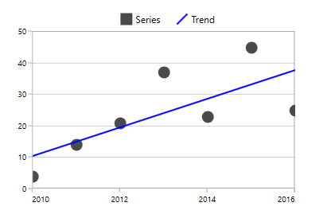
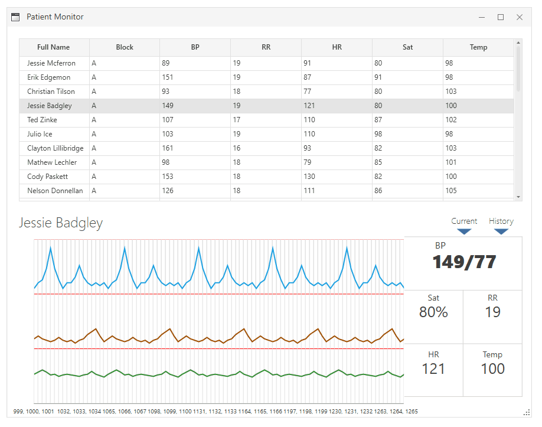

**Syncfusion's SfChart control is available for many platforms including Windows Forms, WPF, UWP, Xamarin, and even JavaScript (Angular, React, and Vue).** Their [demos page](https://www.syncfusion.com/demos) is quite impressive, and it's particularly interesting that the same types of plots available in the WPF controls are [viewable in your browser](https://ej2.syncfusion.com/vue/demos/#/material/chart/histogram.html) using JavaScript.



**SfChart's documentation is easy and accessible.** They have working demos paired with source code showing how to generate all types of plots (e.g., [Bubble and Scatter in WPF Charts](https://help.syncfusion.com/wpf/charts/seriestypes/bubbleandscatter)). They also have controls for more specialized charting, like the [SfSmithChart](https://help.syncfusion.com/wpf/smith-chart/overview) for making [Smith Charts](https://en.wikipedia.org/wiki/Smith_chart).


The [Migrating from Microsoft Chart to SfChart](https://help.syncfusion.com/wpf/charts/migrating-from-chart-to-sfchart) guide makes it easy to learn how to use SfChart for those who already have a strong grasp of Microsoft's Chart module.

## Price

According to their [pricing page](https://www.syncfusion.com/sales/products) in 2022

* $995 / year per developer for one set of controls (e.g., WinForms or WPF)
* $2,495 / year per developer for all controls
* prices decrease after the first year

## Demo

A WPF demo can now be downloaded from [appcenter](https://install.appcenter.ms/orgs/syncfusion-demos/apps/wpf-demos/distribution_groups/release) and run as described in [this help page](https://help.syncfusion.com/wpf/samples). Plots are smooth, but do not seem to be interactive to allow panning or zooming with the mouse.



## Line Plot

Let's take a closer look at their "fast charts" line plot demo. 


Most of the styling and behavior of charts is controlled with XAML:

```xml
<chart:SfChart 
    x:Name="FastLine" 
    Height="450" 
    Width="750" 
    AreaBorderBrush="#8e8e8e" 
    HorizontalAlignment="Center">

    <chart:SfChart.Header>
        <TextBlock 
        FontSize="24" 
        Foreground="Black" 
        FontFamily="Segoe UI" 
        Margin="0,20,0,10">Weather Report</TextBlock>
    </chart:SfChart.Header>
    
    <chart:SfChart.Behaviors>
        <chart:ChartZoomPanBehavior/>
    </chart:SfChart.Behaviors>

    <chart:SfChart.PrimaryAxis>
        <chart:CategoryAxis 
            x:Name="axis1" 
            Header="Months"  
            LabelFormat="MMM/dd"  
            LabelTemplate="{StaticResource labelTemplate}"  
            HeaderTemplate="{StaticResource headerTemplate}">
        </chart:CategoryAxis>
    </chart:SfChart.PrimaryAxis>

    <chart:SfChart.SecondaryAxis>
        <chart:NumericalAxis 
            RangePadding="Round"  
            LabelFormat="0.00" 
            Header="Temperature" 
            HeaderTemplate="{StaticResource headerTemplate}"   
            Interval="5"
            LabelTemplate="{StaticResource labelTemplate}">
        </chart:NumericalAxis>
    </chart:SfChart.SecondaryAxis>

    <chart:FastLineSeries 
        x:Name="StackingAreaSeries" 
        ShowTooltip="True" 
        chart:ChartTooltip.EnableAnimation="True" 
        XBindingPath="Date" 
        YBindingPath="Value" 
        Label="Expenditures">
    </chart:FastLineSeries>

</chart:SfChart>
```

The code-behind uses MVVM to manage data and update the plot:

```cs
DataGenerator _viewModel = new DataGenerator();
ObservableCollection<Data> collection = _viewModel.GenerateData();
FastLine.Series[0].ItemsSource = collection; 
```

## Resources

* [Getting Started with WPF Charts (SfChart)](https://help.syncfusion.com/wpf/charts/getting-started) _includes video_