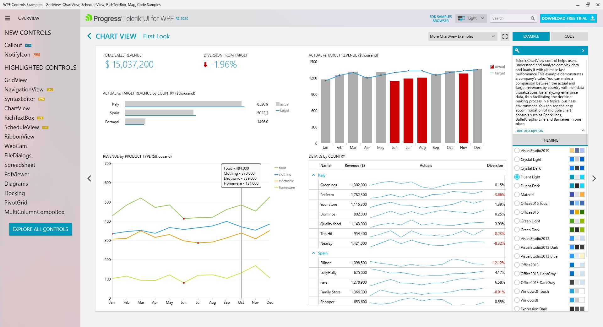
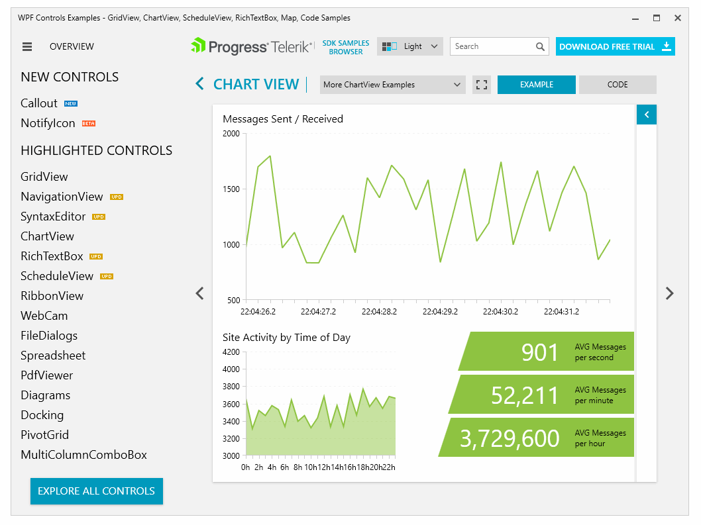

**Telerik sells a suite of UI components which includes ChartView, a control for data visualization.** Information on [WPF ChartView](https://www.telerik.com/products/wpf/chartview.aspx) and [WinForms ChartView](https://www.telerik.com/products/winforms/chartview.aspx) is found on separate pages. It appears this control was built for easy theming and supports animations for simple data, but I suspect performance or support for large datasets was not a primary design goal.

## Price

According to the [WPF](https://www.telerik.com/purchase/individual/wpf.aspx) and [WinForms](https://www.telerik.com/purchase/individual/winforms.aspx) pricing pages in 2022:

* $999 / year per developer for WPF controls
* $999 / year per developer for Windows Forms controls

## Demo

The Telerik UI for WPF has a demo you have to download and install. I chose to take a look at the WPF control because the screenshots of the Windows Forms control didn't look very chart-rich.

The `ChartView` control has several example uses. In all cases the plots are "pretty", but look like they're designed more for simple appearance and theming support rather than performance. I don't think this charting library is suitable for high-performance scientific charting, though I did find the demo to be very insightful and a good way to inspect all the controls provided with this package.

## Default Interactivity
* left-click-drag: zoom region (or pan)
* scroll-wheel: zoom

## Resources
* WPF Control: https://www.telerik.com/products/wpf/chart.aspx
* WinForms Control: https://www.telerik.com/products/winforms.aspx