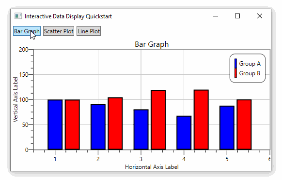
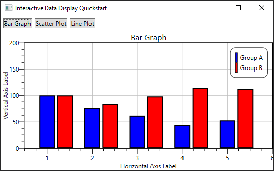
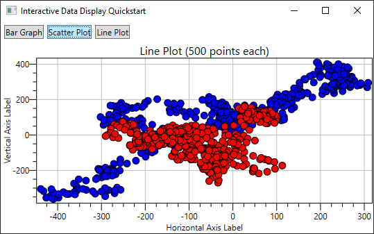
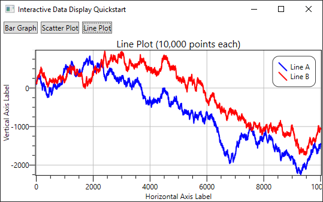

**Interactive Data Display is a set of WPF controls developed by Microsoft for interactively displaying data in WPF applications.** It supports line graphs, bubble charts, heat maps and other complex 2D plots which are very common in scientific software. The last commit on the [GitHub page](https://github.com/Microsoft/InteractiveDataDisplay.WPF) is from 2018 and the last published NuGet package [`InteractiveDataDisplay.WPF`](https://www.nuget.org/packages/InteractiveDataDisplay.WPF/) is from 2017, so it seems **this project is no longer maintained**.



### Platform Support

**The official package only supports .NET Framework:** The NuGet package (version 1.0.0) does not support .NET Core. More specifically, the NuGet package has complex antiquated dependencies and the official NuGet package only works out of the box on `.NET Framework 4.5.2`

**Unofficial support for .NET Core:** Issue [#34](https://github.com/microsoft/InteractiveDataDisplay.WPF/issues/32) from 2019 links to [a fork by Jeff Mastry](https://github.com/mastry/InteractiveDataDisplay.WPF/tree/core) that supports .NET Core, but it's not available on NuGet and Microsoft never responded to the issue.

### Interactivity
* left-click-drag to pan
* left-click-drag on an axis to pan just that axis
* scroll-wheel to zoom
* double-click to fit axis limits to data

## Quickstart

1. Create a .NET Framework WPF Application

2. Add the `InteractiveDataDisplay.WPF` NuGet package

3. Add a chart control to your layout

4. `Add()` graph types to your chart

## MainWindow.xaml

```xml
<Window x:Class="QuickstartInteractiveDataDisplay.MainWindow"
        xmlns="http://schemas.microsoft.com/winfx/2006/xaml/presentation"
        xmlns:x="http://schemas.microsoft.com/winfx/2006/xaml"
        xmlns:d="http://schemas.microsoft.com/expression/blend/2008"
        xmlns:mc="http://schemas.openxmlformats.org/markup-compatibility/2006"
        xmlns:local="clr-namespace:QuickstartInteractiveDataDisplay" 
        xmlns:d3="clr-namespace:InteractiveDataDisplay.WPF;assembly=InteractiveDataDisplay.WPF"
        mc:Ignorable="d"
        Title="MainWindow" Height="450" Width="800">
    <Grid>
        <d3:Chart Name="myChart">
            <Grid Name="myGrid"/>
        </d3:Chart>
    </Grid>
</Window>
```

## Generate Sample Data

This code generates random data we can practice plotting

```cs
private Random rand = new Random(0);
private double[] RandomWalk(int points = 5, double start = 100, double mult = 50)
{
    // return an array of difting random numbers
    double[] values = new double[points];
    values[0] = start;
    for (int i = 1; i < points; i++)
        values[i] = values[i - 1] + (rand.NextDouble() - .5) * mult;
    return values;
}
```

```cs
private double[] Consecutive(int points, double offset = 0, double stepSize = 1)
{
    // return an array of ascending numbers starting at 1
    double[] values = new double[points];
    for (int i = 0; i < points; i++)
        values[i] = i * stepSize + 1 + offset;
    return values;
}
```

## Bar Graph



```cs
// generate some random Y data
int pointCount = 5;
double[] xs1 = Consecutive(pointCount, offset: 0);
double[] xs2 = Consecutive(pointCount, offset: .4);
double[] ys1 = RandomWalk(pointCount);
double[] ys2 = RandomWalk(pointCount);

// create the series and describe their styling
var bar1 = new InteractiveDataDisplay.WPF.BarGraph()
{
    Color = Brushes.Blue,
    Description = "Group A",
    BarsWidth = .35,
};

var bar2 = new InteractiveDataDisplay.WPF.BarGraph()
{
    Color = Brushes.Red,
    Description = "Group B",
    BarsWidth = .35,
};

// load data into each series
bar1.PlotBars(xs1, ys1);
bar2.PlotBars(xs2, ys2);

// add the series to the grid
myGrid.Children.Clear();
myGrid.Children.Add(bar1);
myGrid.Children.Add(bar2);

// customize styling
myChart.Title = $"Bar Graph";
myChart.BottomTitle = $"Horizontal Axis Label";
myChart.LeftTitle = $"Vertical Axis Label";
myChart.IsAutoFitEnabled = false;
myChart.LegendVisibility = Visibility.Visible;

// set axis limits manually
myChart.PlotOriginX = .5;
myChart.PlotWidth = 5.5;
myChart.PlotOriginY = 0;
myChart.PlotHeight = 200;
```

## Scatter Plot



```cs
// generate some random X and Y data
int pointCount = 500;
double[] xs1 = RandomWalk(pointCount);
double[] ys1 = RandomWalk(pointCount);
double[] xs2 = RandomWalk(pointCount);
double[] ys2 = RandomWalk(pointCount);
double[] sizes = Consecutive(pointCount, 10, 0);

// create the lines and describe their styling
var line1 = new InteractiveDataDisplay.WPF.CircleMarkerGraph()
{
    Color = new SolidColorBrush(Colors.Blue),
    Description = "Group A",
    StrokeThickness = 1
};

var line2 = new InteractiveDataDisplay.WPF.CircleMarkerGraph()
{
    Color = new SolidColorBrush(Colors.Red),
    Description = "Group B",
    StrokeThickness = 1
};

// load data into the lines
line1.PlotSize(xs1, ys1, sizes);
line2.PlotSize(xs2, ys2, sizes);

// add lines into the grid
myGrid.Children.Clear();
myGrid.Children.Add(line1);
myGrid.Children.Add(line2);

// customize styling
myChart.Title = $"Line Plot ({pointCount:n0} points each)";
myChart.BottomTitle = $"Horizontal Axis Label";
myChart.LeftTitle = $"Vertical Axis Label";
myChart.IsAutoFitEnabled = true;
myChart.LegendVisibility = Visibility.Hidden;
```

## Line Plot

I can display lines with about 100 thousand lines points performance starts to greatly suffer.



```cs
int pointCount = 10_000;
double[] xs = Consecutive(pointCount);
double[] ys1 = RandomWalk(pointCount);
double[] ys2 = RandomWalk(pointCount);

// create the lines and describe their styling
var line1 = new InteractiveDataDisplay.WPF.LineGraph
{
    Stroke = new SolidColorBrush(Colors.Blue),
    Description = "Line A",
    StrokeThickness = 2
};

var line2 = new InteractiveDataDisplay.WPF.LineGraph
{
    Stroke = new SolidColorBrush(Colors.Red),
    Description = "Line B",
    StrokeThickness = 2
};

// load data into the lines
line1.Plot(xs, ys1);
line2.Plot(xs, ys2);

// add lines into the grid
myGrid.Children.Clear();
myGrid.Children.Add(line1);
myGrid.Children.Add(line2);

// customize styling
myChart.Title = $"Line Plot ({pointCount:n0} points each)";
myChart.BottomTitle = $"Horizontal Axis Label";
myChart.LeftTitle = $"Vertical Axis Label";
myChart.IsAutoFitEnabled = true;
myChart.LegendVisibility = Visibility.Visible;
```

## Resources

* GitHub: [Interactive Data Display for WPF](https://github.com/microsoft/InteractiveDataDisplay.WPF)

* NuGet: [`InteractiveDataDisplay.WPF`](https://www.nuget.org/packages/InteractiveDataDisplay.WPF/)

* Documentation: [Dynamic Data Display library (D3) Core Algorithms and Architecture (PDF)](D3-WPF-Version-2.pdf) is the closest thing to documentation I think there is for this library. I found it [here](https://github.com/artemiusgreat/InteractiveDataDisplay.WPF/) under a MIT license and am copying it to this website so search engines can index it.

## Source Code

* [interactive-data-display](https://github.com/swharden/Csharp-Data-Visualization/tree/main/projects/plotting/interactive-data-display)