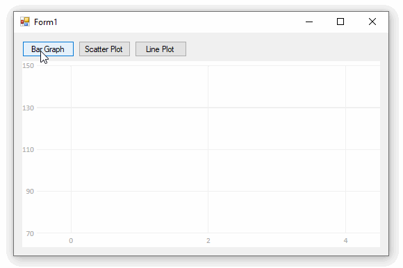
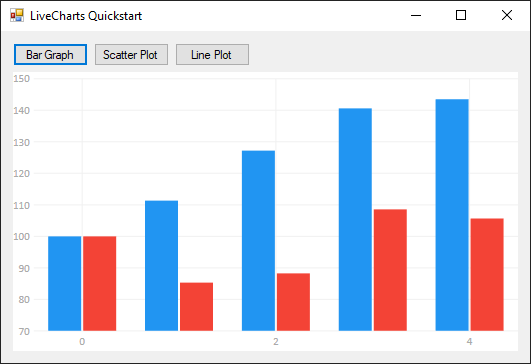
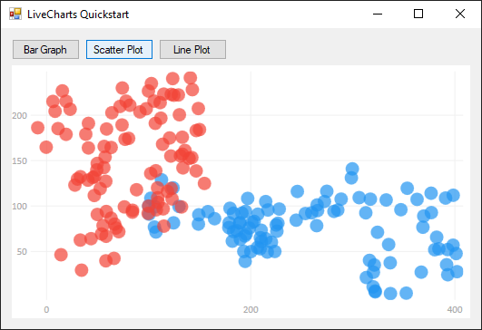
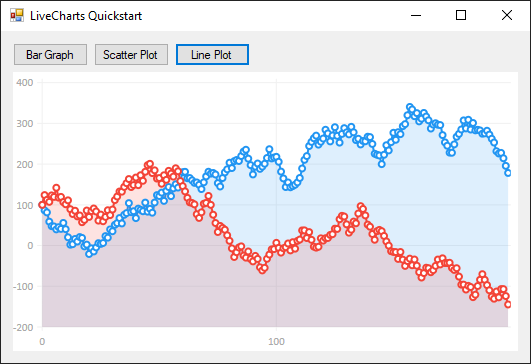

**LiveCharts is a charing library that updates and animates automatically as data changes in real time.** LiveCharts is up-front about the that performance is a secondary concern. LiveCharts used to sell an enhancement called the "Geared package" which improved performance using DirectX (although [SharpDX is no longer maintained](http://sharpdx.org/)). LiveCharts2 began development in 2021 and uses an alternative rendering system (SkiaSharp) to improve support and performance across multiple platforms.



### Project Status

**LiveCharts appears mostly abandoned.** The [LiveCharts GitHub page](https://github.com/Live-Charts/Live-Charts) claimed version 1.0 was "about to be released" in 2018 but that text is now crossed-out. The [last commit to the project](https://github.com/Live-Charts/Live-Charts/commits/) (other than updates to the readme) was in 2018. The last NuGet published was in 2017.

**LiveCharts2 is in preview and is being actively developed.** Work is in the [LiveCharts2 GitHub repository](https://github.com/beto-rodriguez/LiveCharts2) but there are not yet packages on NuGet.

## Quickstart

LiveCharts is designed to work in WPF applications, but for consistency with the other examples in this series the quickstart will be made using Windows Forms

* Install the `LiveCharts.WinForms` package
* Drag a `CartesianChart` from the toolbox onto your form

### Sample Data

This code generates random data we can practice plotting

```cs
private Random rand = new Random(0);
private double[] RandomWalk(int points = 5, double start = 100, double mult = 50)
{
    // return an array of difting random numbers
    double[] values = new double[points];
    values[0] = start;
    for (int i = 1; i < points; i++)
        values[i] = values[i - 1] + (rand.NextDouble() - .5) * mult;
    return values;
}
```

### Bar Graph



```cs
// generate some random Y data
int pointCount = 5;
double[] ys1 = RandomWalk(pointCount);
double[] ys2 = RandomWalk(pointCount);

// create series and populate them with data
var series1 = new LiveCharts.Wpf.ColumnSeries
{
    Title = "Group A",
    Values = new LiveCharts.ChartValues<double>(ys1)
};

var series2 = new LiveCharts.Wpf.ColumnSeries()
{
    Title = "Group B",
    Values = new LiveCharts.ChartValues<double>(ys2)
};

// display the series in the chart control
cartesianChart1.Series.Clear();
cartesianChart1.Series.Add(series1);
cartesianChart1.Series.Add(series2);
```

### Scatter Plot



```cs
// generate some random XY data
int pointCount = 100;
double[] xs1 = RandomWalk(pointCount);
double[] ys1 = RandomWalk(pointCount);
double[] xs2 = RandomWalk(pointCount);
double[] ys2 = RandomWalk(pointCount);

// create series and populate them with data
var series1 = new LiveCharts.Wpf.ScatterSeries
{
    Title = "Group A",
    Values = new LiveCharts.ChartValues<LiveCharts.Defaults.ObservablePoint>(),
    PointGeometry = LiveCharts.Wpf.DefaultGeometries.Circle
};

var series2 = new LiveCharts.Wpf.ScatterSeries()
{
    Title = "Group B",
    Values = new LiveCharts.ChartValues<LiveCharts.Defaults.ObservablePoint>(),
    PointGeometry = LiveCharts.Wpf.DefaultGeometries.Circle
};

for (int i = 0; i < pointCount; i++)
{
    series1.Values.Add(new LiveCharts.Defaults.ObservablePoint(xs1[i], ys1[i]));
    series2.Values.Add(new LiveCharts.Defaults.ObservablePoint(xs2[i], ys2[i]));
}

// display the series in the chart control
cartesianChart1.Series.Clear();
cartesianChart1.Series.Add(series1);
cartesianChart1.Series.Add(series2);
```

### Line Plot



```cs
// generate some random Y data
int pointCount = 200;
double[] ys1 = RandomWalk(pointCount);
double[] ys2 = RandomWalk(pointCount);

// create series and populate them with data
var series1 = new LiveCharts.Wpf.LineSeries()
{
    Title = "Group A",
    Values = new LiveCharts.ChartValues<double>(ys1),
};

var series2 = new LiveCharts.Wpf.LineSeries()
{
    Title = "Group B",
    Values = new LiveCharts.ChartValues<double>(ys2),
};

// display the series in the chart control
cartesianChart1.Series.Clear();
cartesianChart1.Series.Add(series1);
cartesianChart1.Series.Add(series2);
```

## Zooming and Panning

You can enable zooming and panning by modifying the user control after a series is plotted like this:

```cs
cartesianChart1.Zoom = LiveCharts.ZoomingOptions.Xy;
```

However mouse interaction is so sluggish I did not find it useful and intentionally omitted it from the quickstart example.

## Resources
* [LiveCharts Tutorial and Samples](https://lvcharts.net/App/examples/Wpf/start)
* NuGet: [LiveCharts](https://www.nuget.org/packages/LiveCharts/)
* GitHub: [LiveCharts](https://github.com/Live-Charts/Live-Charts/)
* GitHub: [LiveCharts2](https://github.com/beto-rodriguez/LiveCharts2)

## Source Code

* [livecharts quickstart](https://github.com/swharden/Csharp-Data-Visualization/tree/main/dev/old/plotting/livecharts/LiveChartsQuickstart)