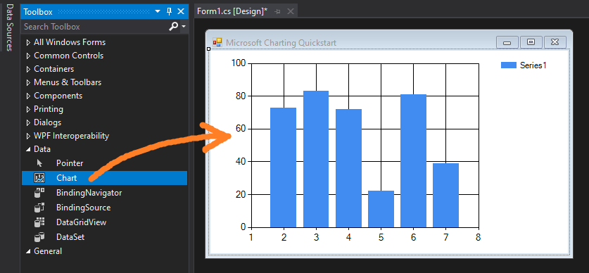
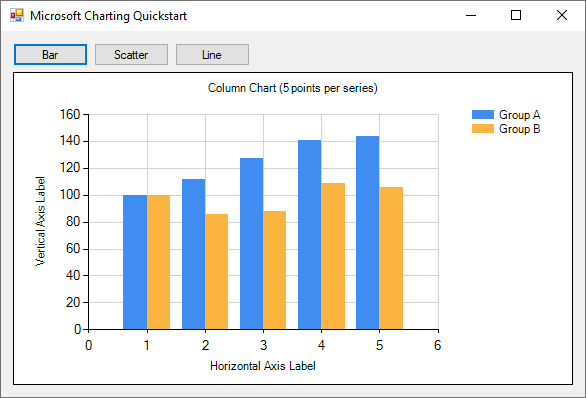
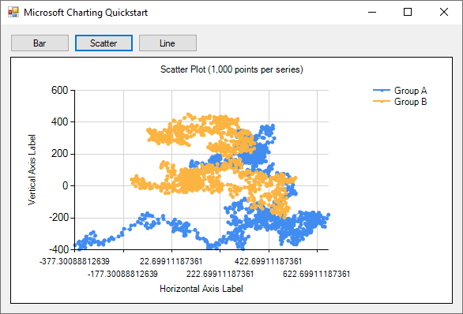
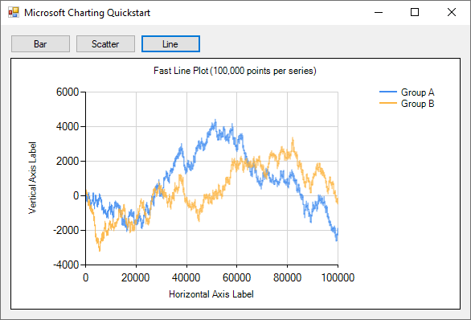

**Microsoft's `Chart` control is one of the easiest ways to get started displaying data in .NET Framework WinForms applications** since it is [natively available](https://docs.microsoft.com/en-us/dotnet/api/system.windows.forms.datavisualization.charting.chart) and automatically appears in the Windows Forms Toolbox in Visual Studio. To get started just drag a `Chart` from the toolbox and drop it onto your form.



### Disadvantages
* It is not mouse-interactive
* It only supports Windows Forms
* It is only available on .NET Framework
* It is no longer actively developed

## Quickstart

### Sample Data

This code generates random data we can practice plotting

```cs
private Random rand = new Random(0);
private double[] RandomWalk(int points = 5, double start = 100, double mult = 50)
{
    // return an array of difting random numbers
    double[] values = new double[points];
    values[0] = start;
    for (int i = 1; i < points; i++)
        values[i] = values[i - 1] + (rand.NextDouble() - .5) * mult;
    return values;
}
```

### Bar Graph (Column Chart)

Microsoft calls a horizontal bar graph a "bar chart", while a bar graph with vertical bars is called a "column chart". This program can be made with the following code.



```cs
// generate some random Y data
int pointCount = 5;
double[] ys1 = RandomWalk(pointCount);
double[] ys2 = RandomWalk(pointCount);

// create a series for each line
Series series1 = new Series("Group A");
series1.Points.DataBindY(ys1);
series1.ChartType = SeriesChartType.Column;

Series series2 = new Series("Group B");
series2.Points.DataBindY(ys2);
series2.ChartType = SeriesChartType.Column;

// add each series to the chart
chart1.Series.Clear();
chart1.Series.Add(series1);
chart1.Series.Add(series2);

// additional styling
chart1.ResetAutoValues();
chart1.Titles.Clear();
chart1.Titles.Add($"Column Chart ({pointCount} points per series)");
chart1.ChartAreas[0].AxisX.Title = "Horizontal Axis Label";
chart1.ChartAreas[0].AxisY.Title = "Vertical Axis Label";
chart1.ChartAreas[0].AxisY.MajorGrid.LineColor = Color.LightGray;
chart1.ChartAreas[0].AxisX.MajorGrid.LineColor = Color.LightGray;
```

### Scatter Plot (Line Chart)

The look of a scatter plot can be achieved by binding X and Y data.



```cs
// generate some random XY data
int pointCount = 1_000;
double[] xs1 = RandomWalk(pointCount);
double[] ys1 = RandomWalk(pointCount);
double[] xs2 = RandomWalk(pointCount);
double[] ys2 = RandomWalk(pointCount);

// create a series for each line
Series series1 = new Series("Group A");
series1.Points.DataBindXY(xs1, ys1);
series1.ChartType = SeriesChartType.Line;
series1.MarkerStyle = MarkerStyle.Circle;

Series series2 = new Series("Group B");
series2.Points.DataBindXY(xs2, ys2);
series2.ChartType = SeriesChartType.Line;
series2.MarkerStyle = MarkerStyle.Circle;

// add each series to the chart
chart1.Series.Clear();
chart1.Series.Add(series1);
chart1.Series.Add(series2);

// additional styling
chart1.ResetAutoValues();
chart1.Titles.Clear();
chart1.Titles.Add($"Scatter Plot ({pointCount:N0} points per series)");
chart1.ChartAreas[0].AxisX.Title = "Horizontal Axis Label";
chart1.ChartAreas[0].AxisY.Title = "Vertical Axis Label";
chart1.ChartAreas[0].AxisY.MajorGrid.LineColor = Color.LightGray;
chart1.ChartAreas[0].AxisX.MajorGrid.LineColor = Color.LightGray;
```

### Line Plot (Fast Line Chart)

The `FastLine` chart is optimized for speed. On my system I can comfortably display 100,000 points in real time. When I tried to display 1 million points interaction became very sluggish.

> **💡 What makes FastLine fast?** According to Microsoft, "The FastLine chart type is a variation of the Line chart that significantly reduces the drawing time of a series that contains a very large number of data points. Use this chart in situations where very large data sets are used and rendering speed is critical. Some features are omitted (control of point level visual attributes, markers, data point labels, and shadows) to improve performance."



```cs
// generate some random Y data
int pointCount = 100_000;
double[] ys1 = RandomWalk(pointCount);
double[] ys2 = RandomWalk(pointCount);

// create a series for each line
Series series1 = new Series("Group A");
series1.Points.DataBindY(ys1);
series1.ChartType = SeriesChartType.FastLine;

Series series2 = new Series("Group B");
series2.Points.DataBindY(ys2);
series2.ChartType = SeriesChartType.FastLine;

// add each series to the chart
chart1.Series.Clear();
chart1.Series.Add(series1);
chart1.Series.Add(series2);

// additional styling
chart1.ResetAutoValues();
chart1.Titles.Clear();
chart1.Titles.Add($"Fast Line Plot ({pointCount:N0} points per series)");
chart1.ChartAreas[0].AxisX.Title = "Horizontal Axis Label";
chart1.ChartAreas[0].AxisY.Title = "Vertical Axis Label";
chart1.ChartAreas[0].AxisY.MajorGrid.LineColor = Color.LightGray;
chart1.ChartAreas[0].AxisX.MajorGrid.LineColor = Color.LightGray;
```

## Source Code

* [Microsoft Charting Quickstart](https://github.com/swharden/Csharp-Data-Visualization/tree/main/dev/old/plotting/microsoft-charting/ChartingQuickstart)
