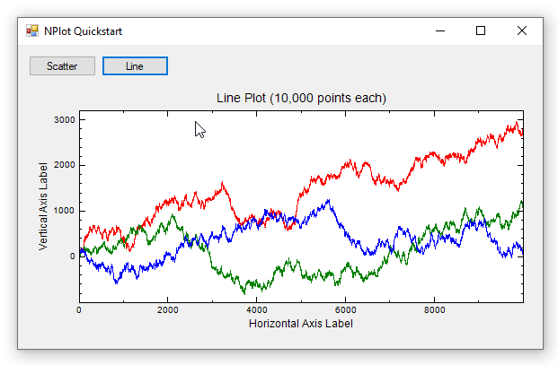
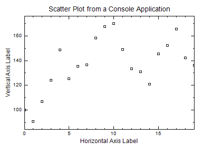

**NPlot is a charting library for .NET Framework applications.** It can be used to render graphs as Bitmaps (suitable for use in console applications) and it has a mouse-interactive user control for Windows Forms. NPlot is simple, but it lacks many features, and it only targets .NET Framework.



### NPlot is no longer developed
* [NPlot WIKI](http://netcontrols.org/nplot/wiki/index.php) has been inactive since 2014
* [NPlot on GitHub](https://github.com/mhowlett/nplot) has a single commit from 2016
* [NPlot on NuGet](https://www.nuget.org/packages/NPlot/) has a single package uploaded in 2016

## Quickstart

* Get the `NPlot` NuGet package

* Drag a `PlotSurface2D` from the toolbox onto your form

### Sample Data

This code generates random data we can practice plotting

```cs
private Random rand = new Random(0);
private double[] RandomWalk(int points = 5, double start = 100, double mult = 50)
{
    // return an array of difting random numbers
    double[] values = new double[points];
    values[0] = start;
    for (int i = 1; i < points; i++)
        values[i] = values[i - 1] + (rand.NextDouble() - .5) * mult;
    return values;
}
```

### Interactive Line Plot

I found I could display lines of 10,000 points, but by 100,000 points the program became very sluggish.

```cs
// generate some random Y data
int pointCount = 10_000;
double[] ys1 = RandomWalk(pointCount);
double[] ys2 = RandomWalk(pointCount);
double[] ys3 = RandomWalk(pointCount);

// create a line plot containing the data
var linePlot1 = new NPlot.LinePlot { DataSource = ys1, Color = Color.Red };
var linePlot2 = new NPlot.LinePlot { DataSource = ys2, Color = Color.Green };
var linePlot3 = new NPlot.LinePlot { DataSource = ys3, Color = Color.Blue };

// add the line plot to the plot surface (user control)
plotSurface2D1.Clear();
plotSurface2D1.Add(linePlot1);
plotSurface2D1.Add(linePlot2);
plotSurface2D1.Add(linePlot3);
plotSurface2D1.Title = $"Line Plot ({pointCount:n0} points each)";
plotSurface2D1.YAxis1.Label = "Vertical Axis Label";
plotSurface2D1.XAxis1.Label = "Horizontal Axis Label";
plotSurface2D1.Refresh();

// allow the plot to be mouse-interactive
plotSurface2D1.AddInteraction(new NPlot.Windows.PlotSurface2D.Interactions.HorizontalDrag());
plotSurface2D1.AddInteraction(new NPlot.Windows.PlotSurface2D.Interactions.VerticalDrag());
plotSurface2D1.AddInteraction(new NPlot.Windows.PlotSurface2D.Interactions.AxisDrag(true));
```

## Console Application Support

Users who aren't using Windows Forms (or the PlotSurface2D user control) can render directly on `Bitmap` objects using the `Bitmap.PlotSurface2D` class. This allows NPlot to be used in console applications (or in server applications such as ASP.NET)



```cs
var linePlot = new NPlot.PointPlot { DataSource = RandomWalk(20) };
var surface = new NPlot.Bitmap.PlotSurface2D(400, 300);
surface.BackColor = Color.White;
surface.Add(linePlot);
surface.Title = $"Scatter Plot from a Console Application";
surface.YAxis1.Label = "Vertical Axis Label";
surface.XAxis1.Label = "Horizontal Axis Label";
surface.Refresh();
surface.Bitmap.Save("nplot-console-quickstart.png");
```

## WPF Support

NPlot is designed for Windows Forms, but the author noted [it can be used in WPF](http://netcontrols.org/nplot/wiki/index.php?n=Main.WPFNotes) applications too. This seems to be accomplished by rendering plots to Bitmap objects and displaying them in WPF. [WChart](https://github.com/mhowlett/WChart) is a modified version of NPlot designed for WPF, but it hasn't been updated since 2015.


## Resources
* [Creating Graphs and Plot Charts Quickly with NPlot](https://www.oreilly.com/library/view/windows-developer-power/0596527543/ch04s08.html) (O'Reilly)

## Source Code

* [NPlot Quickstart](https://github.com/swharden/Csharp-Data-Visualization/tree/main/dev/old/plotting/nplot/NPlotQuickstart)
