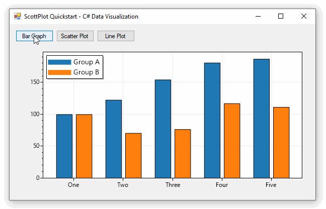
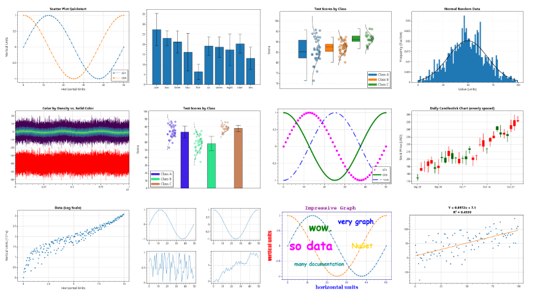
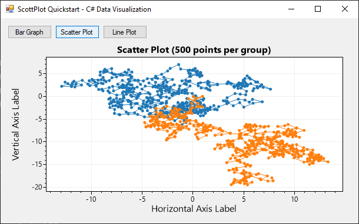

**[ScottPlot](https://scottplot.net) is a free and open-source interactive plotting library for .NET.** It has user controls for Windows Forms, WPF, Avalonia, and Eto Forms, and it can even generate plots as image files in server environments or console applications. ScottPlot targets .NET Standard 2.0 so it can be used in both .NET Framework and .NET Core applications. ScottPlot's API mimics [Matplotlib](https://matplotlib.org/) for Python, and most plots can be created with a single line of code (using optional arguments to customize styling).



### Interactive Controls
* left-click-drag: pan
* right-click-drag: zoom
* middle-click-drag: zoom region
* scroll-wheel: zoom
* middle-click: fit data
* right-click: deploy menu

### ScottPlot Cookbook

The [ScottPlot Cookbook](https://scottplot.net/cookbook) is an extensive collection of sample plots paired with the source code used to create them. Reviewing the cookbook is the best way to survey ScottPlot's capabilities and learn how to use it. An interactive version of each cookbook figure is presented in the [ScottPlot demo](https://scottplot.net/demo) application.

[](https://scottplot.net/cookbook)

## Quickstart (Console)

* Install the `ScottPlot.WinForms` NuGet package

* Add the following to your start-up sequence

```cs
double[] dataX = new double[] { 1, 2, 3, 4, 5 };
double[] dataY = new double[] { 1, 4, 9, 16, 25 };
var plt = new ScottPlot.Plot(400, 300);
plt.AddScatter(dataX, dataY);
plt.SaveFig("quickstart.png");
```


## QuickStart (Windows Forms)

* Install the `ScottPlot.WinForms` NuGet package

* Drag a `FormsPlot` from the toolbox onto your form

* Add the following to your start-up sequence

```cs
// generate some random X/Y data
int pointCount = 500;
Random rand = new Random(0);
double[] xs1 = ScottPlot.DataGen.RandomWalk(rand, pointCount);
double[] ys1 = ScottPlot.DataGen.RandomWalk(rand, pointCount);
double[] xs2 = ScottPlot.DataGen.RandomWalk(rand, pointCount);
double[] ys2 = ScottPlot.DataGen.RandomWalk(rand, pointCount);

// plot the data
formsPlot1.Plot.PlotScatter(xs1, ys1);
formsPlot1.Plot.PlotScatter(xs2, ys2);

// additional styling
formsPlot1.Plot.Title($"Scatter Plot ({pointCount} points per group)");
formsPlot1.Plot.XLabel("Horizontal Axis Label");
formsPlot1.Plot.YLabel("Vertical Axis Label");
formsPlot1.Refresh();
```



## Resources
* ScottPlot website: https://scottplot.net
* ScottPlot Cookbook: https://scottplot.net/cookbook
* ScottPlot Demo: https://scottplot.net/demo
* ScottPlot Quickstart: https://scottplot.net/quickstart
* ScottPlot on GitHub: https://github.com/scottplot/scottplot

## Source Code
* [ScottPlot Quickstart](https://scottplot.net/quickstart)