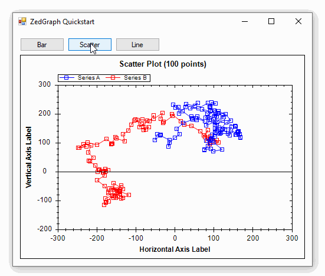
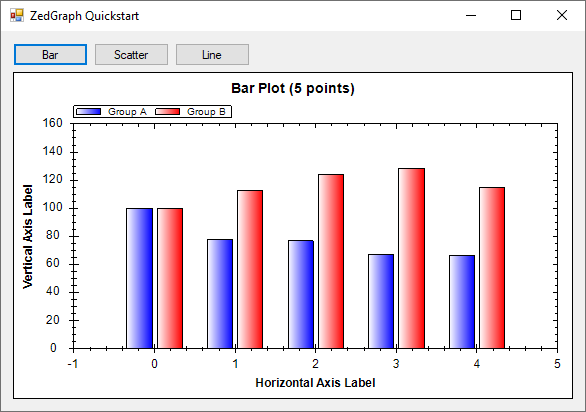
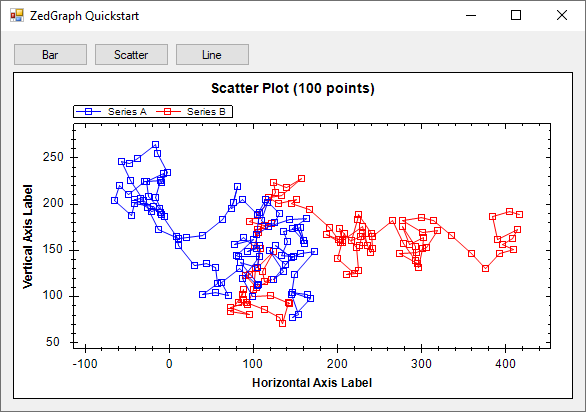
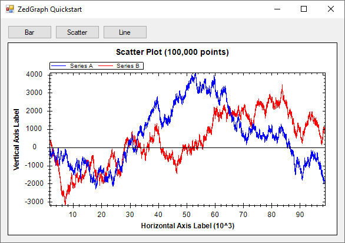
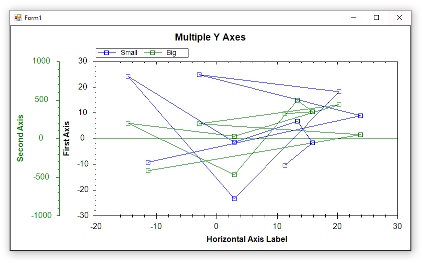

**ZedGraph is a C# plotting library for drawing 2D Line, Bar, and Pie Charts.** ZedGraph was created in the early 2000s but development appears to have ceased in 2008 according to the [ZedGraph SourceForge page](https://sourceforge.net/projects/zedgraph/files/). ZedGraph is available as a [NuGet package](https://www.nuget.org/packages/ZedGraph) and it has a [GitHub page](https://github.com/ZedGraph/ZedGraph), but neither have been active for many years.



> **⚠️ WARNING:** ZedGraph has a LGPL license! 💀 Depending on how you use it in your project, you may be forced to open-source part of your application. Read more about the [LGPL 2.1 license](https://opensource.org/license/lgpl-2-1/) if you are considering using this library in a commercial application.

## Supported Platforms

* The [`ZedGraph 5.1.7` NuGet package](https://www.nuget.org/packages/ZedGraph/5.1.7) (2015) targets **.NET Framework 3.5** so it can only be used in .NET Framework projects.

* The [`ZedGraph 6.0.0-alpha0001` NuGet package](https://www.nuget.org/packages/ZedGraph/6.0.0-alpha0001) (2018) targets **.NET Standard 2.0** so it can be used in .NET Framework and .NET Core projects.

## Quickstart

* Install the `ZedGraph` NuGet package

* Drag a `ZedGraphControl` from the toolbox onto your form

### Sample Data

This code generates random data we can practice plotting

```cs
private Random rand = new Random(0);
private double[] RandomWalk(int points = 5, double start = 100, double mult = 50)
{
    // return an array of difting random numbers
    double[] values = new double[points];
    values[0] = start;
    for (int i = 1; i < points; i++)
        values[i] = values[i - 1] + (rand.NextDouble() - .5) * mult;
    return values;
}
```

### Bar Graph



```cs
// generate some random Y data
int pointCount = 5;
double[] xs = Consecutive(pointCount);
double[] ys1 = RandomWalk(pointCount);
double[] ys2 = RandomWalk(pointCount);

// clear old curves
zedGraphControl1.GraphPane.CurveList.Clear();

// plot the data as bars
zedGraphControl1.GraphPane.AddBar("Group A", xs, ys1, Color.Blue);
zedGraphControl1.GraphPane.AddBar("Group B", xs, ys2, Color.Red);

// style the plot
zedGraphControl1.GraphPane.Title.Text = $"Bar Plot ({pointCount:n0} points)";
zedGraphControl1.GraphPane.XAxis.Title.Text = "Horizontal Axis Label";
zedGraphControl1.GraphPane.YAxis.Title.Text = "Vertical Axis Label";

// auto-axis and update the display
zedGraphControl1.GraphPane.XAxis.ResetAutoScale(zedGraphControl1.GraphPane, CreateGraphics());
zedGraphControl1.GraphPane.YAxis.ResetAutoScale(zedGraphControl1.GraphPane, CreateGraphics());
zedGraphControl1.Refresh();
```

### Scatter Plot



```cs
// generate some random Y data
int pointCount = 100;
double[] xs1 = RandomWalk(pointCount);
double[] ys1 = RandomWalk(pointCount);
double[] xs2 = RandomWalk(pointCount);
double[] ys2 = RandomWalk(pointCount);

// clear old curves
zedGraphControl1.GraphPane.CurveList.Clear();

// plot the data as curves
var curve1 = zedGraphControl1.GraphPane.AddCurve("Series A", xs1, ys1, Color.Blue);
curve1.Line.IsAntiAlias = true;

var curve2 = zedGraphControl1.GraphPane.AddCurve("Series B", xs2, ys2, Color.Red);
curve2.Line.IsAntiAlias = true;

// style the plot
zedGraphControl1.GraphPane.Title.Text = $"Scatter Plot ({pointCount:n0} points)";
zedGraphControl1.GraphPane.XAxis.Title.Text = "Horizontal Axis Label";
zedGraphControl1.GraphPane.YAxis.Title.Text = "Vertical Axis Label";

// auto-axis and update the display
zedGraphControl1.GraphPane.XAxis.ResetAutoScale(zedGraphControl1.GraphPane, CreateGraphics());
zedGraphControl1.GraphPane.YAxis.ResetAutoScale(zedGraphControl1.GraphPane, CreateGraphics());
zedGraphControl1.Refresh();
```

### Line Graph



```cs
// generate some random Y data
int pointCount = 100_000;
double[] xs = Consecutive(pointCount);
double[] ys1 = RandomWalk(pointCount);
double[] ys2 = RandomWalk(pointCount);

// clear old curves
zedGraphControl1.GraphPane.CurveList.Clear();

// plot the data as curves
var curve1 = zedGraphControl1.GraphPane.AddCurve("Series A", xs, ys1, Color.Blue);
curve1.Line.IsAntiAlias = true;
curve1.Symbol.IsVisible = false;

var curve2 = zedGraphControl1.GraphPane.AddCurve("Series B", xs, ys2, Color.Red);
curve2.Line.IsAntiAlias = true;
curve2.Symbol.IsVisible = false;

// style the plot
zedGraphControl1.GraphPane.Title.Text = $"Scatter Plot ({pointCount:n0} points)";
zedGraphControl1.GraphPane.XAxis.Title.Text = "Horizontal Axis Label";
zedGraphControl1.GraphPane.YAxis.Title.Text = "Vertical Axis Label";

// auto-axis and update the display
zedGraphControl1.GraphPane.XAxis.ResetAutoScale(zedGraphControl1.GraphPane, CreateGraphics());
zedGraphControl1.GraphPane.YAxis.ResetAutoScale(zedGraphControl1.GraphPane, CreateGraphics());
zedGraphControl1.Refresh();
```

## Console Applications


```cs
var pane = new ZedGraph.GraphPane();
var curve1 = pane.AddCurve(
    label: "demo",
    x: new double[] { 1, 2, 3, 4, 5 },
    y: new double[] { 1, 4, 9, 16, 25 },
    color:Color.Blue);
curve1.Line.IsAntiAlias = true;
pane.AxisChange();
Bitmap bmp = pane.GetImage(400, 300, dpi: 100, isAntiAlias: true);
bmp.Save("zedgraph-console-quickstart.png", ImageFormat.Png);
```

## Multiple Y Axes



```cs
// generate some random Y data
int pointCount = 10;
double[] xs = Random(pointCount);
double[] ys1 = Random(pointCount);
double[] ys2 = Random(pointCount, 0, 1000);

// clear old curves
zedGraphControl1.GraphPane.CurveList.Clear();

// clear old Y axes and manually add new ones
zedGraphControl1.GraphPane.YAxisList.Clear();

// add a traditional Y axis
zedGraphControl1.GraphPane.AddYAxis("First Axis");
var firstAxis = zedGraphControl1.GraphPane.YAxisList[0];
firstAxis.Color = Color.Blue;

// create another Y axis and customize it
zedGraphControl1.GraphPane.AddYAxis("Second Axis");
var secondAxis = zedGraphControl1.GraphPane.YAxisList[1];
secondAxis.Scale.Max = 1000;
secondAxis.Scale.Min = -1000;
secondAxis.Scale.FontSpec.FontColor = Color.Green;
secondAxis.Title.FontSpec.FontColor = Color.Green;
secondAxis.Color = Color.Green;

// plot the data as curves
var curve1 = zedGraphControl1.GraphPane.AddCurve("Small", xs, ys1, Color.Blue);
var curve2 = zedGraphControl1.GraphPane.AddCurve("Big", xs, ys2, Color.Green);

// specify which curve is to use which axis
curve1.YAxisIndex = 0;
curve2.YAxisIndex = 1;

// style the plot
zedGraphControl1.GraphPane.Title.Text = $"Multiple Y Axes";
zedGraphControl1.GraphPane.XAxis.Title.Text = "Horizontal Axis Label";

// auto-axis and update the display
zedGraphControl1.GraphPane.XAxis.ResetAutoScale(zedGraphControl1.GraphPane, CreateGraphics());
zedGraphControl1.GraphPane.YAxis.ResetAutoScale(zedGraphControl1.GraphPane, CreateGraphics());
zedGraphControl1.Refresh();
```

## Resources
* [ZedGraph home page](http://zedgraph.sourceforge.net/samples.html) (Sourceforge)
* [ZedGraph NuGet package](https://www.nuget.org/packages/ZedGraph/) (uploaded by [discomurray](https://github.com/discomurray), inactive on GitHub since 2018)
* [ZedGraph on GitHub](https://github.com/ZedGraph/ZedGraph) (inactive since 2018)
* [revision history summary](http://zedgraph.sourceforge.net/revision.html)
* [full revision history](http://zedgraph.sourceforge.net/revision_history.txt)
* [ZedGraph Wiki](https://github.com/ZedGraph/ZedGraph/wiki) on GitHub

## Source Code

* [ZedGraph Quickstart](https://github.com/swharden/Csharp-Data-Visualization/tree/main/dev/old/plotting/zedgraph/ZedGraphQuickstart)
