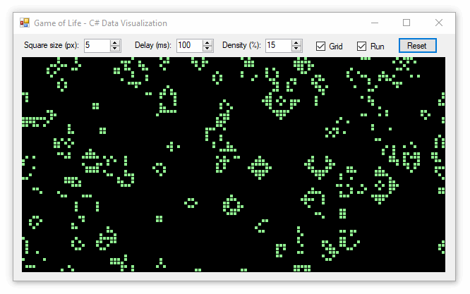
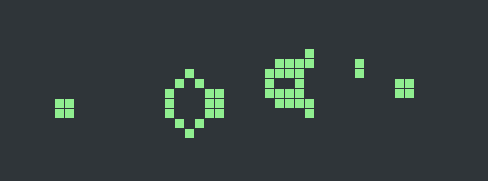
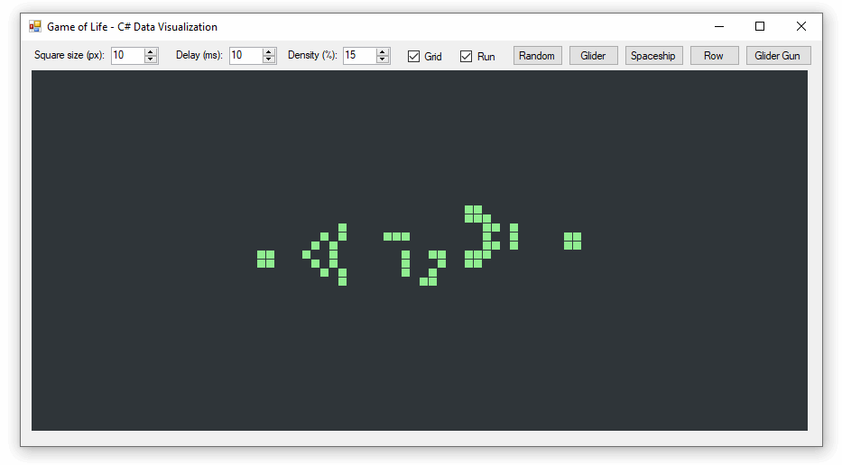

**Conway's _Game of Life_ is a zero-player video game that uses a few basic rules to determine if cells live or die based on the density of their neighbors.** In this project we create _Life_ using C# and System.Drawing and display the animated graphics model using Windows Forms.



## Code

We divide this project into two libraries, one for the graphics model (containing classes for `Cell` and `Booard`) and another that handles the graphical environment and rendering.

### Cell Model

I decided not to make cells position-aware. Instead each cell simply tracks its own `IsAlive` state, and knows about its 8 neighbors. 

When `DetermineNextLiveState()` is called, the neighbors are inspected to determine how many are alive, then _Life_ rules are used to determine if this cell will be alive or not after advancement.

```cs
public class Cell
{
    public bool IsAlive;
    public readonly List<Cell> neighbors = new List<Cell>();

    private bool IsAliveNext;
    public void DetermineNextLiveState()
    {
        // Live cells with fewer than two live neighbors die
        // Live cells with more than three live neighbors die
        // Dead cells with three live neighbors comes alive

        int liveNeighbors = neighbors.Where(x => x.IsAlive).Count();

        if (IsAlive)
            IsAliveNext = liveNeighbors == 2 || liveNeighbors == 3;
        else
            IsAliveNext = liveNeighbors == 3;
    }

    public void Advance()
    {
        IsAlive = IsAliveNext;
    }
}
```

### Board Model

The `Board` holds a 2D array of `Cell` objects and advances the board whenever the `Advance()` method is called.

```cs
public readonly Cell[,] Cells;
public readonly int CellSize;

public int Columns { get { return Cells.GetLength(0); } }
public int Rows { get { return Cells.GetLength(1); } }
public int Width { get { return Columns * CellSize; } }
public int Height { get { return Rows * CellSize; } }

public Board(int width, int height, int cellSize, double liveDensity = .1)
{
    CellSize = cellSize;

    Cells = new Cell[width / cellSize, height / cellSize];
    for (int x = 0; x < Columns; x++)
        for (int y = 0; y < Rows; y++)
            Cells[x, y] = new Cell();

    ConnectNeighbors();
    Randomize(liveDensity);
}

readonly Random rand = new Random();
public void Randomize(double liveDensity)
{
    foreach (var cell in Cells)
        cell.IsAlive = rand.NextDouble() < liveDensity;
}

public void Advance()
{
    foreach (var cell in Cells)
        cell.DetermineNextLiveState();
    foreach (var cell in Cells)
        cell.Advance();
}
```

I separated this method because it's easier to assess in isolation. It's in charge of populating the `Neighbors` property of each `Cell`. Every cell should have 8 neighbors. This design wraps neighbors around the edge of the board.

```cs
private void ConnectNeighbors()
{
    for (int x = 0; x < Columns; x++)
    {
        for (int y = 0; y < Rows; y++)
        {
            // determine X of left and right cells
            int xL = (x > 0) ? x - 1 : Columns - 1;
            int xR = (x < Columns - 1) ? x + 1 : 0;

            // determine Y of top and bottom cells
            int yT = (y > 0) ? y - 1 : Rows - 1;
            int yB = (y < Rows - 1) ? y + 1 : 0;

            // add the 8 neighbors surrounding this cell
            Cells[x, y].neighbors.Add(Cells[xL, yT]);
            Cells[x, y].neighbors.Add(Cells[x, yT]);
            Cells[x, y].neighbors.Add(Cells[xR, yT]);
            Cells[x, y].neighbors.Add(Cells[xL, y]);
            Cells[x, y].neighbors.Add(Cells[xR, y]);
            Cells[x, y].neighbors.Add(Cells[xL, yB]);
            Cells[x, y].neighbors.Add(Cells[x, yB]);
            Cells[x, y].neighbors.Add(Cells[xR, yB]);
        }
    }
}
```

### Creating the GUI


#### Resetting the Board

The board is stored at the class-level and is reset whenever settings are changed or the board is resized.

```cs
Board board;
private void Reset()
{
    board = new Board(
        width: pictureBox1.Width, 
        height: pictureBox1.Height, 
        cellSize: (int)SizeNud.Value, 
        liveDensity: (double)DensityNud.Value / 100);
}
```

#### Advancement

A `Timer` triggers board advancement and rendering
```cs
private void timer1_Tick(object sender, EventArgs e)
{
    board.Advance();
    Render();
}
```

#### Rendering

This is pretty straightforward drawing with System.Drawing in Windows Forms. A `Bitmap` is created in memory, drawn on, and applied to a `Picturebox` (used here because its built-in double-buffering prevents flickering as the image is rapidly updated).

```cs
private void Render()
{
    using (var bmp = new Bitmap(board.Width, board.Height))
    using (var gfx = Graphics.FromImage(bmp))
    using (var cellBrush = new SolidBrush(Color.LightGreen))
    {
        gfx.Clear(Color.Black);

        var cellSize = (GridCheckbox.Checked && board.CellSize > 1) ?
                        new Size(board.CellSize - 1, board.CellSize - 1) :
                        new Size(board.CellSize, board.CellSize);

        for (int col = 0; col < board.Columns; col++)
        {
            for (int row = 0; row < board.Rows; row++)
            {
                var cell = board.Cells[col, row];
                if (cell.IsAlive)
                {
                    var cellLocation = new Point(col * board.CellSize, row * board.CellSize);
                    var cellRect = new Rectangle(cellLocation, cellSize);
                    gfx.FillRectangle(cellBrush, cellRect);
                }
            }
        }

        pictureBox1.Image = (Bitmap)bmp.Clone();
    }
}
```

## Defining Starting Conditions

Special starting patterns in _Game of Life_ can produce intriguing animations. There are many websites dedicated to exploring these phenomena, and in this example we will take a look a starting pattern which infinitely produces self-propelling "gliders". 



### Defining Initial State

I found it useful to define the starting condition as a multi-line string, then write a method to translate the string into a _Life_ starting condition.

```cs
private void StartWithPattern(string pattern)
{
    board.KillAll();

    string[] lines = pattern.Split('\n');
    int yOffset = (board.Rows - lines.Length) / 2;
    int xOffset = (board.Columns - lines[0].Length) / 2;

    for (int y = 0; y < lines.Length; y++)
        for (int x = 0; x < lines[y].Length; x++)
            board.Cells[x + xOffset, y + yOffset].IsAlive = lines[y].Substring(x, 1) == "X";
}
```

Now I can design patterns visually in code.

```cs
private void GunButton_Click(object sender, EventArgs e)
{
    string gliderGun =
        "-------------------------X----------\n" +
        "----------------------XXXX----X-----\n" +
        "-------------X-------XXXX-----X-----\n" +
        "------------X-X------X--X---------XX\n" +
        "-----------X---XX----XXXX---------XX\n" +
        "XX---------X---XX-----XXXX----------\n" +
        "XX---------X---XX--------X----------\n" +
        "------------X-X---------------------\n" +
        "-------------X----------------------";
    StartWithPattern(gliderGun);
}
```



This "glider gun" starting pattern could run infinitely, but since our universe wraps around the edges the gliders eventually wrap around and destroy the gun.

## Source Code

* GitHub: [game-of-life C# project](https://github.com/swharden/Csharp-Data-Visualization/tree/main/dev/old/drawing/game-of-life)

## Resources

* [Conway's Game of Life](https://en.wikipedia.org/wiki/Conway%27s_Game_of_Life) (Wikipedia)
* [Game of Life News](http://pentadecathlon.com/lifeNews/2006/06/single_glider_collision_survey.html)
* [ConwayLife](https://www.conwaylife.com/wiki/Spaceship) (Wiki)
