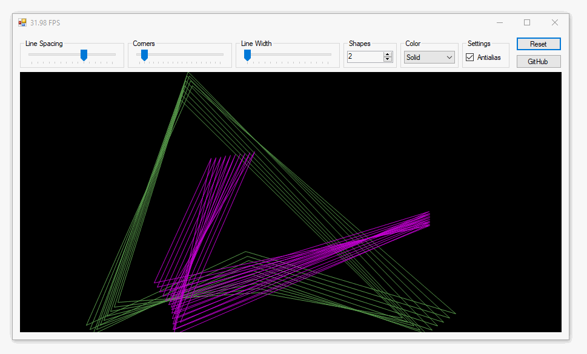

This project recreates the classic screensaver _Mystify_ using C# and `System.Drawing` in a Windows Forms application.

> 💡 An updated version of this article is at https://swharden.com/blog/2022-04-06-mystify/



### Field.cs
```cs
using System;
using System.Collections.Generic;
using System.Linq;
using System.Text;
using System.Threading.Tasks;

namespace MystifySharp.Mystify
{
    public class Field
    {
        Random rand = new Random();
        public readonly List<MovingPolygon> polygons = new List<MovingPolygon>();

        public Field(int width, int height, int polygonCount = 10, int cornerCount = 5)
        {
            for (int i=0; i<polygonCount; i++)
            {
                Color randomColor = new Color(rand.Next(256), rand.Next(256), rand.Next(256));
                polygons.Add(new MovingPolygon(width, height, cornerCount, randomColor, rand));
            }
        }
    }
}
```

### Polygon.cs
```cs
using System;
using System.Collections.Generic;
using System.Linq;
using System.Text;
using System.Threading.Tasks;

namespace MystifySharp.Mystify
{
    public class Corner
    {
        public double X, Y;
        public double velX, velY;
    }

    public class Polygon
    {
        public Corner[] corners;
        public Color color = new Color(255, 255, 255);
        public double lineWidth = 1;

        public Polygon(int cornerCount)
        {
            corners = new Corner[cornerCount];
            for (int i = 0; i < corners.Length; i++)
                corners[i] = new Corner();
        }

        public Polygon(Polygon source)
        {
            corners = new Corner[source.corners.Length];
            for (int i = 0; i < corners.Length; i++)
                corners[i] = new Corner()
                {
                    X = source.corners[i].X,
                    Y = source.corners[i].Y,
                    velX = source.corners[i].velX,
                    velY = source.corners[i].velY
                };
            color = new Color(source.color);
            lineWidth = source.lineWidth;
        }
    }

    public class MovingPolygon
    {
        public List<Polygon> polygonHistory = new List<Polygon>();
        public int width, height;

        public MovingPolygon(int width, int height, int cornerCount, Color color, Random rand)
        {
            this.width = width;
            this.height = height;

            Polygon firstPolygon = new Polygon(cornerCount) { color = color };
            for (int i = 0; i < firstPolygon.corners.Count(); i++)
            {
                var corner = firstPolygon.corners[i];
                corner.X = rand.NextDouble() * width;
                corner.Y = rand.NextDouble() * height;
                corner.velX = rand.NextDouble() * 2 - 1;
                corner.velY = rand.NextDouble() * 2 - 1;
            }

            polygonHistory.Add(firstPolygon);
        }

        public void StepForward(double stepSize = 1.0, int lineWidth = 1, int maxTails = 10)
        {
            Polygon nextPolygon = new Polygon(polygonHistory.Last()) { lineWidth = lineWidth };

            for (int i = 0; i < nextPolygon.corners.Count(); i++)
            {
                var corner = nextPolygon.corners[i];
                corner.X += corner.velX * stepSize;
                corner.Y += corner.velY * stepSize;

                if (corner.X <= 0 || corner.X >= width)
                    corner.velX *= -1;

                if (corner.Y <= 0 || corner.Y >= height)
                    corner.velY *= -1;
            }

            polygonHistory.Add(nextPolygon);

            while (polygonHistory.Count() > maxTails)
                polygonHistory.RemoveAt(0);
        }
    }
}
```
## Source Code

* [Mystify version 1](https://github.com/swharden/Csharp-Data-Visualization/tree/main/dev/old/drawing/mystify)
* [Mystify version 2](https://github.com/swharden/Mystify)

## References

* Video of Mystify on Windows 3.1: https://youtu.be/osCZyfoScFg?t=370
* Video of Mystify on Windows 95: https://youtu.be/SaBvcHHdlGE
