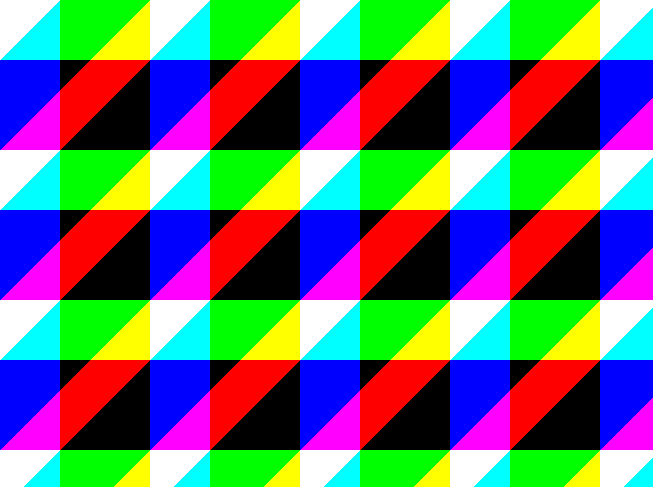

This page describes how to create an image from an array of RGB byte values (and vise-versa) using SkiaSharp.


## Array to Image

**This example creates a `SKBitmap` image from a 3D `byte` array** where the first axis is `row` position, the second axis is `column` position, and the final axis is color (`red`, `green` and `blue`).

This code uses the garbage collector handle's `AddrOfPinnedObject()` in combination with `InstallPixels()` so the conversion can be accomplished without requiring an `unsafe` code block.

```cs
public static SKBitmap ArrayToImage(byte[,,] pixelArray)
{
    int width = pixelArray.GetLength(1);
    int height = pixelArray.GetLength(0);

    uint[] pixelValues = new uint[width * height];
    for (int y = 0; y < height; y++)
    {
        for (int x = 0; x < width; x++)
        {
            byte alpha = 255;
            byte red = pixelArray[y, x, 0];
            byte green = pixelArray[y, x, 1];
            byte blue = pixelArray[y, x, 2];
            uint pixelValue = (uint)red + (uint)(green << 8) + (uint)(blue << 16) + (uint)(alpha << 24);
            pixelValues[y * width + x] = pixelValue;
        }
    }

    SKBitmap bitmap = new();
    GCHandle gcHandle = GCHandle.Alloc(pixelValues, GCHandleType.Pinned);
    SKImageInfo info = new(width, height, SKColorType.Rgba8888, SKAlphaType.Premul);

    IntPtr ptr = gcHandle.AddrOfPinnedObject();
    int rowBytes = info.RowBytes;
    bitmap.InstallPixels(info, ptr, rowBytes, delegate { gcHandle.Free(); });

    return bitmap;
}
```

## Image to Array

This example uses `Span<T>` so byte access can be provided without requiring `unsafe` code.

```cs
public byte[,,] ImageToArray(SKBitmap bmp)
{
    ReadOnlySpan<byte> spn = bmp.GetPixelSpan();

    byte[,,] pixelValues = new byte[bmp.Height, bmp.Width, 3];
    for (int y = 0; y < bmp.Height; y++)
    {
        for (int x = 0; x < bmp.Width; x++)
        {
            int offset = (y * bmp.Width + x) * bmp.BytesPerPixel;
            pixelValues[y, x, 0] = spn[offset + 2];
            pixelValues[y, x, 1] = spn[offset + 1];
            pixelValues[y, x, 2] = spn[offset + 0];
        }
    }

    return pixelValues;
}
```

## Example Program

The following code produces a multi-color pattern suitable for testing code found on this page.

> 💡 **Tip:** I create test images using prime numbers for width and height to maximize the likelihood that memory errors and stride length miscalculations will be most obvious.

```cs
byte[,,] pixelArray = TestPattern(653, 487);
SKBitmap bmp = ArrayToImage(pixelArray);
using FileStream fs = new("demo.png", FileMode.Create);
bmp.Encode(fs, SKEncodedImageFormat.Png, quality: 100);
```

```cs
public byte[,,] TestPattern(int width, int height)
{
    byte[,,] pixelArray = new byte[height, width, 3];

    int period = 150;
    int thickness = 60;

    for (int y = 0; y < pixelArray.GetLength(0); y++)
    {
        for (int x = 0; x < pixelArray.GetLength(1); x++)
        {
            if ((x + y) % period < thickness)
                pixelArray[y, x, 0] = 255; // red

            if (y % period < thickness)
                pixelArray[y, x, 1] = 255; // green

            if (x % period < thickness)
                pixelArray[y, x, 2] = 255; // blue
        }
    }

    return pixelArray;
}
```

### Output



## What about Unsafe Code?

While the example above does not use the `unsafe` keyword, many of the examples in the [official documentation](https://docs.microsoft.com/en-us/xamarin/xamarin-forms/user-interface/graphics/skiasharp/bitmaps/pixel-bits) accomplish similar tasks using `unsafe` code blocks. This certainly works, and it's up to you whether you want to permit `unsafe` code in your project.

```cs
SKBitmap bitmap = new SKBitmap(256, 256);
IntPtr pixelsAddr = bitmap.GetPixels();

unsafe
{
    for (int rep = 0; rep < REPS; rep++)
    {
        byte* ptr = (byte*)pixelsAddr.ToPointer();
        for (int row = 0; row < 256; row++)
            for (int col = 0; col < 256; col++)
            {
                *ptr++ = (byte)(col);   // red
                *ptr++ = 0;             // green
                *ptr++ = (byte)(row);   // blue
                *ptr++ = 0xFF;          // alpha
            }
    }
}
```

## What about `SKBitmap.Pixels[]`?

It is true that `SKBitmap` has a `SKColor Pixels[]`, but interacting with this property is _extremely_ slow. This example is included for educational purposes, but in practice it is not useful beyond getting or setting an extremely small number of pixels.

```cs
[Obsolete("WARNING: This is extremely slow")]
private static SKBitmap GetBitmapSLOW(byte[,,] pixelArray)
{
    int width = pixelArray.GetLength(1);
    int height = pixelArray.GetLength(0);
    SKBitmap bitmap = new(width, height);

    for (int y = 0; y < height; y++)
    {
        Console.WriteLine($"Row {y}");
        for (int x = 0; x < width; x++)
        {
            byte r = pixelArray[y, x, 0];
            byte g = pixelArray[y, x, 1];
            byte b = pixelArray[y, x, 2];
            bitmap.Pixels[y * width + x] = new SKColor(r, g, b);
        }
    }

    return bitmap;
}
```

## Resources
* [C# Data Visualization on GitHib](https://github.com/swharden/Csharp-Data-Visualization)
* Multi-platform project source: [array-to-image](https://github.com/swharden/Csharp-Data-Visualization/tree/main/projects/array-to-image)
* Official documentation: [Accessing SkiaSharp bitmap pixel bits
](https://docs.microsoft.com/en-us/xamarin/xamarin-forms/user-interface/graphics/skiasharp/bitmaps/pixel-bits)