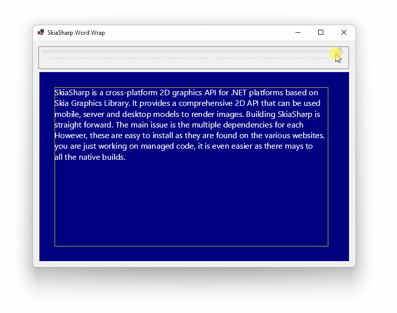

> 💡 **TIP:** If you just want to measure a string to draw a border around it, check out the [Drawing Text with SkiaSharp](../text) page

SkiaSharp can render text in a straight using the [SKCanvas.DrawText Method](https://docs.microsoft.com/en-us/dotnet/api/skiasharp.skcanvas.drawtext), but developers will find that there is no built-in ability to wrap text to fit a rectangle. This page demonstrates how to draw a text inside a rectangle using SkiaSharp.



## Code

This code breaks the string into words and renders each word left-to-right until it runs out of room, then it drops down a line and starts over.

```cs
void DrawText(SKCanvas canvas, string text, SKRect rect, SKPaint paint)
{
	float spaceWidth = paint.MeasureText(" ");
	float wordX = rect.Left;
	float wordY = rect.Top + paint.TextSize;
	foreach (string word in text.Split(' '))
	{
		float wordWidth = paint.MeasureText(word);
		if (wordWidth <= rect.Right - wordX)
		{
			canvas.DrawText(word, wordX, wordY, paint);
			wordX += wordWidth + spaceWidth;
		}
		else
		{
			wordY += paint.FontSpacing;
			wordX = rect.Left;
		}
	}
}
```

This minimal code example doesn't break after hyphens or insert an extra break after `\n`, but these features are easy to implement as needed.

## Improvements

**Store word sizes:** As words are measured add them to a `Dictionary<string, float>`, and when new words are measured check first to see if their width already exists in the dictionary. This falls over when the font changes, but wrapping this functionality in a class that clears the dictionary when the paint changes could solve that issue.

**Reduce font size when measuring:** String measurement rarely needs to be pixel-perfect. Measure strings at 1/4 their size, then multiply the returned widths by 4. In fairness I haven't benchmarked this (I saw it suggested elsewhere), but if you benchmark it I am interested to learn the results!

**Use fixed-width fonts:** If the paint contains a font with characters of a fixed with (e.g., Consolas) you can measure width of a single character and then "measure" strings by multiplying that value by the number of characters in each string.

**Use a different line-wrap algorithm:** This will probably decrease performance but can improve the visual appearance of large blocks of text. Microsoft Word uses the basic method outlined above, but LaTeX commonly uses an algorithm that favors minimum raggedness.

## Resources

* Download the WinForms project in the screenshot: [skiasharp-word-wrap.zip](skiasharp-word-wrap.zip)

* Official Documentation: [SKCanvas.DrawText Method](https://docs.microsoft.com/en-us/dotnet/api/skiasharp.skcanvas.drawtext)

* Wikipedia: [Line wrap and word wrap](https://en.wikipedia.org/wiki/Line_wrap_and_word_wrap) (includes algorithms)

* [RichTextKit](https://github.com/toptensoftware/RichTextKit) -  a rich-text layout, measurement and rendering library for SkiaSharp

* StackOverflow: [#58887795](https://stackoverflow.com/questions/58887795/add-text-inside-rectangle-using-skia-sharp-with-wrap-lines), [#49853168](https://stackoverflow.com/questions/49853168/fit-text-in-a-rectangle-using-skiasharp)
