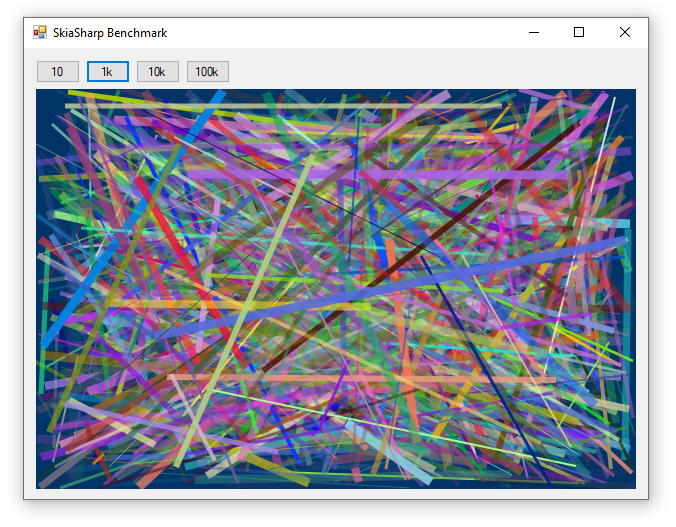

**[SkiaSharp](https://github.com/mono/SkiaSharp) is a .NET wrapper for Google's [Skia Graphics Library](https://skia.org/)** that can be used to draw 2D graphics across mobile, server, and desktop platforms. SkiaSharp can be used with OpenGL for hardware-accelerated rendering. SkiaSharp was initially developed by Mono but is now maintained by Microsoft and is provided under the [MIT License](https://github.com/mono/SkiaSharp/blob/master/LICENSE.md).

> 💡 This page demonstrates how to create a `Surface`, draw on it, then convert it to a `Bitmap` and display it on a `PictureBox` in a windows forms application. A much better way to achieve this effect in WinForms apps is to [simply use the SKGLControl](https://swharden.com/csdv/platforms/skiasharp-opengl/)



<div class="text-center">
<div class="d-inline-block">

Drawing Library | 10 lines | 1k lines | 10k lines | 100k lines
---|---|---|---|---
System.Drawing | 0.614 ms | 28.350 ms | 278.477 ms | 2.834 sec
SkiaSharp | 12.777 ms | 97.011 ms | 352.343 ms | 3.493 sec
SkiaSharp + OpenGL | 2.973 ms | 6.588 ms | 40.765 ms | 422.217 ms

</div>
</div>

## Code

In this example we are going to use SkiaSharp _without_ the SkiaSharp user control (SKControl). The advantage of the present method is that it can be used in console applications. Other articles on this website demonstrate how to use the control (typically with OpenGL acceleration).

* Edit your build settings to target `32-bit` or `64-bit` (not `any CPU`)
* Install the `SkiaSharp` NuGet package

### 1. Create a SKSurface and Canvas

```cs
var imageInfo = new SKImageInfo(
    width: pictureBox1.Width,
    height: pictureBox1.Height,
    colorType: SKColorType.Rgba8888,
    alphaType: SKAlphaType.Premul);
    
var surface = SKSurface.Create(imageInfo);

var canvas = surface.Canvas;
```

### 2. Draw on the Canvas

```cs
canvas.Clear(SKColor.Parse("#003366"));

int lineCount = 1000;
for (int i = 0; i < lineCount; i++)
{
    float lineWidth = rand.Next(1, 10);
    var lineColor = new SKColor(
            red: (byte)rand.Next(255),
            green: (byte)rand.Next(255),
            blue: (byte)rand.Next(255),
            alpha: (byte)rand.Next(255));

    var linePaint = new SKPaint
    {
        Color = lineColor,
        StrokeWidth = lineWidth,
        IsAntialias = true,
        Style = SKPaintStyle.Stroke
    };

    int x1 = rand.Next(imageInfo.Width);
    int y1 = rand.Next(imageInfo.Height);
    int x2 = rand.Next(imageInfo.Width);
    int y2 = rand.Next(imageInfo.Height);
    canvas.DrawLine(x1, y1, x2, y2, linePaint);
}
```

> 💡 See the [full SkiaSharp API](https://docs.microsoft.com/en-us/dotnet/api/SkiaSharp) to learn more about the available drawing methods

### 3. Render onto a Bitmap displayed in a Picturebox

Now that we're done with the drawing, let's convert this image to a Bitmap so we can display it in a Picturebox. As we've discussed previously, as Picturebox is preferred because it is double-buffered and less prone to flickering during animations where the underlying image it displays is frequently updated.

```cs
using (SKImage image = surface.Snapshot())
using (SKData data = image.Encode())
using (System.IO.MemoryStream mStream = new System.IO.MemoryStream(data.ToArray()))
{
    pictureBox1.Image?.Dispose();
    pictureBox1.Image = new Bitmap(mStream, false);
}
```

## Source Code

GitHub:
[SkiaSharpBenchmark](https://github.com/swharden/Csharp-Data-Visualization/tree/master/dev/old/drawing/alternate/SkiaSharpBenchmark)
