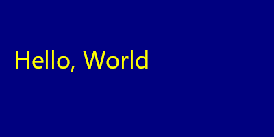
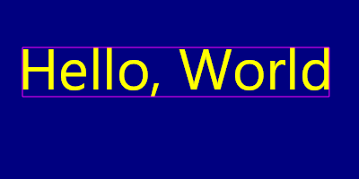
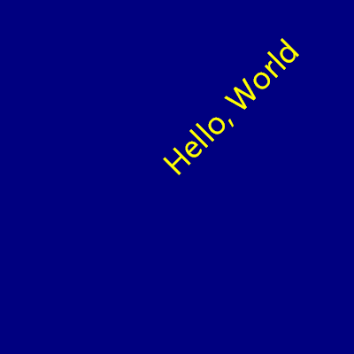
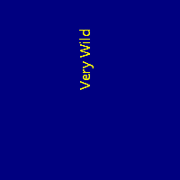
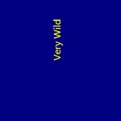

## Quickstart

```cs
SKBitmap bmp = new(400, 200);
using SKCanvas canvas = new(bmp);
canvas.Clear(SKColors.Navy);

using SKPaint paint = new()
{
    Color = SKColors.Yellow,
    IsAntialias = true,
    TextSize = 36,
};

canvas.DrawText("Hello, World", 20, 100, paint);

using SKFileWStream fs = new("quickstart.png");
bmp.Encode(fs, SKEncodedImageFormat.Png, quality: 100);
```



## Font and Styling Options

```cs
SKBitmap bmp = new(400, 200);
using SKCanvas canvas = new(bmp);
canvas.Clear(SKColors.Navy);

using SKPaint paint = new()
{
    Color = SKColors.Yellow,
    IsAntialias = true,
    TextSize = 64,
    Typeface = SKTypeface.FromFamilyName(
        familyName: "Impact",
        weight: SKFontStyleWeight.SemiBold,
        width: SKFontStyleWidth.Normal,
        slant: SKFontStyleSlant.Italic),
};

canvas.DrawText("Hello, World", 20, 100, paint);

using SKFileWStream fs = new("options.png");
bmp.Encode(fs, SKEncodedImageFormat.Png, quality: 100);
```


## Measure a String with SkiaSharp

The best way to measure a string's width and height is to create a `SKRect`, pass it into `MeasureText` by reference, and then it holds the dimensions of the text. You can then offset it by the location of the text to get a rectangle containing the text.

```cs
SKBitmap bmp = new(400, 200);
using SKCanvas canvas = new(bmp);
canvas.Clear(SKColors.Navy);

using SKPaint paint = new()
{
    Color = SKColors.Yellow,
    IsAntialias = true,
    TextSize = 64,
};

string text = "Hello, World";
SKRect rect = new();
paint.MeasureText(text, ref rect);
Console.WriteLine($"Width={rect.Width}, Height={rect.Height}");

SKPoint pt = new(20, 100);
canvas.DrawText(text, pt, paint);

rect.Offset(pt);
paint.IsStroke = true;
paint.Color = SKColors.Magenta;
canvas.DrawRect(rect, paint);

using SKFileWStream fs = new("measure.png");
bmp.Encode(fs, SKEncodedImageFormat.Png, quality: 100);
```



## Rotating Text with SkiaSharp

You can't draw rotated text, but you can rotate the _canvas_

```cs
SKBitmap bmp = new(400, 400);
using SKCanvas canvas = new(bmp);
canvas.Clear(SKColors.Navy);

canvas.Translate(200, 200);
canvas.RotateDegrees(-45);

using SKPaint paint = new()
{
    Color = SKColors.Yellow,
    IsAntialias = true,
    TextSize = 36,
};

canvas.DrawText("Hello, World", 0, 0, paint);

SKFileWStream fs = new("rotation.png");
bmp.Encode(fs, SKEncodedImageFormat.Png, quality: 100);
```



If you intend to revert transformations and draw on the original canvas again, use [SKCanvas.Save](https://learn.microsoft.com/en-us/dotnet/api/skiasharp.skcanvas.save) and [SKCanvas.Restore](https://learn.microsoft.com/en-us/dotnet/api/skiasharp.skcanvas.restore)

```cs
canvas.Save(); // remember the original state
canvas.Translate(200, 200);
canvas.RotateDegrees(-45);
canvas.DrawText("Hello, World", 0, 0, paint);
canvas.Restore(); // revert to the original state
```

Advanced users will appreciate [SKAutoCanvasRestore](https://learn.microsoft.com/en-us/dotnet/api/skiasharp.skautocanvasrestore) which restores state from its destructor when the object goes out of scope

```cs
using SKAutoCanvasRestore _ = new(surface.Canvas);
```

## Fix Pixelated Rotated Text

SkiaSharp renders text poorly when rendered 90º, most noticeable in the "V" characters:

A solution is to rotate the text by 90.1º instead of 90.0º

<div class="text-center">
<div class="d-inline-block">

Rotated by `90.0f` | Rotated by `90.1f`
---|---
|

</div>
</div>

## References
* https://learn.microsoft.com/en-us/dotnet/api/skiasharp.skcanvas.drawtext
* https://learn.microsoft.com/en-us/dotnet/api/skiasharp.skcanvas.save
* https://learn.microsoft.com/en-us/dotnet/api/skiasharp.skcanvas.restore
* https://github.com/mono/SkiaSharp/issues/354
* https://stackoverflow.com/questions/56494189/how-can-i-force-rotated-text-to-anti-alias-correctly-in-chrome-on-windows
