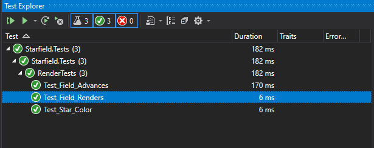

**I often create _graphics model_ classes** to hold simulation information and rendering logic in a .NET Standard library. If designed without any platform-specific dependencies this model can be reused in many different projects using different rendering technologies.

## Starfield

In this example we will create a starfield animation with these rules: 
* Stars of random sizes are randomly placed on the field
* Stars move away from the center (bigger stars move faster)
* Stars that fall off the edge are replaced by random new ones


## Code

A `Star` has a location and size, and a `Field` contains a collection of `Star` objects. Every time the `Advance()` method is called, stars are moved forward in time. 

```cs
public struct Star
{
    public double x;
    public double y;
    public double size;
}
```

```cs
public class Starfield
{
    Random rand = new Random();
    Star[] stars;

    public Field(int starCount)
    {
        Reset(starCount);
    }

    public void Reset(int starCount)
    {
        stars = new Star[starCount];
        for (int i = 0; i < starCount; i++)
            stars[i] = GetRandomStar();
    }

    private Star GetRandomStar(bool randomSize = true)
    {
        double starSize = 1;
        if (randomSize)
            starSize += rand.NextDouble() * 5;

        return new Star
        {
            x = rand.NextDouble(),
            y = rand.NextDouble(),
            size = starSize
        };
    }

    public void Advance(double step = .01)
    {
        for (int i = 0; i < stars.Length; i++)
        {
            stars[i].x += (stars[i].x - .5) * stars[i].size * step;
            stars[i].y += (stars[i].y - .5) * stars[i].size * step;
            stars[i].size += stars[i].size * step * 2;

            // reset stars that went out of bounds
            if (stars[i].x < 0 || stars[i].x > 1 ||
                stars[i].y < 0 || stars[i].y > 1)
                stars[i] = GetRandomStar(randomSize: false);
        }
    }

    public void Render(Bitmap bmp, Color? starColor = null)
    {
        starColor = starColor ?? Color.White;
        using (var brush = new SolidBrush(starColor.Value))
        using (var gfx = Graphics.FromImage(bmp))
        {
            gfx.SmoothingMode = System.Drawing.Drawing2D.SmoothingMode.AntiAlias;
            gfx.Clear(Color.Black);
            for (int i = 0; i < stars.Length; i++)
            {
                var star = stars[i];
                float xPixel = (float)star.x * bmp.Width;
                float yPixel = (float)star.y * bmp.Height;
                float radius = (float)star.size - 1;
                float diameter = radius * 2;
                gfx.FillEllipse(brush, xPixel - radius, yPixel - radius, diameter, diameter);
            }
        }
    }
}
```

## Testing the Graphics Model

Since the `Starfield` project is a class library it cannot be executed directly. The best way to start executing the code it contains is to create a small set of tests. I prefer NUnit test projects but any test system that allows you to initialize a `Starfield`, `Advance()` several times, and save the output will be fine.



The image at the top of this page was generated by one of these tests. If you've never used tests before, this is a great project to take a look at. In Visual Studio open the "view" menu and select "Test Explorer". Right-click on any test or group of tests and hit Run. In the test output window you can see the output of the tests, including paths to PNG files ready to view.

> **💡 Tip:** When I write tests that render graphics I have the output saved as an image, then I load that image in my browser. Every time the test runs I hit F5 to refresh my browser and update the image. Using tabs and keyboard shortcuts to flip between them I can easily compare between images.

## Source Code

* GitHub: [Starfield Graphics Model](https://github.com/swharden/Csharp-Data-Visualization/blob/master/dev/old/drawing/starfield/Starfield/)