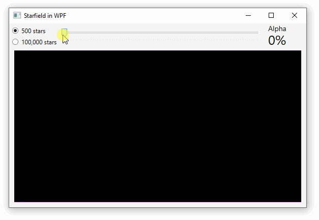

**This page demonstrates a simple method for animating graphics in WPF.** In this example we use the [Starfield graphics model](../animate-starfield/) to keep track of star positions and sizes and implement a renderer inside our Window which uses System.Drawing to draw stars on a `Bitmap` displayed on an `Image` inside a `Canvas`. A `DispatchTimer` will be used to continuously advance the graphics model and trigger rendering. Controls let the user adjust the number of stars and their transparency, but also serve as a way to assess GUI responsiveness.



### MainWindow.xaml

```xml
<DockPanel>

    <DockPanel DockPanel.Dock="Top">
        <StackPanel DockPanel.Dock="Left">
            <RadioButton Content="500 stars" IsChecked="True" Checked="Set500Stars"/>
            <RadioButton Content="100,000 stars" Checked="Set100kStars"/>
        </StackPanel>
        <StackPanel DockPanel.Dock="Right">
            <Label Content="Alpha" FontSize="14"/>
            <Label FontSize="26" Width="80"
                    Content="{Binding ElementName=mySlider, Path=Value}" 
                    ContentStringFormat="{}{0:0}%"/>
        </StackPanel>
        <Slider x:Name="mySlider" Maximum="100" Value="100" TickPlacement="BottomRight" />
    </DockPanel>

    <Canvas x:Name="myCanvas">
        <Image x:Name="myImage"/>
    </Canvas>
    
</DockPanel>
```

### MainWindow.xaml.cs

```cs
readonly Field field = new Field(500);

public MainWindow()
{
    InitializeComponent();

    DispatcherTimer timer = new DispatcherTimer();
    timer.Interval = TimeSpan.FromMilliseconds(1);
    timer.Tick += timer_Tick;
    timer.Start();
}

void timer_Tick(object sender, EventArgs e)
{
    field.Advance();
    Bitmap bmp = new Bitmap((int)myCanvas.ActualWidth, (int)myCanvas.ActualHeight);
    byte alpha = (byte)(mySlider.Value * 255 / 100);
    var starColor = System.Drawing.Color.FromArgb(alpha, 255, 255, 255);
    field.Render(bmp, starColor);
    myImage.Source = BmpImageFromBmp(bmp);
}
```

> **⚠️ WARNING: This method blocks the GUI thread while rendering.** This is not noticeable if your renderer is very fast, but this can result in laggy applications if your renderer takes more than a few milliseconds. We will explore how to render graphics without blocking the GUI thread in a future article.

> 💡 Install the `System.Drawing.Common` NuGet package even if you don't think you need it. Using the common library instead of native `System.Drawing` will ensure your program can be compiled for .NET Core if you decide to upgrade later. It also ensures you can pass `System.Drawing` objects to .NET Standard libraries which use `System.Drawing.Common` under the hood.

### Convert a `Bitmap` to a `BitmapImage`

```cs
private BitmapImage BmpImageFromBmp(Bitmap bmp)
{
    using (var memory = new System.IO.MemoryStream())
    {
        bmp.Save(memory, System.Drawing.Imaging.ImageFormat.Png);
        memory.Position = 0;

        var bitmapImage = new BitmapImage();
        bitmapImage.BeginInit();
        bitmapImage.StreamSource = memory;
        bitmapImage.CacheOption = BitmapCacheOption.OnLoad;
        bitmapImage.EndInit();
        bitmapImage.Freeze();

        return bitmapImage;
    }
}
```

## Source Code

* GitHub: Starfield
[MainWindow.xaml](https://github.com/swharden/Csharp-Data-Visualization/blob/master/dev/old/drawing/starfield/Starfield.WPF/MainWindow.xaml)
and
[MainWindow.xaml.cs](https://github.com/swharden/Csharp-Data-Visualization/blob/master/dev/old/drawing/starfield/Starfield.WPF/MainWindow.xaml.cs)