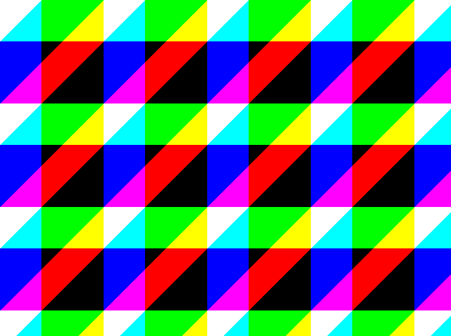

This page describes how to create an image from an array of RGB `byte` values (and vise-versa) using System.Drawing.

> ⚠️ **Warning: System.Drawing.Common now only supports Windows!**\
> See [Cross-Platform Support for `System.Drawing`](../cross-platform) for more information and what you can do about it.

## Array to Image

**This example creates a `Bitmap` image from a 3D `byte` array** where the first axis is `row` position, the second axis is `column` position, and the final axis is color (`red`, `green` and `blue`).

```cs
/// <summary>
/// Create an image from a 3D array of bytes arranged [width, height, channel]
/// </summary>
public static Bitmap ArrayToImage(byte[,,] pixelArray)
{
    int width = pixelArray.GetLength(1);
    int height = pixelArray.GetLength(0);
    int stride = (width % 4 == 0) ? width : width + 4 - width % 4;
    int bytesPerPixel = 3;

    byte[] bytes = new byte[stride * height * bytesPerPixel];
    for (int y = 0; y < height; y++)
    {
        for (int x = 0; x < width; x++)
        {
            int offset = (y * stride + x) * bytesPerPixel;
            bytes[offset + 0] = pixelArray[y, x, 2]; // blue
            bytes[offset + 1] = pixelArray[y, x, 1]; // green
            bytes[offset + 2] = pixelArray[y, x, 0]; // red
        }
    }

    PixelFormat formatOutput = PixelFormat.Format24bppRgb;
    Rectangle rect = new(0, 0, width, height);
    Bitmap bmp = new(stride, height, formatOutput);
    BitmapData bmpData = bmp.LockBits(rect, ImageLockMode.ReadOnly, formatOutput);
    Marshal.Copy(bytes, 0, bmpData.Scan0, bytes.Length);
    bmp.UnlockBits(bmpData);

    Bitmap bmp2 = new(width, height, PixelFormat.Format32bppPArgb);
    Graphics gfx2 = Graphics.FromImage(bmp2);
    gfx2.DrawImage(bmp, 0, 0);

    return bmp2;
}
```

## Image to Array

**This example converts a `Bitmap` image to a 3D `byte` array** where the first axis is `row` position, the second axis is `column` position, and the final axis is color (`red`, `green` and `blue`).

```cs
public byte[,,] ImageToArray(Bitmap bmp)
{
    int bytesPerPixel = Image.GetPixelFormatSize(bmp.PixelFormat) / 8;
    Rectangle rect = new(0, 0, bmp.Width, bmp.Height);
    BitmapData bmpData = bmp.LockBits(rect, ImageLockMode.ReadWrite, bmp.PixelFormat);
    int byteCount = Math.Abs(bmpData.Stride) * bmp.Height;
    byte[] bytes = new byte[byteCount];
    Marshal.Copy(bmpData.Scan0, bytes, 0, byteCount);
    bmp.UnlockBits(bmpData);

    byte[,,] pixelValues = new byte[bmp.Height, bmp.Width, 3];
    for (int y = 0; y < bmp.Height; y++)
    {
        for (int x = 0; x < bmp.Width; x++)
        {
            int offset = (y * bmpData.Stride) + x * bytesPerPixel;
            pixelValues[y, x, 0] = bytes[offset + 2]; // red
            pixelValues[y, x, 1] = bytes[offset + 1]; // green
            pixelValues[y, x, 2] = bytes[offset + 0]; // blue
        }
    }

    return pixelValues;
}
```

## Example Program

The following code produces a multi-color pattern suitable for testing code found on this page.

> 💡 **Tip:** I create test images using prime numbers for `width` and `height` to maximize the likelihood that memory errors and stride length miscalculations will be most obvious.

```cs
byte[,,] pixelArray = TestPattern(653, 487);
using Bitmap bmp = ArrayToImage(pixelArray);
bmp.Save("demo.png");
```

```cs
public byte[,,] TestPattern(int width, int height)
{
    byte[,,] pixelArray = new byte[height, width, 3];

    int period = 150;
    int thickness = 60;

    for (int y = 0; y < pixelArray.GetLength(0); y++)
    {
        for (int x = 0; x < pixelArray.GetLength(1); x++)
        {
            if ((x + y) % period < thickness)
                pixelArray[y, x, 0] = 255; // red

            if (y % period < thickness)
                pixelArray[y, x, 1] = 255; // green

            if (x % period < thickness)
                pixelArray[y, x, 2] = 255; // blue
        }
    }

    return pixelArray;
}
```

### Output



## Resources
* My blog post from 2021: [Representing Images in Memory](https://swharden.com/blog/2021-06-03-images-in-memory/)
* Multi-platform project source: [array-to-image](https://github.com/swharden/Csharp-Data-Visualization/tree/main/projects/array-to-image)
* Official documentation: [Accessing SkiaSharp bitmap pixel bits
](https://docs.microsoft.com/en-us/xamarin/xamarin-forms/user-interface/graphics/skiasharp/bitmaps/pixel-bits)