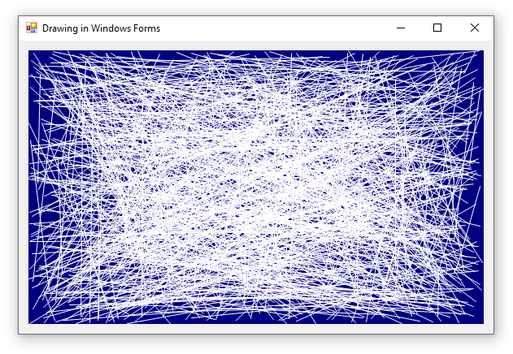

**This example demonstrates how to draw graphics in Windows Forms.** We create a `Bitmap` and draw on it using a `Graphics` object like before, but then we apply it to the `Image` property of a `PictureBox`. A key difference here is that the Bitmap will be sized to exactly fit the `PictureBox`, and we will use events to create new properly-sized `Bitmap` objects every time the form is resized.

**Drawing on a `PictureBox` is preferred** over other methods (such as drawing on the background of a `Form`) because the background of a `PictureBox` is double-buffered and will produce flicker-free rendering.



## Coding Strategy

The strategy here is to place a `PictureBox` where we want our graphics to go, then we will create a `Bitmap` the size of the `PictureBox`, render onto it, then assign it to the `Image` property of the `PictureBox`.

> **💡 Tip:** Make your `PictureBox` magenta (or some other obnoxious color) so it's easy to adjust in the designer and obvious when it's been drawn on.

### 1. Create a Render Method

The code used to draw lines is similar to what we saw in the previous example, but with a few key differences:

* The `Bitmap` is sized to be exactly the size of the Picturebox
* The `pictureBox1.Image` is disposed of before receiving a clone of the Bitmap

```cs
Random rand = new Random();
void Render()
{
    using (var bmp = new Bitmap(pictureBox1.Width, pictureBox1.Height))
    using (var gfx = Graphics.FromImage(bmp))
    using (var pen = new Pen(Color.White))
    {
        // draw one thousand random white lines on a dark blue background
        gfx.SmoothingMode = System.Drawing.Drawing2D.SmoothingMode.AntiAlias;
        gfx.Clear(Color.Navy);
        for (int i = 0; i < 1000; i++)
        {
            var pt1 = new Point(rand.Next(bmp.Width), rand.Next(bmp.Height));
            var pt2 = new Point(rand.Next(bmp.Width), rand.Next(bmp.Height));
            gfx.DrawLine(pen, pt1, pt2);
        }

        // copy the bitmap to the picturebox
        pictureBox1.Image?.Dispose();
        pictureBox1.Image = (Bitmap)bmp.Clone();
    }
}
```

> **⚠️ WARNING:** Respect objects that implement `IDisposable` by properly disposing them before overwriting them. Improper disposal of these objects can result in serious stability and performance issues! See the discussion on the [System.Drawing Fundamentals](../quickstart-console) article for details.

### 2. Call the Render Method

The Render method won't run unless we tell it to. Let's have it run when the program launches, when the window is resized, and when we click on the picturebox.

```cs
public Form1()
{
    InitializeComponent();
    Render();
}
```

```cs
private void pictureBox1_SizeChanged(object sender, EventArgs e)
{
    Render();
}
```

```cs
private void pictureBox1_MouseDown(object sender, MouseEventArgs e)
{
    Render();
}
```

## Rendering in a Separate Thread

This is a good start at drawing in a Windows Forms application, but it has a flaw: calls to the render method block the GUI thread. This isn't a problem if your renderer is very fast, but as it gets slow your GUI will become less responsive. A later article will demonstrate how to move the renderer into another thread so you can draw and animate graphics without blocking the GUI thread.

## Why is `IDisposable` such a big deal?

Code on this page has `using` statements like those below, and this article has warnings about respecting `IDisposable`. How much does it _really_ matter?

**Bad Code Ignores Disposal:** If you don't properly dispose of old Bitmaps and Graphics objects they accumulate in memory and cause a lot of work for your garbage collector or put your application at risk for a memory error.

```cs
void ResizeBitmap()
{
    // improper treatment of IDisposable objects
    var bmp = new Bitmap(pictureBox1.Width, pictureBox1.Height))
    var gfx = Graphics.FromImage(bmp))
    /* rendering code */
}
```

Look how this bad code causes a new Bitmap to be created every time the window is resized without properly disposing the old one. The process memory increases by hundreds of megabytes in just a few seconds.


**Good Code Uses Disposal:**  Good code properly disposes of `IDisposable` objects. The easiest way to do this is to `new` one inside a `using` statement (which automatically calls `Dispose()` at the end). This is all it takes to fix the memory error from the previous example.

```cs
void ResizeBitmap()
{
    // properly disposing IDisposable objects
    using (var bmp = new Bitmap(pictureBox1.Width, pictureBox1.Height))
    using (var gfx = Graphics.FromImage(bmp))
    {
        /* rendering code */
    }
}
```


## Why I avoid the `Paint` event.

Some Windows Forms applications use the [Control.Paint event](https://docs.microsoft.com/en-us/dotnet/api/system.windows.forms.control.paint) to trigger rendering graphics on a control. This is convenient for fine-tuning the look of Windows Forms controls because you can obtain a `Graphics` object right from the `PaintEventArgs` argument and don't have to create a `Bitmap` yourself.

However, I strive to write platform-agnostic software. Use of the `Paint` event and WinForms-specific calls (like `Control.CreateGraphics`) couples your rendering system to Windows Forms, making it harder to develop your rendering system in other environments in the future (like WPF, UWP, or WinUI). 

By creating Bitmaps and Graphics programmatically, controlling when renders occur, and displaying the images using Picturebox controls, the rendering system can remain largely decoupled from GUI-specific implementation.

## Why Display in a `PictureBox`?

The short answer is "double buffering".

Imagine your goal is to animate white text scrolling on a black background. To achieve this you repeatedly fill the image all black, then render text at a slightly different location each time. If the screen displays your Bitmap at random times, some of the time the Bitmap will be all black (before the text has been added). When animated this will appear as flickering. 

Double buffering is a technique that uses one Bitmap to render on and a separate Bitmap to display from. Picturebox controls support double buffering automatically, so they don't suffer from flickering due to incomplete renders. The advantage of using Picturebox controls will become evident as we begin animating graphics in windows forms.

## Source Code
* [Form1.cs](https://github.com/swharden/Csharp-Data-Visualization/blob/master/dev/old/drawing/quickstart-winforms/Form1.cs)