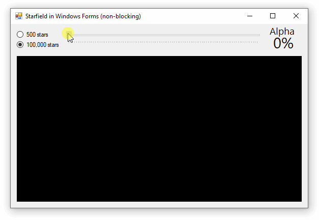
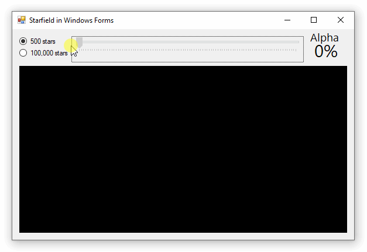

Interactive GUI should update around 60 times per second (once every 16 ms), but what happens if your graphics system takes longer than this to render an image? If you render graphics in the GUI thread, your GUI will become unresponsive. **This project explores how to render graphics _outside_ the GUI thread to keep the GUI responsive while CPU-intensive rendering happens in another thread.** We use a Windows Forms example to demonstrate this concept, but the same code can be used in WPF applications.

Our application will achieve threaded rendering by creating a static `RenderForever()` which runs outside the main GUI thread and continuously updates a `Bitmap` that contains the most recent render. A `Timer` in our Form will trigger the GUI thread to copy the latest rendered `Bitmap` and display it in a Picturebox.



**The result is a GUI which remains responsive even if the rendering system becomes extremely slow.** Notice how the trackbar and the alpha label update smoothly even through the graphics only renders at a rate of a couple frames per second.



**This method also improves the reverse case, allowing high-speed graphics model updates and rendering which is not slowed down by the GUI.** In cases where the rendering system can run exceedingly fast, the graphics model can be throttled with a FPS limiter.

## Code

The overall strategy here is to spin-off a renderer thread which will continuously work to draw on a rendering Bitmap (`bmpLive`), then copy the output to a display Bitmap (`bmpLast`) every time a render completes. 

We use the [`lock` statement](https://docs.microsoft.com/en-us/dotnet/csharp/language-reference/keywords/lock-statement) to ensure the Bitmap being written in one thread does not get simultaneously read by another thread. Notice that we lock the _display_ Bitmap and not the _rendering_ Bitmap to avoid ever having our GUI to wait on the renderer.

### Use a Trackbar to Adjust Alpha

* Threads can only interact with `static` properties, so `starColor` will be defined as a class-level property rather than be determined inside the render method.

```cs
static Color starColor = Color.White;
private void trackBar1_Scroll(object sender, EventArgs e)
{
    label1.Text = $"{trackBar1.Value}%";
    byte alpha = (byte)(trackBar1.Value * 255 / 100);
    starColor = Color.FromArgb(alpha, Color.White);
}
```

### Startup

* Threads can only interact with `static` properties, so `static Bitmap` objects will be used to store active (`bmpLive`) and display (`bmpLast`) images. Same goes for the `field`.

* You can't lock `null` objects, so both `Bitmap` objects are populated with the program starts.

* The renderer thread will get started as soon as the program starts.

```cs
static readonly Field field = new Field(500);
static Bitmap bmpLive;
static Bitmap bmpLast;
public Form1()
{
    InitializeComponent();

    bmpLive = new Bitmap(pictureBox1.Width, pictureBox1.Height);
    bmpLast = (Bitmap)bmpLive.Clone();

    var renderThread = new Thread(new ThreadStart(RenderForever));
    renderThread.Start();
}
```

### Threaded Renderer

The renderer thread runs forever and performs these tasks:
* advances the graphics model
* draws on the _render_ Bitmap
* locks the _display_ Bitmap as it copies the _render_ Bitmap onto it
* performs FPS rate-limiting* (optional)

*FPS rate limiting prevents the renderer from advancing the model and creating Bitmaps too frequently. If the renderer thread can render 1000 FPS but your GUI only displays 60 FPS, the FPS limiter can be used to prevent unnecessary renders.

> 💡 We use the [`lock` statement](https://docs.microsoft.com/en-us/dotnet/csharp/language-reference/keywords/lock-statement) to ensure the render thread doesn't write to the Bitmap at the same time as the GUI thread is reading from it.

```cs
private static void RenderForever()
{
    double maxFPS = 100;
    double minFramePeriodMsec = 1000.0 / maxFPS;

    Stopwatch stopwatch = Stopwatch.StartNew();
    while (true)
    {
        // advance the model
        field.Advance();

        // Render on the "live" Bitmap
        field.Render(bmpLive, starColor);

        // Lock and update the "display" Bitmap
        lock (bmpLast)
        {
            bmpLast.Dispose();
            bmpLast = (Bitmap)bmpLive.Clone();
        }

        // FPS limiter
        double msToWait = minFramePeriodMsec - stopwatch.ElapsedMilliseconds;
        if (msToWait > 0)
            Thread.Sleep((int)msToWait);
        stopwatch.Restart();
    }
}
```


### Update the GUI with a Timer

> **⚠️ You must `Clone()` images you display in a Picturebox:** The Picturebox class natively supports double buffering. This is excellent for preventing flicker, but it also means you can't control when the image is painted (and its data read). To ensure a paint doesn't occur on a Bitmap locked by another thread, clone the `Bitmap` as you assign it to the Picturebox. Be sure to properly dispose of the old `Image` which may already be assigned to it.

```cs
private void timer1_Tick(object sender, EventArgs e)
{
    lock (bmpLast)
    {
        pictureBox1.Image?.Dispose();
        pictureBox1.Image = (Bitmap)bmpLast.Clone();
    }
}
```

### Consider also Threading your Graphics Model

If your model advancement takes a lot of time, consider placing it in its own thread as well. This way your model, rendering system, and GUI can all be on separate threads.

## Source Code

* GitHub: [Form1.cs](https://github.com/swharden/Csharp-Data-Visualization/blob/master/dev/old/drawing/starfield/Starfield.WinFormsNoBlock/Form1.cs)